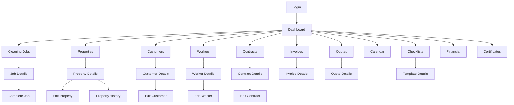
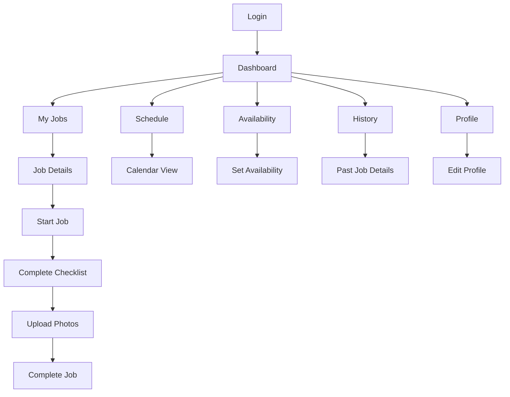

# RightFit Services UI/UX Specification

**Version:** 2.0
**Date:** November 7, 2025
**Status:** DRAFT - Awaiting Review
**Author:** Sally (UX Expert)

---

## Executive Summary

This comprehensive UI/UX specification addresses the current state of the RightFit Services platform, which consists of 8 interconnected applications serving multiple user types across a multi-tenant B2B2C SaaS architecture.

**Critical Findings:**
- ✅ Strong quality philosophy and accessibility mindset
- 🔴 **CRITICAL:** UI components duplicated 5-6x across applications
- 🔴 No formal design system or design tokens
- 🔴 Inconsistent icon usage (MUI + SVG + emojis)
- ⚠️ Mobile responsiveness planned but not validated
- ⚠️ Missing state patterns (errors, offline, loading)

**This specification provides:**
1. A unified design system architecture
2. Component library structure to eliminate duplication
3. Comprehensive accessibility standards (WCAG 2.1 AA minimum)
4. Responsive design patterns with real device testing strategy
5. State management patterns for all UI scenarios
6. Production-ready implementation guidelines

---

## Table of Contents

1. [Introduction](#1-introduction)
2. [UX Goals & Principles](#2-ux-goals--principles)
3. [Information Architecture](#3-information-architecture)
4. [Design System Architecture](#4-design-system-architecture)
5. [Component Library](#5-component-library)
6. [Visual Design Standards](#6-visual-design-standards)
7. [State Management Patterns](#7-state-management-patterns)
8. [Responsive Design Strategy](#8-responsive-design-strategy)
9. [Accessibility Requirements](#9-accessibility-requirements)
10. [Animation & Motion Design](#10-animation--motion-design)
11. [Performance Standards](#11-performance-standards)
12. [Implementation Roadmap](#12-implementation-roadmap)
13. [Testing Strategy](#13-testing-strategy)

---

## 1. Introduction

### 1.1 Purpose

This document defines the user experience goals, information architecture, user flows, and visual design specifications for RightFit Services' user interface. It serves as the foundation for visual design and frontend development, ensuring a cohesive and user-centered experience across all 8 applications.

### 1.2 Scope

**In Scope:**
- All 8 web applications (landlord, cleaning, maintenance, customer, worker, guest-tablet, and 2 mobile apps)
- Unified design system with shared component library
- Accessibility standards (WCAG 2.1 AA minimum, AAA preferred)
- Responsive design patterns for mobile, tablet, and desktop
- State management patterns (loading, error, empty, success, offline)
- Icon system standardization
- Animation and transition guidelines

**Out of Scope:**
- Backend API design (covered in ARCHITECTURE.md)
- Database schema (covered in packages/database)
- Deployment infrastructure (covered in ARCHITECTURE.md Section 9)
- Third-party integrations beyond UI impact

### 1.3 Applications Overview

| Application | User Type | Port | Purpose |
|------------|-----------|------|---------|
| **web-landlord** | Landlord | 5173 | Traditional landlord property management |
| **web-cleaning** | Cleaning Service Provider | 5174 | Cleaning company operations |
| **web-maintenance** | Maintenance Service Provider | 5175 | Maintenance company operations |
| **web-customer** | Short-let Business | 5176 | Customer portal for short-let businesses |
| **web-worker** | Cleaners & Maintenance Workers | 5178 | Worker job management (shared) |
| **guest-tablet** | Property Guests | 5177 | Guest issue reporting |
| **mobile** | Workers (offline-first) | 8081 | React Native mobile app with WatermelonDB |
| **api** | Backend | 3001 | Unified Express.js REST API |

### 1.4 Change Log

| Date | Version | Description | Author |
|------|---------|-------------|--------|
| 2025-11-07 | 2.0 | Complete UI/UX specification based on brownfield analysis | Sally (UX Expert) |

---

## 2. UX Goals & Principles

### 2.1 Target User Personas

#### Persona 1: Service Provider Administrator
**Profile:** Cleaning or maintenance company owner/manager
**Goals:**
- Manage team of workers efficiently
- Track job completion and quality
- Handle customer relationships and billing
- Monitor business performance

**Pain Points:**
- Needs to work across desktop and mobile
- Limited time for training on complex systems
- Needs quick access to critical information
- Must handle urgent situations while mobile

**Tech Savviness:** Moderate
**Device Usage:** 60% desktop, 40% mobile

---

#### Persona 2: Field Worker (Cleaner/Maintenance)
**Profile:** Frontline worker performing cleaning or maintenance tasks
**Goals:**
- See daily schedule and job details
- Access property information and instructions
- Complete checklists and report issues
- Work offline when internet unavailable

**Pain Points:**
- Often has wet or gloved hands (touch targets must be large)
- Works in poor lighting conditions (contrast critical)
- Unreliable internet at job sites
- Needs hands-free information access

**Tech Savviness:** Low to Moderate
**Device Usage:** 95% mobile, 5% desktop

---

#### Persona 3: Property Customer/Landlord
**Profile:** Short-let business owner or traditional landlord
**Goals:**
- Monitor property cleaning/maintenance
- Manage bookings and turnovers
- View service history and reports
- Manage multiple properties

**Pain Points:**
- Needs transparency and proof of work
- Often checks system while traveling
- Wants simple overview, not complex details
- Needs quick problem resolution

**Tech Savviness:** Moderate to High
**Device Usage:** 50% mobile, 30% tablet, 20% desktop

---

#### Persona 4: Property Guest
**Profile:** Short-term rental guest staying at property
**Goals:**
- Report maintenance issues easily
- Find property information (WiFi, parking)
- Minimal friction - one-time use

**Pain Points:**
- Never used the app before
- Expects instant submission
- May not speak English as first language
- Using property tablet, not own device

**Tech Savviness:** Variable (Low to High)
**Device Usage:** 100% tablet (property-provided)

---

### 2.2 Usability Goals

1. **Ease of Learning**
   - New users can complete core tasks within 5 minutes without training
   - Onboarding flow explains key features contextually
   - Consistent patterns reduce cognitive load

2. **Efficiency of Use**
   - Power users can complete frequent tasks in ≤3 clicks
   - Keyboard shortcuts available for all major actions
   - Bulk actions available where appropriate

3. **Error Prevention & Recovery**
   - Clear validation feedback before submission
   - Confirmation required for destructive actions
   - Auto-save prevents data loss
   - Clear error messages with recovery actions

4. **Memorability**
   - Infrequent users can return after months without relearning
   - Visual consistency across all applications
   - Familiar UI patterns (industry standards)

5. **User Satisfaction**
   - Delightful micro-interactions
   - Fast, responsive interface (< 100ms feedback)
   - Beautiful, professional visual design
   - Accessible to users of all abilities

---

### 2.3 Design Principles

#### 1. **Clarity Over Cleverness**
*Prioritize clear communication over aesthetic innovation*

- Use plain language, not jargon
- Obvious affordances (buttons look clickable)
- Clear visual hierarchy guides user attention
- Status always visible and unambiguous

**Example:** Status indicators use both color AND text labels (not color alone)

---

#### 2. **Progressive Disclosure**
*Show only what's needed, when it's needed*

- Default to simple view, offer "Show More" for details
- Use tabs to organize complex information
- Lazy-load secondary data
- Collapse advanced options by default

**Example:** Property details show summary first, full details in tabs

---

#### 3. **Consistent Patterns**
*Use familiar UI patterns throughout all applications*

- Same component for same purpose across all apps
- Predictable navigation structure
- Consistent terminology and icons
- Unified keyboard shortcuts

**Example:** "Jobs" navigation item uses same icon and position in all apps

---

#### 4. **Immediate Feedback**
*Every action should have clear, immediate response*

- Visual confirmation within 100ms
- Optimistic UI updates (assume success)
- Loading states for operations > 200ms
- Success/error toasts for background operations

**Example:** Button changes to "Saving..." with spinner during submit

---

#### 5. **Accessible by Default**
*Design for all users from the start, not as afterthought*

- WCAG 2.1 AA minimum, AAA preferred
- Keyboard navigation for all interactions
- Screen reader compatible semantic HTML
- 44x44px minimum touch targets
- 7:1 contrast ratio preferred (4.5:1 minimum)

**Example:** All form fields have visible labels, not just placeholders

---

#### 6. **Mobile-First, Offline-Aware**
*Design for mobile constraints, enhance for desktop*

- Touch-friendly targets and gestures
- Offline-first data architecture (mobile app)
- Graceful degradation when offline
- Responsive from 320px to 3840px

**Example:** Worker app works fully offline, syncs when connection available

---

## 3. Information Architecture

### 3.1 Navigation Strategy

#### Primary Navigation Structure

All applications share a consistent navigation pattern:

**Layout:**
- Left sidebar (collapsible on desktop, overlay on mobile)
- Top header with search and profile
- Main content area

**Navigation Hierarchy:**
1. **Global Navigation** (Sidebar)
   - Dashboard
   - Domain-specific items (Jobs, Properties, etc.)
   - Settings

2. **Contextual Actions** (Page-level)
   - Create, Edit, Delete buttons
   - Filters and search
   - Bulk actions

3. **Breadcrumbs** (for deep navigation)
   - Home > Properties > Acacia Gardens > Edit

---

### 3.2 Application-Specific Sitemaps

#### Cleaning Service Provider Portal (web-cleaning)



---

#### Worker Portal (web-worker)



---

### 3.3 Breadcrumb Strategy

**Rules:**
- Show breadcrumbs for pages 2+ levels deep
- Make all segments clickable except current page
- Truncate middle segments if > 4 levels
- Always show: Home > ... > Current Page

**Examples:**
```
Home > Properties > Acacia Gardens
Home > Customers > Sunshine Lets > Edit
Home > Jobs > JOB-2025-001 > Complete
Home > ... > Property Details (when > 4 levels)
```

---

### 3.4 Search Strategy

**Global Search (Header):**
- Searches across: Jobs, Properties, Customers, Workers
- Keyboard shortcut: `Cmd/Ctrl + K`
- Shows categorized results
- Recent searches saved

**Page-Level Search/Filters:**
- Filters specific to current view
- Persistent across sessions
- Clear all filters option
- Show active filter count

---

## 4. Design System Architecture

### 4.1 Current State Analysis

**Problem Statement:**

Currently, UI components are duplicated across 6 web applications:
```
apps/web-landlord/src/components/ui/Button.tsx
apps/web-cleaning/src/components/ui/Button.tsx
apps/web-maintenance/src/components/ui/Button.tsx
apps/web-customer/src/components/ui/Button.tsx
apps/web-worker/src/components/ui/Button.tsx
apps/guest-tablet/src/components/ui/Button.tsx
```

This creates:
- **5-6x maintenance burden** - bug fixes must be applied 6 times
- **Inconsistency risk** - components drift as developers make local changes
- **~500KB duplicate code** across applications
- **No single source of truth** for design decisions

---

### 4.2 Proposed Design System Structure

#### Package Architecture

```
packages/
├── ui-core/                    # Shared foundation components
│   ├── src/
│   │   ├── components/
│   │   │   ├── Button/
│   │   │   │   ├── Button.tsx
│   │   │   │   ├── Button.test.tsx
│   │   │   │   ├── Button.stories.tsx
│   │   │   │   └── Button.module.css
│   │   │   ├── Card/
│   │   │   ├── Input/
│   │   │   ├── Select/
│   │   │   ├── Modal/
│   │   │   ├── Toast/
│   │   │   ├── Badge/
│   │   │   ├── Spinner/
│   │   │   ├── Tabs/
│   │   │   └── ... (15 core components)
│   │   ├── tokens/
│   │   │   ├── colors.ts
│   │   │   ├── spacing.ts
│   │   │   ├── typography.ts
│   │   │   ├── breakpoints.ts
│   │   │   └── animations.ts
│   │   ├── icons/
│   │   │   └── index.ts (unified icon system)
│   │   └── utils/
│   │       ├── classNames.ts
│   │       └── a11y.ts
│   ├── package.json
│   └── README.md
│
├── ui-cleaning/                # Cleaning-specific components
│   ├── src/
│   │   ├── components/
│   │   │   ├── JobCard/
│   │   │   ├── PropertyCard/
│   │   │   ├── ChecklistItem/
│   │   │   └── CleaningSchedule/
│   │   └── index.ts
│   └── package.json
│
├── ui-maintenance/             # Maintenance-specific components
│   ├── src/
│   │   ├── components/
│   │   │   ├── MaintenanceJobCard/
│   │   │   ├── IssueReporter/
│   │   │   └── WorkOrderForm/
│   │   └── index.ts
│   └── package.json
│
└── ui-mobile/                  # Mobile-specific components
    ├── src/
    │   ├── components/
    │   │   ├── OfflineIndicator/
    │   │   ├── SyncStatus/
    │   │   └── CameraUpload/
    │   └── index.ts
    └── package.json
```

---

#### Component Import Pattern

**Before (Current - DUPLICATED):**
```tsx
// apps/web-cleaning/src/pages/Dashboard.tsx
import { Button, Card } from '../components/ui'
```

**After (Proposed - SHARED):**
```tsx
// apps/web-cleaning/src/pages/Dashboard.tsx
import { Button, Card, Badge } from '@rightfit/ui-core'
import { JobCard, PropertyCard } from '@rightfit/ui-cleaning'
```

---

### 4.3 Design Tokens

Design tokens centralize all design decisions, making global changes trivial.

#### File: `packages/ui-core/src/tokens/colors.ts`

```typescript
/**
 * RightFit Services Design Tokens - Colors
 *
 * Usage:
 * import { colors } from '@rightfit/ui-core/tokens'
 *
 * const buttonBg = colors.primary[600]
 */

export const colors = {
  // Brand Colors
  primary: {
    50: '#eff6ff',
    100: '#dbeafe',
    200: '#bfdbfe',
    300: '#93c5fd',
    400: '#60a5fa',
    500: '#3b82f6',  // Primary blue
    600: '#2563eb',
    700: '#1d4ed8',
    800: '#1e40af',
    900: '#1e3a8a',
  },

  // Semantic Colors
  success: {
    50: '#f0fdf4',
    500: '#22c55e',  // Success green
    700: '#15803d',
  },
  warning: {
    50: '#fffbeb',
    500: '#f59e0b',  // Warning amber
    700: '#b45309',
  },
  error: {
    50: '#fef2f2',
    500: '#ef4444',  // Error red
    700: '#b91c1c',
  },
  info: {
    50: '#f0f9ff',
    500: '#0ea5e9',  // Info cyan
    700: '#0369a1',
  },

  // Neutral Colors
  neutral: {
    50: '#f9fafb',
    100: '#f3f4f6',
    200: '#e5e7eb',
    300: '#d1d5db',
    400: '#9ca3af',
    500: '#6b7280',
    600: '#4b5563',
    700: '#374151',
    800: '#1f2937',
    900: '#111827',
  },

  // Gradient Colors (for gradient card system)
  gradients: {
    blue: {
      light: { from: '#eff6ff', to: '#dbeafe' },
      dark: { from: 'rgba(30, 58, 138, 0.2)', to: 'rgba(30, 64, 175, 0.2)' },
    },
    purple: {
      light: { from: '#faf5ff', to: '#f3e8ff' },
      dark: { from: 'rgba(107, 33, 168, 0.2)', to: 'rgba(126, 34, 206, 0.2)' },
    },
    green: {
      light: { from: '#f0fdf4', to: '#dcfce7' },
      dark: { from: 'rgba(20, 83, 45, 0.2)', to: 'rgba(22, 101, 52, 0.2)' },
    },
    // ... more gradients
  },
}

export type ColorToken = typeof colors
```

---

#### File: `packages/ui-core/src/tokens/spacing.ts`

```typescript
/**
 * RightFit Services Design Tokens - Spacing
 *
 * Based on 4px baseline grid
 */

export const spacing = {
  0: '0',
  1: '0.25rem',    // 4px
  2: '0.5rem',     // 8px
  3: '0.75rem',    // 12px
  4: '1rem',       // 16px
  5: '1.25rem',    // 20px
  6: '1.5rem',     // 24px
  8: '2rem',       // 32px
  10: '2.5rem',    // 40px
  12: '3rem',      // 48px
  16: '4rem',      // 64px
  20: '5rem',      // 80px
  24: '6rem',      // 96px
}

export const containerPadding = {
  mobile: spacing[4],    // 16px
  tablet: spacing[6],    // 24px
  desktop: spacing[8],   // 32px
}

export type SpacingToken = typeof spacing
```

---

#### File: `packages/ui-core/src/tokens/typography.ts`

```typescript
/**
 * RightFit Services Design Tokens - Typography
 */

export const fontFamilies = {
  primary: '-apple-system, BlinkMacSystemFont, "Segoe UI", Roboto, "Helvetica Neue", Arial, sans-serif',
  mono: '"SF Mono", "Monaco", "Inconsolata", "Fira Code", "Droid Sans Mono", monospace',
}

export const fontSizes = {
  xs: '0.75rem',      // 12px
  sm: '0.875rem',     // 14px
  base: '1rem',       // 16px
  lg: '1.125rem',     // 18px
  xl: '1.25rem',      // 20px
  '2xl': '1.5rem',    // 24px
  '3xl': '1.875rem',  // 30px
  '4xl': '2.25rem',   // 36px
  '5xl': '3rem',      // 48px
}

export const fontWeights = {
  normal: 400,
  medium: 500,
  semibold: 600,
  bold: 700,
  extrabold: 800,
}

export const lineHeights = {
  none: '1',
  tight: '1.25',
  snug: '1.375',
  normal: '1.5',
  relaxed: '1.625',
  loose: '2',
}

export type TypographyTokens = {
  fontFamilies: typeof fontFamilies
  fontSizes: typeof fontSizes
  fontWeights: typeof fontWeights
  lineHeights: typeof lineHeights
}
```

---

### 4.4 Unified Icon System

**Current Problem:**
- Material-UI icons in some apps
- Custom SVG icons in others
- Emojis used as icons (🏠, 🔑, 🧹)
- Inconsistent sizes and styles

**Solution: Lucide React Icons**

```typescript
// packages/ui-core/src/icons/index.ts

/**
 * Unified icon system for RightFit Services
 *
 * Using Lucide React for consistency:
 * - 1000+ icons
 * - Consistent design language
 * - Tree-shakeable
 * - TypeScript support
 * - Accessible by default
 */

import {
  Home,
  Key,
  Wrench,
  Users,
  Calendar,
  FileText,
  Settings,
  LogOut,
  Search,
  Plus,
  Edit,
  Trash,
  Check,
  X,
  AlertCircle,
  Info,
  // ... export only icons we use
} from 'lucide-react'

export const icons = {
  // Navigation
  home: Home,
  dashboard: Home,
  calendar: Calendar,
  settings: Settings,
  logout: LogOut,

  // Domain
  property: Home,
  key: Key,
  maintenance: Wrench,
  workers: Users,

  // Actions
  search: Search,
  add: Plus,
  edit: Edit,
  delete: Trash,
  check: Check,
  close: X,

  // Status
  alert: AlertCircle,
  info: Info,
}

export type IconName = keyof typeof icons
```

**Usage:**
```tsx
import { Icon } from '@rightfit/ui-core'

<Icon name="property" size={20} />
<Icon name="alert" size={16} color="error" />
```

---

### 4.5 Storybook Integration

**Purpose:** Visual documentation and component playground

```bash
# Install Storybook
pnpm add -D @storybook/react @storybook/addon-essentials @storybook/addon-a11y
```

**File: `packages/ui-core/.storybook/main.js`**

```javascript
module.exports = {
  stories: ['../src/**/*.stories.tsx'],
  addons: [
    '@storybook/addon-essentials',
    '@storybook/addon-a11y',  // Accessibility testing
  ],
}
```

**Component Story Example:**

```tsx
// packages/ui-core/src/components/Button/Button.stories.tsx

import type { Meta, StoryObj } from '@storybook/react'
import { Button } from './Button'

const meta: Meta<typeof Button> = {
  title: 'Core/Button',
  component: Button,
  argTypes: {
    variant: {
      control: 'select',
      options: ['primary', 'secondary', 'outline', 'ghost', 'danger'],
    },
    size: {
      control: 'select',
      options: ['sm', 'md', 'lg'],
    },
  },
}

export default meta
type Story = StoryObj<typeof Button>

export const Primary: Story = {
  args: {
    children: 'Primary Button',
    variant: 'primary',
  },
}

export const AllVariants: Story = {
  render: () => (
    <div style={{ display: 'flex', gap: '1rem' }}>
      <Button variant="primary">Primary</Button>
      <Button variant="secondary">Secondary</Button>
      <Button variant="outline">Outline</Button>
      <Button variant="ghost">Ghost</Button>
      <Button variant="danger">Danger</Button>
    </div>
  ),
}
```

---

## 5. Component Library

### 5.1 Core Components Inventory

**Foundation Components (packages/ui-core):**

1. **Button** - Primary interaction element
2. **Card** - Content container
3. **Input** - Text input field
4. **Select** - Dropdown selection
5. **Textarea** - Multi-line text input
6. **Checkbox** - Boolean selection
7. **Radio** - Single choice from options
8. **Modal** - Overlay dialog
9. **Toast** - Notification message
10. **Badge** - Status indicator
11. **Spinner** - Loading indicator
12. **EmptyState** - No data placeholder
13. **Tabs** - Content organization
14. **ThemeToggle** - Light/dark mode switcher
15. **KeyboardShortcutsHelp** - Shortcut reference
16. **Skeleton** - Loading placeholder

---

### 5.2 Component Specifications

#### Component: Button

**Purpose:** Primary interactive element for user actions

**Variants:**
- `primary` - Main call-to-action (blue, high contrast)
- `secondary` - Secondary actions (gray)
- `outline` - Tertiary actions (bordered, no fill)
- `ghost` - Minimal actions (no border or fill)
- `danger` - Destructive actions (red)

**Sizes:**
- `sm` - Small (height: 32px, padding: 8px 12px, font: 14px)
- `md` - Medium (height: 40px, padding: 10px 16px, font: 16px) **DEFAULT**
- `lg` - Large (height: 48px, padding: 12px 20px, font: 18px)

**States:**
- Default
- Hover
- Active (pressed)
- Focus (keyboard)
- Disabled
- Loading (with spinner)

**Accessibility:**
- Minimum touch target: 44x44px (AA) or 48x48px (AAA preferred)
- Focus indicator: 2px solid outline with 2px offset
- ARIA labels for icon-only buttons
- Disabled state uses `aria-disabled` + visual opacity

**Usage Guidelines:**
```tsx
// Primary action (one per page/section)
<Button variant="primary">Save Changes</Button>

// Secondary action
<Button variant="secondary">Cancel</Button>

// Destructive action (requires confirmation)
<Button variant="danger">Delete Account</Button>

// Loading state
<Button loading>Saving...</Button>

// Icon + text
<Button variant="primary">
  <Icon name="plus" size={16} />
  Add Property
</Button>

// Icon only (MUST have aria-label)
<Button variant="ghost" aria-label="Edit property">
  <Icon name="edit" size={16} />
</Button>
```

**Implementation:**

```tsx
// packages/ui-core/src/components/Button/Button.tsx

import React from 'react'
import { Spinner } from '../Spinner'
import { colors } from '../../tokens/colors'
import styles from './Button.module.css'

export interface ButtonProps extends React.ButtonHTMLAttributes<HTMLButtonElement> {
  variant?: 'primary' | 'secondary' | 'outline' | 'ghost' | 'danger'
  size?: 'sm' | 'md' | 'lg'
  loading?: boolean
  fullWidth?: boolean
  children: React.ReactNode
}

export const Button = React.forwardRef<HTMLButtonElement, ButtonProps>(
  (
    {
      variant = 'primary',
      size = 'md',
      loading = false,
      fullWidth = false,
      disabled,
      children,
      className,
      ...props
    },
    ref
  ) => {
    return (
      <button
        ref={ref}
        className={`${styles.button} ${styles[variant]} ${styles[size]} ${
          fullWidth ? styles.fullWidth : ''
        } ${className || ''}`}
        disabled={disabled || loading}
        aria-disabled={disabled || loading}
        {...props}
      >
        {loading && <Spinner size="sm" className={styles.spinner} />}
        {children}
      </button>
    )
  }
)

Button.displayName = 'Button'
```

---

#### Component: GradientCard

**Purpose:** Information display with visual hierarchy and status indication

**This component formalizes the existing gradient card pattern found in PropertyDetails.tsx and ContractDetails.tsx**

**Variants:**
- `blue` - General information
- `purple` - Secondary information
- `green` - Success/positive data
- `yellow` - Warning/attention data
- `red` - Error/urgent data
- `cyan` - Neutral data
- `orange` - Count/quantity data

**Structure:**
```tsx
<GradientCard variant="blue">
  <GradientCard.Icon>🏠</GradientCard.Icon>
  <GradientCard.Content>
    <GradientCard.Label>Property Type</GradientCard.Label>
    <GradientCard.Value>Apartment</GradientCard.Value>
  </GradientCard.Content>
</GradientCard>
```

**Implementation:**

```tsx
// packages/ui-core/src/components/GradientCard/GradientCard.tsx

import React from 'react'
import { colors } from '../../tokens/colors'
import styles from './GradientCard.module.css'

type Variant = 'blue' | 'purple' | 'green' | 'yellow' | 'red' | 'cyan' | 'orange'

interface GradientCardProps {
  variant: Variant
  children: React.ReactNode
  className?: string
  onClick?: () => void
}

export const GradientCard = ({ variant, children, className, onClick }: GradientCardProps) => {
  return (
    <div
      className={`${styles.card} ${styles[variant]} ${className || ''}`}
      onClick={onClick}
      role={onClick ? 'button' : undefined}
      tabIndex={onClick ? 0 : undefined}
    >
      {children}
    </div>
  )
}

const Icon = ({ children }: { children: React.ReactNode }) => (
  <div className={styles.icon} aria-hidden="true">
    {children}
  </div>
)

const Content = ({ children }: { children: React.ReactNode }) => (
  <div className={styles.content}>{children}</div>
)

const Label = ({ children }: { children: React.ReactNode }) => (
  <p className={styles.label}>{children}</p>
)

const Value = ({ children }: { children: React.ReactNode }) => (
  <p className={styles.value}>{children}</p>
)

GradientCard.Icon = Icon
GradientCard.Content = Content
GradientCard.Label = Label
GradientCard.Value = Value
```

**CSS Module:**

```css
/* packages/ui-core/src/components/GradientCard/GradientCard.module.css */

.card {
  padding: 1.25rem; /* 20px */
  border-radius: 0.5rem; /* 8px */
  border-width: 1px;
  display: flex;
  align-items: flex-start;
  gap: 0.75rem; /* 12px */
  transition: box-shadow 0.2s ease;
}

.card:hover {
  box-shadow: 0 10px 15px -3px rgba(0, 0, 0, 0.1), 0 4px 6px -2px rgba(0, 0, 0, 0.05);
}

/* Blue Variant */
.blue {
  background: linear-gradient(135deg, #eff6ff 0%, #dbeafe 100%);
  border-color: #bfdbfe;
}

:global(.dark) .blue {
  background: linear-gradient(135deg, rgba(30, 58, 138, 0.2) 0%, rgba(30, 64, 175, 0.2) 100%);
  border-color: rgba(30, 64, 175, 0.8);
}

/* ... more variants ... */

.icon {
  width: 2.5rem; /* 40px */
  height: 2.5rem; /* 40px */
  border-radius: 0.5rem; /* 8px */
  display: flex;
  align-items: center;
  justify-content: center;
  flex-shrink: 0;
  font-size: 1.25rem; /* 20px */
}

.blue .icon {
  background-color: #bfdbfe;
}

:global(.dark) .blue .icon {
  background-color: rgba(30, 64, 175, 0.8);
}

.content {
  flex: 1;
  min-width: 0;
}

.label {
  font-size: 0.75rem; /* 12px */
  font-weight: 700;
  text-transform: uppercase;
  letter-spacing: 0.05em;
  margin-bottom: 0.25rem; /* 4px */
}

.blue .label {
  color: #1e40af;
}

:global(.dark) .blue .label {
  color: #93c5fd;
}

.value {
  font-size: 1.125rem; /* 18px */
  font-weight: 800;
  line-height: 1.2;
  word-break: break-word;
}

.blue .value {
  color: #1e3a8a;
}

:global(.dark) .blue .value {
  color: #dbeafe;
}
```

---

#### Component: EmptyState

**Purpose:** Placeholder when no data exists, guiding users to next action

**Props:**
- `icon` - Visual representation (Icon component)
- `title` - Primary message (e.g., "No properties yet")
- `description` - Secondary explanation
- `action` - Call-to-action button (optional)

**Usage:**
```tsx
<EmptyState
  icon={<Icon name="home" size={64} />}
  title="No properties yet"
  description="Create your first property to get started"
  action={
    <Button variant="primary" onClick={() => navigate('/properties/new')}>
      <Icon name="plus" size={16} />
      Add Property
    </Button>
  }
/>
```

**Implementation:**

```tsx
// packages/ui-core/src/components/EmptyState/EmptyState.tsx

import React from 'react'
import styles from './EmptyState.module.css'

interface EmptyStateProps {
  icon: React.ReactNode
  title: string
  description?: string
  action?: React.ReactNode
}

export const EmptyState = ({ icon, title, description, action }: EmptyStateProps) => {
  return (
    <div className={styles.container} role="status" aria-live="polite">
      <div className={styles.icon} aria-hidden="true">
        {icon}
      </div>
      <h3 className={styles.title}>{title}</h3>
      {description && <p className={styles.description}>{description}</p>}
      {action && <div className={styles.action}>{action}</div>}
    </div>
  )
}
```

---

### 5.3 Domain-Specific Components

#### packages/ui-cleaning

**JobCard:**
```tsx
interface JobCardProps {
  job: CleaningJob
  onClick?: () => void
}

export const JobCard = ({ job, onClick }: JobCardProps) => {
  const variant =
    job.status === 'COMPLETED' ? 'green' :
    job.status === 'IN_PROGRESS' ? 'blue' :
    job.status === 'SCHEDULED' ? 'yellow' : 'gray'

  return (
    <GradientCard variant={variant} onClick={onClick}>
      <GradientCard.Icon>
        {job.status === 'COMPLETED' ? '✅' :
         job.status === 'IN_PROGRESS' ? '🔄' :
         '📅'}
      </GradientCard.Icon>
      <GradientCard.Content>
        <GradientCard.Label>
          {new Date(job.scheduled_date).toLocaleDateString('en-GB')}
        </GradientCard.Label>
        <GradientCard.Value>{job.status.replace('_', ' ')}</GradientCard.Value>
        {job.assigned_worker && (
          <p className="text-sm mt-1">
            {job.assigned_worker.first_name} {job.assigned_worker.last_name}
          </p>
        )}
      </GradientCard.Content>
    </GradientCard>
  )
}
```

---

## 6. Visual Design Standards

### 6.1 Color System

#### Brand Colors

| Color | Hex | Usage | Accessibility |
|-------|-----|-------|---------------|
| **Primary Blue** | `#2563eb` | Primary buttons, links, focus states | AA contrast on white |
| **Primary Dark** | `#1e40af` | Hover states, dark mode accents | AAA contrast on white |
| **Primary Light** | `#93c5fd` | Backgrounds, disabled states | Used with dark text |

#### Semantic Colors

| Semantic | Light Mode | Dark Mode | Usage |
|----------|-----------|-----------|-------|
| **Success** | `#22c55e` | `#4ade80` | Completed jobs, positive feedback |
| **Warning** | `#f59e0b` | `#fbbf24` | Scheduled jobs, cautions |
| **Error** | `#ef4444` | `#f87171` | Failed jobs, validation errors |
| **Info** | `#0ea5e9` | `#38bdf8` | Informational messages |

#### Gradient System (Formalized)

**Usage:** Information cards with visual hierarchy

| Variant | Light From | Light To | Dark From | Dark To |
|---------|-----------|----------|-----------|---------|
| Blue | `#eff6ff` | `#dbeafe` | `rgba(30, 58, 138, 0.2)` | `rgba(30, 64, 175, 0.2)` |
| Purple | `#faf5ff` | `#f3e8ff` | `rgba(107, 33, 168, 0.2)` | `rgba(126, 34, 206, 0.2)` |
| Green | `#f0fdf4` | `#dcfce7` | `rgba(20, 83, 45, 0.2)` | `rgba(22, 101, 52, 0.2)` |
| Yellow | `#fefce8` | `#fef9c3` | `rgba(133, 77, 14, 0.2)` | `rgba(161, 98, 7, 0.2)` |
| Red | `#fef2f2` | `#fee2e2` | `rgba(127, 29, 29, 0.2)` | `rgba(153, 27, 27, 0.2)` |
| Cyan | `#ecfeff` | `#cffafe` | `rgba(21, 94, 117, 0.2)` | `rgba(14, 116, 144, 0.2)` |
| Orange | `#fff7ed` | `#ffedd5` | `rgba(154, 52, 18, 0.2)` | `rgba(194, 65, 12, 0.2)` |

---

### 6.2 Typography System

#### Font Families

**Primary:** System font stack for optimal performance
```css
font-family: -apple-system, BlinkMacSystemFont, "Segoe UI", Roboto, "Helvetica Neue", Arial, sans-serif;
```

**Monospace:** For code, IDs, technical data
```css
font-family: "SF Mono", "Monaco", "Inconsolata", "Fira Code", "Droid Sans Mono", monospace;
```

#### Type Scale

| Element | Size | Weight | Line Height | Usage |
|---------|------|--------|-------------|-------|
| **H1** | 36px (2.25rem) | 700 (Bold) | 1.2 | Page titles |
| **H2** | 30px (1.875rem) | 700 (Bold) | 1.25 | Section titles |
| **H3** | 24px (1.5rem) | 600 (Semibold) | 1.3 | Subsection titles |
| **H4** | 20px (1.25rem) | 600 (Semibold) | 1.4 | Card titles |
| **Body Large** | 18px (1.125rem) | 400 (Normal) | 1.5 | Emphasized body text |
| **Body** | 16px (1rem) | 400 (Normal) | 1.5 | Default body text |
| **Small** | 14px (0.875rem) | 400 (Normal) | 1.5 | Secondary text |
| **Tiny** | 12px (0.75rem) | 600 (Semibold) | 1.5 | Labels, captions |

#### Typography Guidelines

**Headings:**
- Use semantic HTML (`<h1>`, `<h2>`, etc.) for accessibility
- Only one `<h1>` per page
- Don't skip heading levels (h1 → h3 is wrong)
- Headings should describe content, not be generic

**Body Text:**
- Maximum line length: 80 characters (optimal readability)
- Use `font-weight: 400` for body, `600` for emphasis
- Avoid full justification (creates uneven spacing)

**Links:**
- Underline links in body text (color alone is insufficient)
- Use blue color for unvisited, purple for visited
- Ensure 4.5:1 contrast ratio minimum

---

### 6.3 Spacing System

**Baseline:** 4px grid

| Token | Value | Usage |
|-------|-------|-------|
| `spacing-1` | 4px | Tight inline spacing |
| `spacing-2` | 8px | Component padding (small) |
| `spacing-3` | 12px | Default gap between elements |
| `spacing-4` | 16px | Component padding (medium) |
| `spacing-5` | 20px | Card padding |
| `spacing-6` | 24px | Section spacing |
| `spacing-8` | 32px | Large section spacing |
| `spacing-12` | 48px | Page section dividers |
| `spacing-16` | 64px | Hero/banner spacing |

**Responsive Container Padding:**
- Mobile: 16px (spacing-4)
- Tablet: 24px (spacing-6)
- Desktop: 32px (spacing-8)

---

### 6.4 Border Radius

| Token | Value | Usage |
|-------|-------|-------|
| `radius-sm` | 4px | Small elements (badges, tags) |
| `radius-md` | 8px | Buttons, inputs, cards |
| `radius-lg` | 12px | Large cards, modals |
| `radius-full` | 9999px | Pills, circular avatars |

---

### 6.5 Shadows

| Name | Value | Usage |
|------|-------|-------|
| **Shadow SM** | `0 1px 2px 0 rgba(0, 0, 0, 0.05)` | Subtle depth |
| **Shadow** | `0 1px 3px 0 rgba(0, 0, 0, 0.1), 0 1px 2px -1px rgba(0, 0, 0, 0.1)` | Cards |
| **Shadow MD** | `0 4px 6px -1px rgba(0, 0, 0, 0.1), 0 2px 4px -2px rgba(0, 0, 0, 0.1)` | Dropdowns |
| **Shadow LG** | `0 10px 15px -3px rgba(0, 0, 0, 0.1), 0 4px 6px -4px rgba(0, 0, 0, 0.1)` | Modals, elevated cards |
| **Shadow XL** | `0 20px 25px -5px rgba(0, 0, 0, 0.1), 0 8px 10px -6px rgba(0, 0, 0, 0.1)` | Sticky headers, popovers |

**Dark Mode Adjustments:**
Use stronger shadows in dark mode for depth perception:
```css
.dark {
  --shadow: 0 1px 3px 0 rgba(0, 0, 0, 0.3), 0 1px 2px -1px rgba(0, 0, 0, 0.3);
}
```

---

### 6.6 Iconography

**Icon Library:** Lucide React (1000+ icons, consistent style)

**Sizes:**
| Size | Pixels | Usage |
|------|--------|-------|
| **Small** | 16px | Inline icons, badges |
| **Medium** | 20px | Navigation, buttons |
| **Large** | 24px | Page headers |
| **XL** | 32px | Empty states |
| **2XL** | 48px | Hero sections |

**Usage Rules:**
1. **Never use emojis as functional icons** (accessibility issues, platform inconsistencies)
2. **Always provide `aria-label` for icon-only buttons**
3. **Use `aria-hidden="true"` for decorative icons**
4. **Match icon color to text color** for consistency
5. **Maintain 1:1 aspect ratio** (never stretch icons)

**Emoji Usage:**
- **ONLY** for decorative purposes in gradient cards
- **NEVER** as interactive elements
- **NEVER** to convey status information alone

---

## 7. State Management Patterns

### 7.1 Loading States

**Problem:** Current implementation shows generic spinner, no skeleton loaders

**Solution: Progressive Loading Pattern**

#### Page-Level Loading

```tsx
// BAD: Current approach
if (isLoading) {
  return (
    <div className="flex justify-center items-center min-h-screen">
      <Spinner size="lg" />
    </div>
  )
}

// GOOD: Skeleton loader
if (isLoading) {
  return <PropertyDetailsSkeleton />
}
```

#### Component-Level Loading

**Skeleton Component:**

```tsx
// packages/ui-core/src/components/Skeleton/Skeleton.tsx

interface SkeletonProps {
  width?: string
  height?: string
  variant?: 'text' | 'circular' | 'rectangular'
  count?: number
}

export const Skeleton = ({
  width = '100%',
  height = '20px',
  variant = 'rectangular',
  count = 1
}: SkeletonProps) => {
  return (
    <>
      {Array.from({ length: count }).map((_, index) => (
        <div
          key={index}
          className={`skeleton skeleton-${variant}`}
          style={{ width, height }}
          aria-label="Loading..."
          role="status"
        />
      ))}
    </>
  )
}
```

**Usage Example:**

```tsx
// Loading state for property details
const PropertyDetailsSkeleton = () => (
  <div className="container mx-auto px-4 py-8">
    <Skeleton width="300px" height="40px" /> {/* Title */}
    <Skeleton width="200px" height="20px" className="mt-2" /> {/* Subtitle */}

    <div className="grid grid-cols-3 gap-4 mt-6">
      <Skeleton height="120px" /> {/* Card 1 */}
      <Skeleton height="120px" /> {/* Card 2 */}
      <Skeleton height="120px" /> {/* Card 3 */}
    </div>
  </div>
)
```

---

### 7.2 Error States

**Current Problem:** No error handling patterns, API failures show nothing

**Solution: Error Boundary + Retry Pattern**

#### Error Boundary Component

```tsx
// packages/ui-core/src/components/ErrorBoundary/ErrorBoundary.tsx

import React from 'react'
import { Button } from '../Button'
import { Icon } from '../Icon'

interface ErrorBoundaryState {
  hasError: boolean
  error: Error | null
}

export class ErrorBoundary extends React.Component<
  { children: React.ReactNode; fallback?: React.ReactNode },
  ErrorBoundaryState
> {
  constructor(props: any) {
    super(props)
    this.state = { hasError: false, error: null }
  }

  static getDerivedStateFromError(error: Error) {
    return { hasError: true, error }
  }

  componentDidCatch(error: Error, errorInfo: React.ErrorInfo) {
    console.error('Error caught by boundary:', error, errorInfo)
    // Log to error tracking service (e.g., Sentry)
  }

  render() {
    if (this.state.hasError) {
      if (this.props.fallback) {
        return this.props.fallback
      }

      return (
        <div className="error-boundary">
          <Icon name="alert-circle" size={48} color="error" />
          <h2>Something went wrong</h2>
          <p>We're sorry, but something unexpected happened.</p>
          <div className="actions">
            <Button
              variant="primary"
              onClick={() => window.location.reload()}
            >
              Reload Page
            </Button>
            <Button
              variant="outline"
              onClick={() => this.setState({ hasError: false, error: null })}
            >
              Try Again
            </Button>
          </div>
        </div>
      )
    }

    return this.props.children
  }
}
```

#### Data Fetching Error State

```tsx
// Pattern for API error handling

const PropertyDetails = () => {
  const [property, setProperty] = useState<Property | null>(null)
  const [loading, setLoading] = useState(true)
  const [error, setError] = useState<string | null>(null)

  const fetchProperty = async () => {
    try {
      setLoading(true)
      setError(null)
      const data = await customerPropertiesAPI.get(id)
      setProperty(data)
    } catch (err: any) {
      setError(err.message || 'Failed to load property')
      console.error('Load property error:', err)
    } finally {
      setLoading(false)
    }
  }

  useEffect(() => {
    fetchProperty()
  }, [id])

  // Loading state
  if (loading) {
    return <PropertyDetailsSkeleton />
  }

  // Error state
  if (error) {
    return (
      <ErrorState
        icon={<Icon name="alert-circle" size={64} />}
        title="Failed to load property"
        description={error}
        action={
          <Button variant="primary" onClick={fetchProperty}>
            <Icon name="refresh" size={16} />
            Retry
          </Button>
        }
      />
    )
  }

  // Success state
  return <PropertyDetailsView property={property} />
}
```

---

### 7.3 Empty States

**Current Status:** Some pages have good empty states, others missing

**Standard Pattern:**

```tsx
// GOOD: Existing empty state from PropertyDetails.tsx
<Card className="p-12 text-center">
  <h3 className="text-xl font-semibold text-gray-700 dark:text-gray-300 mb-2">
    No Checklists
  </h3>
  <p className="text-gray-600 dark:text-gray-400 mb-4">
    No checklist templates available for {property?.property_type} properties
  </p>
  <div className="flex gap-3 justify-center">
    <Button onClick={handleShowAddTemplate}>
      <AddIcon sx={{ fontSize: 16, mr: 0.5 }} />
      Add Template
    </Button>
    <Button onClick={() => navigate('/checklist-templates')}>
      Create New Template
    </Button>
  </div>
</Card>
```

**Required for all list/grid views:**
- Properties list
- Jobs list
- Workers list
- Customers list
- Invoices list
- Quotes list
- Calendar (no events)

---

### 7.4 Success States

**Current Problem:** Toasts used inconsistently, no success animations

**Solution: Toast System + Optimistic UI**

#### Toast Component (Already Exists)

```tsx
// Usage pattern
import { useToast } from '@rightfit/ui-core'

const { toast } = useToast()

// Success
toast.success('Property created successfully')

// Error
toast.error('Failed to create property')

// Warning
toast.warning('Some fields are missing')

// Info
toast.info('Changes will take effect after saving')
```

#### Optimistic UI Pattern

```tsx
// Example: Delete property
const handleDeleteProperty = async (propertyId: string) => {
  // 1. Optimistic update - remove from UI immediately
  setProperties(prev => prev.filter(p => p.id !== propertyId))

  // 2. Show success toast
  toast.success('Property deleted')

  try {
    // 3. Make API call
    await customerPropertiesAPI.delete(propertyId)
  } catch (error) {
    // 4. Rollback on error
    setProperties(prev => [...prev, deletedProperty])
    toast.error('Failed to delete property. Please try again.')
  }
}
```

---

### 7.5 Offline States

**Current Status:**
- ✅ Mobile app has offline-first with WatermelonDB
- 🔴 Web apps have no offline handling

**Solution: Online/Offline Indicators + Graceful Degradation**

#### Offline Indicator Component

```tsx
// packages/ui-core/src/components/OfflineIndicator/OfflineIndicator.tsx

import { useEffect, useState } from 'react'
import { Icon } from '../Icon'

export const OfflineIndicator = () => {
  const [isOnline, setIsOnline] = useState(navigator.onLine)

  useEffect(() => {
    const handleOnline = () => setIsOnline(true)
    const handleOffline = () => setIsOnline(false)

    window.addEventListener('online', handleOnline)
    window.addEventListener('offline', handleOffline)

    return () => {
      window.removeEventListener('online', handleOnline)
      window.removeEventListener('offline', handleOffline)
    }
  }, [])

  if (isOnline) return null

  return (
    <div
      className="offline-indicator"
      role="alert"
      aria-live="assertive"
    >
      <Icon name="wifi-off" size={16} />
      <span>You're offline. Some features may not be available.</span>
    </div>
  )
}
```

**Usage in AppLayout:**

```tsx
// apps/web-cleaning/src/components/layout/AppLayout.tsx

<main className="app-content">
  <OfflineIndicator />
  {children}
</main>
```

---

## 8. Responsive Design Strategy

### 8.1 Current State Analysis

**From REVIEW-GUIDE.md:**
- ⚠️ "Is mobile responsive actually implemented or just planned?"
- ⚠️ "Have we tested on real mobile devices?"

**Finding:** Responsive design is PLANNED but NOT VALIDATED on real devices.

---

### 8.2 Breakpoint System

| Breakpoint | Min Width | Max Width | Target Devices | Design Notes |
|-----------|-----------|-----------|----------------|--------------|
| **Mobile** | 320px | 767px | iPhone SE, iPhone 12/13/14, Samsung Galaxy | Single column, hamburger menu, large touch targets |
| **Tablet** | 768px | 1023px | iPad, iPad Pro, Android tablets | 2-column layouts, collapsible sidebar |
| **Desktop** | 1024px | 1439px | Laptops, small desktops | Full sidebar, 3-column grids |
| **Wide** | 1440px | - | Large desktops, ultrawide monitors | Constrained max-width (1280px), centered content |

---

### 8.3 Layout Patterns

#### Mobile (320px - 767px)

**Navigation:**
- Hamburger menu (overlay sidebar)
- Bottom navigation for critical actions (alternative pattern)
- Sticky header with search

**Content:**
- Single column
- Cards stack vertically
- Full-width modals
- Bottom sheets for actions (alternative to modals)

**Forms:**
- One field per row
- Large inputs (min 44px height)
- Sticky submit button at bottom

**Example:**
```tsx
// Mobile: Single column
<div className="grid grid-cols-1 gap-4">
  <PropertyCard />
  <PropertyCard />
  <PropertyCard />
</div>
```

---

#### Tablet (768px - 1023px)

**Navigation:**
- Collapsible sidebar (icons + text)
- Top navigation + search
- Breadcrumbs visible

**Content:**
- 2-column grid
- Modals (not full-screen)
- Side panels for details

**Forms:**
- 2 columns where appropriate
- Grouped fields

**Example:**
```tsx
// Tablet: 2 columns
<div className="grid grid-cols-1 md:grid-cols-2 gap-4">
  <PropertyCard />
  <PropertyCard />
  <PropertyCard />
  <PropertyCard />
</div>
```

---

#### Desktop (1024px+)

**Navigation:**
- Persistent sidebar (expanded by default)
- Full navigation visible
- Breadcrumbs + search

**Content:**
- 3-4 column grids
- Multi-panel layouts
- Hover states active

**Forms:**
- Multi-column layouts
- Inline validation
- Keyboard shortcuts active

**Example:**
```tsx
// Desktop: 3 columns
<div className="grid grid-cols-1 md:grid-cols-2 lg:grid-cols-3 gap-4">
  <PropertyCard />
  <PropertyCard />
  <PropertyCard />
  <PropertyCard />
  <PropertyCard />
  <PropertyCard />
</div>
```

---

### 8.4 Touch Target Guidelines

**WCAG 2.1 Level AA (Minimum):**
- Touch targets: **44x44px**

**WCAG 2.1 Level AAA (Preferred):**
- Touch targets: **48x48px**

**Implementation:**

```css
/* Ensure all interactive elements meet minimum */
.button,
.link,
.checkbox,
.radio,
.select {
  min-width: 44px;
  min-height: 44px;
  /* Prefer 48px for AAA */
}

/* Increase spacing on mobile */
@media (max-width: 767px) {
  .button {
    min-height: 48px;
    padding: 12px 20px;
  }
}
```

---

### 8.5 Real Device Testing Strategy

**Test Matrix:**

| Device Category | Device | Screen Size | Browser | Priority |
|----------------|---------|-------------|---------|----------|
| **iPhone** | iPhone SE (3rd gen) | 375x667 | Safari | HIGH |
| **iPhone** | iPhone 14 Pro | 393x852 | Safari | HIGH |
| **Android** | Samsung Galaxy S23 | 360x800 | Chrome | HIGH |
| **Tablet** | iPad (10th gen) | 820x1180 | Safari | MEDIUM |
| **Tablet** | iPad Pro 12.9" | 1024x1366 | Safari | MEDIUM |
| **Desktop** | MacBook Pro 14" | 1512x982 | Chrome/Safari | HIGH |
| **Desktop** | 1080p Monitor | 1920x1080 | Chrome/Edge | HIGH |
| **Wide** | 4K Monitor | 3840x2160 | Chrome | LOW |

**Testing Tools:**
1. **Browser DevTools** - Initial testing
2. **BrowserStack** - Cloud device testing (50+ real devices)
3. **Physical Devices** - Final validation before release

**Checklist per Device:**
- [ ] All navigation accessible
- [ ] Forms submittable
- [ ] Touch targets minimum 44x44px
- [ ] Text readable without zoom
- [ ] Images load correctly
- [ ] No horizontal scroll
- [ ] Modals/dialogs functional
- [ ] Orientation change handled (mobile/tablet)

---

## 9. Accessibility Requirements

### 9.1 Compliance Target

**Standard:** WCAG 2.1 Level AA (minimum), Level AAA (preferred)

**Rationale:**
- WCAG 2.1 AA is legally required in UK, EU, US (ADA compliance)
- Level AAA shows commitment to inclusive design
- Future-proofs against accessibility lawsuits

---

### 9.2 Visual Accessibility

#### Color Contrast

**Requirements:**
- **Normal text (< 18px):** 4.5:1 minimum (AA), 7:1 preferred (AAA)
- **Large text (≥ 18px or bold ≥ 14px):** 3:1 minimum (AA), 4.5:1 preferred (AAA)
- **UI components:** 3:1 minimum (icons, borders, focus indicators)

**Testing:**
- Use WebAIM Contrast Checker: https://webaim.org/resources/contrastchecker/
- Browser extensions: Axe DevTools, WAVE

**Current Issues Found:**
```tsx
// BAD: Yellow on white (insufficient contrast)
<Badge style={{ background: '#fef9c3', color: '#854d0e' }}>
  Scheduled
</Badge>

// GOOD: Higher contrast
<Badge style={{ background: '#fef3c7', color: '#78350f' }}>
  Scheduled
</Badge>
```

---

#### Focus Indicators

**Requirements:**
- **Visible on all interactive elements** (buttons, links, inputs, etc.)
- **Minimum 2px outline**
- **Minimum 2px offset** from element
- **High contrast color** (preferably #2563eb blue)

**Implementation:**

```css
/* Global focus styles */
*:focus-visible {
  outline: 2px solid #2563eb;
  outline-offset: 2px;
}

/* Remove default browser outline */
*:focus {
  outline: none;
}

/* Ensure :focus-visible support */
@supports not selector(:focus-visible) {
  *:focus {
    outline: 2px solid #2563eb;
    outline-offset: 2px;
  }
}
```

---

#### Text Sizing

**Requirements:**
- Users must be able to zoom to **200% without loss of functionality**
- Text must reflow without horizontal scrolling
- Minimum font size: **16px** for body text (mobile), **14px** acceptable on desktop

**Implementation:**
- Use `rem` units (not `px`) for font sizes
- Use `em` or `rem` for spacing
- Test at 200% zoom in browser

---

### 9.3 Interaction Accessibility

#### Keyboard Navigation

**Requirements:**
- **All functionality accessible via keyboard**
- **Logical tab order** (matches visual order)
- **Focus never trapped** (can escape modals with Esc)
- **Skip links** to main content

**Key Patterns:**

| Element | Keyboard Interaction |
|---------|---------------------|
| **Button** | Enter/Space to activate |
| **Link** | Enter to follow |
| **Modal** | Esc to close, Tab cycles through modal only |
| **Dropdown** | Arrow keys to navigate, Enter to select |
| **Tabs** | Arrow keys to change tab |
| **Table** | Arrow keys to navigate cells |

**Implementation Example:**

```tsx
// Modal with focus trap
const Modal = ({ isOpen, onClose, children }) => {
  const modalRef = useRef<HTMLDivElement>(null)

  useEffect(() => {
    if (isOpen) {
      // Focus first focusable element
      const firstFocusable = modalRef.current?.querySelector(
        'button, [href], input, select, textarea, [tabindex]:not([tabindex="-1"])'
      )
      ;(firstFocusable as HTMLElement)?.focus()

      // Trap focus within modal
      const handleKeyDown = (e: KeyboardEvent) => {
        if (e.key === 'Escape') {
          onClose()
        }
        if (e.key === 'Tab') {
          // Trap focus logic here
        }
      }

      document.addEventListener('keydown', handleKeyDown)
      return () => document.removeEventListener('keydown', handleKeyDown)
    }
  }, [isOpen])

  return (
    <div
      ref={modalRef}
      role="dialog"
      aria-modal="true"
      aria-labelledby="modal-title"
    >
      {children}
    </div>
  )
}
```

---

#### Screen Reader Support

**Requirements:**
- **Semantic HTML** (use correct elements: `<button>`, `<nav>`, `<main>`, etc.)
- **ARIA labels** for icon-only buttons
- **ARIA live regions** for dynamic content (toasts, notifications)
- **Alt text** for all images
- **Form labels** for all inputs

**Implementation Checklist:**

```tsx
// GOOD Examples

// 1. Semantic HTML
<nav aria-label="Main navigation">
  <ul>
    <li><a href="/dashboard">Dashboard</a></li>
  </ul>
</nav>

// 2. Icon button with label
<button aria-label="Edit property">
  <Icon name="edit" aria-hidden="true" />
</button>

// 3. Form with proper labels
<label htmlFor="property-name">Property Name</label>
<input id="property-name" type="text" required />

// 4. Status updates
<div role="status" aria-live="polite">
  Property saved successfully
</div>

// 5. Image with alt text


// BAD Examples

// 1. Div instead of button
<div onClick={handleClick}>Click me</div> // ❌

// 2. Icon without label
<button>
  <Icon name="edit" /> // ❌ No text or aria-label
</button>

// 3. Input without label
<input type="text" placeholder="Property name" /> // ❌ Placeholder is not a label

// 4. Decorative image without alt
 // ❌ Should have alt="" for decorative images
```

---

#### Touch Targets

**Requirements:**
- **Minimum 44x44px** (WCAG 2.1 AA)
- **Prefer 48x48px** (WCAG 2.1 AAA)
- **Spacing between targets:** minimum 8px

**Worker App Special Considerations:**
- Workers often have wet/gloved hands
- **Minimum 48x48px required** for worker-facing apps
- **Extra spacing** between buttons (12px minimum)

---

### 9.4 Content Accessibility

#### Alternative Text

**Rules:**
1. **Informative images:** Describe content/function
   ```html
   
   ```

2. **Decorative images:** Empty alt
   ```html
   
   ```

3. **Functional images (buttons):** Describe action
   ```html
   <button>
     
   </button>
   ```

4. **Complex images (charts):** Alt + detailed description
   ```html
   
   <p id="chart-description">Revenue increased from £10,000 in January to £15,000 in June, showing a 50% growth over 6 months.</p>
   ```

---

#### Heading Structure

**Rules:**
- One `<h1>` per page (page title)
- Don't skip levels (h1 → h3 is invalid)
- Headings describe content, not styling

**Example Structure:**

```html
<h1>Property Details</h1>

<h2>Property Information</h2>
<h3>Address</h3>
<h3>Features</h3>

<h2>Cleaning Schedule</h2>
<h3>Upcoming Jobs</h3>
<h3>Past Jobs</h3>
```

---

#### Form Labels & Instructions

**Requirements:**
- All inputs have visible labels (not just placeholders)
- Error messages clearly associated with fields
- Required fields indicated

**Implementation:**

```tsx
// GOOD: Complete form field
<div className="form-field">
  <label htmlFor="postcode">
    Postcode <span aria-label="required">*</span>
  </label>
  <input
    id="postcode"
    type="text"
    required
    aria-required="true"
    aria-describedby="postcode-error postcode-hint"
  />
  <p id="postcode-hint" className="hint">
    Enter UK postcode (e.g., SW1A 1AA)
  </p>
  {error && (
    <p id="postcode-error" className="error" role="alert">
      Please enter a valid UK postcode
    </p>
  )}
</div>
```

---

### 9.5 Testing Strategy

#### Automated Testing

**Tools:**
1. **Axe DevTools** (browser extension) - Free, comprehensive
2. **WAVE** (browser extension) - Visual feedback
3. **Lighthouse** (Chrome DevTools) - Accessibility score + report

**CI/CD Integration:**
```json
// package.json
{
  "scripts": {
    "test:a11y": "pa11y-ci --config .pa11yci.json"
  }
}
```

```json
// .pa11yci.json
{
  "defaults": {
    "standard": "WCAG2AA",
    "timeout": 10000
  },
  "urls": [
    "http://localhost:5174/dashboard",
    "http://localhost:5174/properties",
    "http://localhost:5174/jobs"
  ]
}
```

---

#### Manual Testing

**Keyboard Testing Checklist:**
- [ ] Tab through all interactive elements
- [ ] Shift+Tab navigates backwards
- [ ] Enter/Space activates buttons
- [ ] Arrow keys navigate dropdowns/tabs
- [ ] Escape closes modals
- [ ] Focus visible at all times
- [ ] No keyboard traps

**Screen Reader Testing:**
- **macOS:** VoiceOver (Cmd+F5)
- **Windows:** NVDA (free) or JAWS (commercial)
- **Chrome:** ChromeVox extension

**Testing Checklist:**
- [ ] All content announced
- [ ] Correct heading structure
- [ ] Form labels announced
- [ ] Button purposes clear
- [ ] Status changes announced (toasts)
- [ ] Error messages announced

---

## 10. Animation & Motion Design

### 10.1 Motion Principles

**Purpose:** Animations should:
1. **Guide attention** to important changes
2. **Provide feedback** for user actions
3. **Create hierarchy** in complex transitions
4. **Delight users** with subtle micro-interactions

**Constraints:**
- **Fast:** 150-300ms for most transitions
- **Subtle:** Avoid distracting motion
- **Purposeful:** Every animation has a reason
- **Accessible:** Respect `prefers-reduced-motion`

---

### 10.2 Motion Durations

| Duration | Use Case | Example |
|----------|----------|---------|
| **Instant (0ms)** | Feedback for direct manipulation | Checkbox check |
| **Fast (150ms)** | Small UI changes | Dropdown open, tooltip show |
| **Medium (250ms)** | Standard transitions | Modal fade in, sidebar collapse |
| **Slow (350ms)** | Large UI changes | Page transitions, panels sliding |
| **Very Slow (500ms)** | Emphasis or delight | Success animation, celebration |

---

### 10.3 Easing Functions

| Easing | Cubic Bezier | Use Case |
|--------|--------------|----------|
| **Ease Out** | `cubic-bezier(0, 0, 0.2, 1)` | Elements entering (modals, dropdowns) |
| **Ease In** | `cubic-bezier(0.4, 0, 1, 1)` | Elements exiting (closing modals) |
| **Ease In Out** | `cubic-bezier(0.4, 0, 0.2, 1)` | Elements moving (sidebar slide) |
| **Linear** | `linear` | Loading spinners, progress bars |
| **Spring** | Custom | Playful interactions (success checkmark) |

---

### 10.4 Key Animations

#### Button Click Feedback

```css
.button {
  transition: transform 150ms cubic-bezier(0, 0, 0.2, 1);
}

.button:active {
  transform: scale(0.97);
}
```

---

#### Modal Enter/Exit

```css
/* Enter */
.modal-enter {
  opacity: 0;
  transform: scale(0.95);
}

.modal-enter-active {
  opacity: 1;
  transform: scale(1);
  transition: opacity 250ms cubic-bezier(0, 0, 0.2, 1),
              transform 250ms cubic-bezier(0, 0, 0.2, 1);
}

/* Exit */
.modal-exit {
  opacity: 1;
  transform: scale(1);
}

.modal-exit-active {
  opacity: 0;
  transform: scale(0.95);
  transition: opacity 200ms cubic-bezier(0.4, 0, 1, 1),
              transform 200ms cubic-bezier(0.4, 0, 1, 1);
}
```

---

#### Toast Notification

```css
@keyframes slideInRight {
  from {
    transform: translateX(100%);
    opacity: 0;
  }
  to {
    transform: translateX(0);
    opacity: 1;
  }
}

.toast {
  animation: slideInRight 300ms cubic-bezier(0, 0, 0.2, 1);
}
```

---

#### Skeleton Pulse

```css
@keyframes pulse {
  0%, 100% {
    opacity: 1;
  }
  50% {
    opacity: 0.5;
  }
}

.skeleton {
  animation: pulse 2s cubic-bezier(0.4, 0, 0.6, 1) infinite;
}
```

---

#### Success Checkmark

```css
@keyframes checkmark {
  0% {
    stroke-dashoffset: 50;
    opacity: 0;
    transform: scale(0.5);
  }
  50% {
    opacity: 1;
    transform: scale(1.1);
  }
  100% {
    stroke-dashoffset: 0;
    transform: scale(1);
  }
}

.checkmark {
  stroke-dasharray: 50;
  animation: checkmark 500ms cubic-bezier(0, 0, 0.2, 1) forwards;
}
```

---

### 10.5 Reduced Motion Support

**CRITICAL:** Respect user's motion preferences

```css
/* Default: Animations enabled */
.element {
  transition: transform 250ms ease-out;
}

/* Reduced motion: Instant or simplified */
@media (prefers-reduced-motion: reduce) {
  .element {
    transition: none;
  }

  /* Keep important feedback, simplify execution */
  .button:active {
    transform: scale(0.97);
    transition: transform 50ms linear;
  }

  /* Disable decorative animations */
  .skeleton {
    animation: none;
    opacity: 0.7;
  }
}
```

**React Hook:**

```tsx
const useReducedMotion = () => {
  const [prefersReducedMotion, setPrefersReducedMotion] = useState(false)

  useEffect(() => {
    const mediaQuery = window.matchMedia('(prefers-reduced-motion: reduce)')
    setPrefersReducedMotion(mediaQuery.matches)

    const handleChange = (e: MediaQueryListEvent) => {
      setPrefersReducedMotion(e.matches)
    }

    mediaQuery.addEventListener('change', handleChange)
    return () => mediaQuery.removeEventListener('change', handleChange)
  }, [])

  return prefersReducedMotion
}
```

---

## 11. Performance Standards

### 11.1 Performance Goals

| Metric | Target | Maximum | Measurement |
|--------|--------|---------|-------------|
| **First Contentful Paint (FCP)** | < 1.5s | 2.5s | Lighthouse |
| **Largest Contentful Paint (LCP)** | < 2.0s | 3.0s | Lighthouse |
| **Time to Interactive (TTI)** | < 3.5s | 5.0s | Lighthouse |
| **Cumulative Layout Shift (CLS)** | < 0.1 | 0.25 | Lighthouse |
| **Interaction to Next Paint (INP)** | < 100ms | 200ms | Chrome DevTools |

---

### 11.2 Design Strategies for Performance

#### Image Optimization

**Rules:**
1. **Use modern formats:** WebP with JPEG fallback
2. **Responsive images:** Different sizes for different breakpoints
3. **Lazy loading:** Load images as they enter viewport
4. **Dimensions specified:** Prevent layout shift

**Implementation:**

```tsx
<picture>
  <source
    srcSet="/images/property-mobile.webp"
    type="image/webp"
    media="(max-width: 767px)"
  />
  <source
    srcSet="/images/property-desktop.webp"
    type="image/webp"
    media="(min-width: 768px)"
  />
  
</picture>
```

---

#### Code Splitting

**Strategy:**
- Route-based splitting (automatic with React Router)
- Component-based splitting for heavy components

**Implementation:**

```tsx
// Route-based splitting
const PropertyDetails = lazy(() => import('./pages/PropertyDetails'))
const JobDetails = lazy(() => import('./pages/JobDetails'))

// Component-based splitting
const HeavyChart = lazy(() => import('./components/HeavyChart'))

// Usage with Suspense
<Suspense fallback={<Spinner />}>
  <PropertyDetails />
</Suspense>
```

---

#### Minimize Layout Shift

**Strategies:**
1. **Reserve space for images:** Set width/height
2. **Reserve space for dynamic content:** Use skeleton loaders
3. **Avoid injecting content above the fold**
4. **Use CSS containment** for isolated updates

```css
/* Prevent layout shift during image load */
.image-container {
  aspect-ratio: 16 / 9;
  overflow: hidden;
}

/* CSS containment for isolated components */
.property-card {
  contain: layout style paint;
}
```

---

#### Debounce Search/Filter

**Problem:** Searching on every keystroke creates excessive API calls

**Solution:**

```tsx
import { useMemo, useState } from 'react'
import { debounce } from 'lodash'

const SearchBar = () => {
  const [query, setQuery] = useState('')

  // Debounce API call by 300ms
  const debouncedSearch = useMemo(
    () => debounce((searchQuery: string) => {
      // Make API call
      searchAPI(searchQuery)
    }, 300),
    []
  )

  const handleChange = (e: React.ChangeEvent<HTMLInputElement>) => {
    const newQuery = e.target.value
    setQuery(newQuery)
    debouncedSearch(newQuery)
  }

  return <input value={query} onChange={handleChange} />
}
```

---

## 12. Implementation Roadmap

### 12.1 Phase 1: Design System Foundation (2-3 weeks)

**Goal:** Eliminate component duplication, establish design system

**Tasks:**

1. **Create packages/ui-core** (Week 1)
   - [ ] Set up package structure
   - [ ] Implement design tokens (colors, spacing, typography)
   - [ ] Create unified icon system (Lucide React)
   - [ ] Set up Storybook

2. **Migrate Core Components** (Week 1-2)
   - [ ] Button (all variants, sizes, states)
   - [ ] Card (including GradientCard)
   - [ ] Input, Select, Textarea
   - [ ] Modal, Toast, Badge
   - [ ] Spinner, Skeleton, EmptyState
   - [ ] Tabs, Checkbox, Radio

3. **Update All Applications** (Week 2-3)
   - [ ] web-landlord: Replace local components with @rightfit/ui-core
   - [ ] web-cleaning: Replace local components with @rightfit/ui-core
   - [ ] web-maintenance: Replace local components with @rightfit/ui-core
   - [ ] web-customer: Replace local components with @rightfit/ui-core
   - [ ] web-worker: Replace local components with @rightfit/ui-core
   - [ ] guest-tablet: Replace local components with @rightfit/ui-core

4. **Validate & Test** (Week 3)
   - [ ] Visual regression testing (Percy or Chromatic)
   - [ ] Accessibility testing (Axe DevTools)
   - [ ] Cross-browser testing

**Success Criteria:**
- Zero duplicate component files
- All apps using shared components
- Storybook documentation complete
- No visual regressions

---

### 12.2 Phase 2: State Management Patterns (1-2 weeks)

**Goal:** Implement loading, error, empty, success states consistently

**Tasks:**

1. **Skeleton Loaders** (Week 1)
   - [ ] Create Skeleton component
   - [ ] Design page-specific skeletons (PropertyDetailsSkeleton, JobListSkeleton, etc.)
   - [ ] Replace all spinner-only loading states

2. **Error States** (Week 1)
   - [ ] Create ErrorBoundary component
   - [ ] Create ErrorState component
   - [ ] Add retry functionality to all data fetching
   - [ ] Implement error logging (Sentry integration)

3. **Empty States** (Week 1)
   - [ ] Audit all list/grid views
   - [ ] Create EmptyState variations
   - [ ] Add empty states to all applicable pages

4. **Offline Handling** (Week 2)
   - [ ] Create OfflineIndicator component
   - [ ] Add to all web apps
   - [ ] Disable actions when offline
   - [ ] Queue writes for sync (mobile app only)

**Success Criteria:**
- All pages have loading, error, empty states
- No jarring loading transitions
- Users can recover from errors
- Offline state clearly communicated

---

### 12.3 Phase 3: Responsive & Accessibility (2 weeks)

**Goal:** Validate responsive design on real devices, achieve WCAG 2.1 AA

**Tasks:**

1. **Responsive Testing** (Week 1)
   - [ ] Set up BrowserStack account
   - [ ] Test all pages on iPhone SE, iPhone 14, Samsung Galaxy
   - [ ] Test all pages on iPad, iPad Pro
   - [ ] Fix layout issues (document in GitHub issues)
   - [ ] Validate touch targets (44x44px minimum)

2. **Accessibility Audit** (Week 1-2)
   - [ ] Run Axe DevTools on all pages
   - [ ] Fix color contrast issues
   - [ ] Add missing ARIA labels
   - [ ] Validate keyboard navigation
   - [ ] Test with screen readers (VoiceOver, NVDA)

3. **Focus Management** (Week 2)
   - [ ] Ensure all interactive elements have focus styles
   - [ ] Fix modal focus traps
   - [ ] Add skip links to main content
   - [ ] Implement roving tabindex for complex widgets

**Success Criteria:**
- All pages work on mobile/tablet/desktop
- WCAG 2.1 AA compliance (Axe DevTools score > 95)
- Keyboard navigation complete
- Screen reader friendly

---

### 12.4 Phase 4: Visual Polish & Animation (1 week)

**Goal:** Consistent visual design, delightful micro-interactions

**Tasks:**

1. **Visual Consistency Audit** (3 days)
   - [ ] Standardize all button styles
   - [ ] Ensure consistent card layouts
   - [ ] Unify status indicators (badges)
   - [ ] Replace emojis with icons where appropriate

2. **Animation Implementation** (2 days)
   - [ ] Add button click feedback
   - [ ] Add modal enter/exit animations
   - [ ] Add toast slide-in animations
   - [ ] Add success checkmark animations

3. **Dark Mode Validation** (2 days)
   - [ ] Test all pages in dark mode
   - [ ] Fix contrast issues
   - [ ] Ensure gradient cards work in dark mode

**Success Criteria:**
- Visual consistency across all apps
- Smooth, delightful interactions
- Dark mode works perfectly

---

### 12.5 Phase 5: Documentation & Handoff (1 week)

**Goal:** Complete documentation for developers

**Tasks:**

1. **Storybook Documentation** (3 days)
   - [ ] Document all components with examples
   - [ ] Add accessibility notes to each component
   - [ ] Add usage guidelines
   - [ ] Add do's and don'ts

2. **Design Tokens Documentation** (1 day)
   - [ ] Document color palette
   - [ ] Document spacing system
   - [ ] Document typography scale
   - [ ] Create Figma library (if using Figma)

3. **Developer Guidelines** (2 days)
   - [ ] How to use shared components
   - [ ] How to create new components
   - [ ] Accessibility checklist for new features
   - [ ] Responsive design checklist

4. **API Documentation** (1 day)
   - [ ] Set up Swagger/OpenAPI (Priority #4 from CURRENT-STATE.md)
   - [ ] Document all 200+ endpoints
   - [ ] Provide example requests/responses

**Success Criteria:**
- Storybook accessible to all developers
- Design tokens documented
- Developers can self-serve component usage
- API fully documented

---

## 13. Testing Strategy

### 13.1 Visual Regression Testing

**Tool:** Percy (percy.io) or Chromatic (chromatic.com)

**Purpose:** Catch unintended visual changes

**Setup:**

```bash
# Install Percy
pnpm add -D @percy/cli @percy/puppeteer

# Configure
# .percy.yml
version: 2
static:
  static-snapshots: true
  base-directory: apps/web-cleaning/dist
```

**Usage:**

```bash
# Build Storybook
pnpm build-storybook

# Take snapshots
percy storybook ./storybook-static
```

**Process:**
1. Take baseline snapshots of all components/pages
2. On every PR, take new snapshots
3. Review visual diffs
4. Approve or reject changes

---

### 13.2 Accessibility Testing

**Automated (CI/CD):**

```bash
# Install pa11y
pnpm add -D pa11y-ci

# Run on all pages
pnpm test:a11y
```

**Manual (Per Release):**

1. **Keyboard Navigation Test** (30 min)
   - Tab through all pages
   - Test all interactive elements
   - Ensure no keyboard traps

2. **Screen Reader Test** (1 hour)
   - Test with VoiceOver (macOS)
   - Test with NVDA (Windows)
   - Validate all content announced

3. **Color Contrast Check** (15 min)
   - Run Axe DevTools on all pages
   - Fix any contrast issues

---

### 13.3 Responsive Testing

**BrowserStack Matrix:**

| Device | OS | Browser | Test Frequency |
|--------|----|---------|-----------------|
| iPhone SE | iOS 17 | Safari | Every release |
| iPhone 14 Pro | iOS 17 | Safari | Every release |
| Samsung Galaxy S23 | Android 14 | Chrome | Every release |
| iPad 10th gen | iPadOS 17 | Safari | Every release |
| MacBook Pro 14" | macOS | Chrome, Safari | Every PR |
| Windows PC | Windows 11 | Chrome, Edge | Every PR |

**Checklist per Device:**
- [ ] All content visible without horizontal scroll
- [ ] Touch targets meet 44x44px minimum
- [ ] Forms submittable
- [ ] Navigation functional
- [ ] Images load correctly
- [ ] Performance acceptable (< 3s LCP)

---

### 13.4 Performance Testing

**Tools:**
- Lighthouse (Chrome DevTools)
- WebPageTest (webpagetest.org)

**Testing Schedule:**
- **Every PR:** Lighthouse CI (desktop only)
- **Every release:** Full Lighthouse audit (mobile + desktop)
- **Quarterly:** WebPageTest audit from multiple global locations

**Failure Criteria:**
- Lighthouse score < 90 on any metric
- LCP > 3.0s
- CLS > 0.25
- FCP > 2.5s

---

## 14. Open Questions & Next Steps

### 14.1 Open Questions

1. **Design Tool:** Do we have a Figma account/workspace? Should we create a Figma design library?
2. **Component Library Name:** Is `@rightfit/ui-core` acceptable, or prefer different naming?
3. **Storybook Hosting:** Should Storybook be deployed publicly or kept internal?
4. **Icon Replacement:** Should we replace ALL emojis with icons, or keep some for personality?
5. **Testing Budget:** What's the budget for testing tools (Percy/Chromatic, BrowserStack)?
6. **Mobile Strategy:** Are we building native mobile apps or PWAs in the future?

---

### 14.2 Immediate Actions

1. **Stakeholder Review** (1-2 days)
   - Present this specification to team
   - Gather feedback
   - Prioritize any missing requirements

2. **Create GitHub Project** (1 day)
   - Break down implementation roadmap into issues
   - Assign tasks to developers
   - Set milestones for each phase

3. **Set Up Infrastructure** (2-3 days)
   - Create `packages/ui-core` package
   - Set up Storybook
   - Configure testing tools

4. **Begin Phase 1** (Week 1)
   - Start migrating components to shared library

---

### 14.3 Design Handoff Checklist

- [x] All user flows documented
- [x] Component inventory complete
- [x] Accessibility requirements defined
- [x] Responsive strategy clear
- [x] Brand guidelines incorporated (design tokens)
- [x] Performance goals established
- [ ] Figma design library created (pending)
- [ ] User personas validated with real users (pending)

---

## Appendix A: Current Architecture References

This specification builds upon and complements the existing architectural documentation:

- **ARCHITECTURE.md** - 15,000+ word technical architecture
- **CURRENT-STATE.md** - Current development priorities
- **PROJECT-PLAN.md** - Development roadmap
- **PHILOSOPHY.md** - Quality-first development approach
- **REVIEW-GUIDE.md** - Team validation checklist

---

## Appendix B: Glossary

**Component Library:** Reusable UI components shared across applications
**Design Tokens:** Named design decisions (colors, spacing, typography) stored as code
**Gradient Card:** Information display pattern with gradient background and icon
**Skeleton Loader:** Placeholder UI shown during content loading
**WCAG:** Web Content Accessibility Guidelines
**LCP:** Largest Contentful Paint (performance metric)
**CLS:** Cumulative Layout Shift (performance metric)
**Axe DevTools:** Accessibility testing browser extension

---

**Document Status:** DRAFT - Awaiting Review
**Next Review Date:** 2025-11-14
**Owner:** Sally (UX Expert)
**Approvers:** Project Architect, Product Owner, Lead Developer

---

*This specification was created based on a comprehensive brownfield analysis of the RightFit Services platform on November 7, 2025.*
