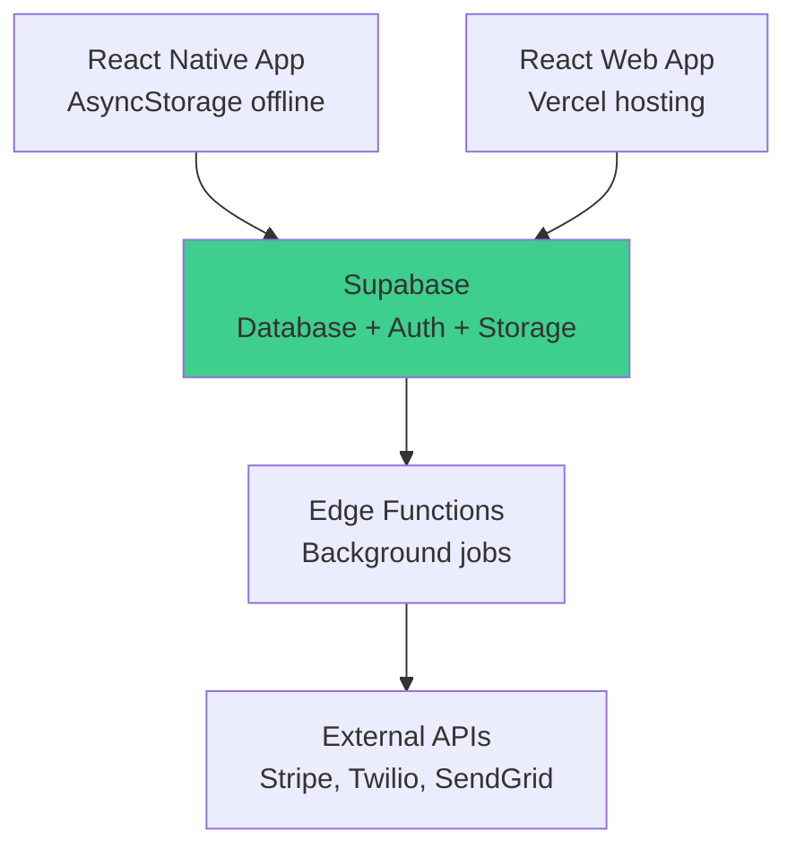

# RightFit Services - Simple Start Architecture

**Version:** FINAL - Start Building Today
**Date:** 2025-10-27
**Philosophy:** Ship fast, iterate based on real user feedback

---

## The Stack (Simple)

```
Mobile:    React Native + Expo + AsyncStorage
Web:       React + Vite + Vercel
Database:  Supabase (PostgreSQL + Auth + Storage + Realtime)
API:       Supabase Edge Functions (serverless)
Jobs:      Supabase Edge Functions (triggered by database events)
Payments:  Stripe
Email:     SendGrid (free tier 100/day)
SMS:       Twilio (pay per SMS)
```

**No WatermelonDB. No Railway. No Redis. No Terraform.**

---

## Monthly Cost

**MVP (0-50 users):** £0/month
- Supabase Free tier
- Vercel Free tier
- Expo Free tier
- SendGrid Free tier
- Stripe (pay per transaction only)

**Growth (50-100 users):** ~£100/month
- Supabase Pro: £25
- Vercel Pro: £20
- Expo EAS: £29
- SendGrid: £15
- Twilio SMS: ~£20

**Revenue at 100 users × £15/month = £1,500/month**
**Profit = £1,400/month**

---

## Architecture Diagram



---

## Database Schema (Supabase)

```sql
-- Supabase handles auth.users table automatically
-- You just reference it

-- Tenants (landlord accounts)
CREATE TABLE tenants (
  id UUID PRIMARY KEY DEFAULT gen_random_uuid(),
  owner_id UUID REFERENCES auth.users(id) ON DELETE CASCADE,
  company_name TEXT,
  subscription_status TEXT DEFAULT 'TRIAL',
  trial_ends_at TIMESTAMPTZ DEFAULT NOW() + INTERVAL '14 days',
  stripe_customer_id TEXT,
  created_at TIMESTAMPTZ DEFAULT NOW()
);

-- Row Level Security
ALTER TABLE tenants ENABLE ROW LEVEL SECURITY;

CREATE POLICY "Users see own tenant" ON tenants
  FOR ALL USING (owner_id = auth.uid());

-- Properties
CREATE TABLE properties (
  id UUID PRIMARY KEY DEFAULT gen_random_uuid(),
  tenant_id UUID REFERENCES tenants(id) ON DELETE CASCADE,
  name TEXT NOT NULL,
  address_line1 TEXT NOT NULL,
  city TEXT NOT NULL,
  postcode TEXT NOT NULL,
  property_type TEXT NOT NULL,
  bedrooms INTEGER,
  bathrooms INTEGER,
  created_at TIMESTAMPTZ DEFAULT NOW()
);

ALTER TABLE properties ENABLE ROW LEVEL SECURITY;

CREATE POLICY "Tenant isolation" ON properties
  FOR ALL USING (
    tenant_id IN (SELECT id FROM tenants WHERE owner_id = auth.uid())
  );

-- Work Orders
CREATE TABLE work_orders (
  id UUID PRIMARY KEY DEFAULT gen_random_uuid(),
  tenant_id UUID REFERENCES tenants(id) ON DELETE CASCADE,
  property_id UUID REFERENCES properties(id) ON DELETE CASCADE,
  contractor_id UUID REFERENCES contractors(id),
  title TEXT NOT NULL,
  description TEXT,
  status TEXT DEFAULT 'OPEN',
  priority TEXT NOT NULL,
  category TEXT NOT NULL,
  created_at TIMESTAMPTZ DEFAULT NOW(),
  updated_at TIMESTAMPTZ DEFAULT NOW()
);

ALTER TABLE work_orders ENABLE ROW LEVEL SECURITY;

CREATE POLICY "Tenant isolation" ON work_orders
  FOR ALL USING (
    tenant_id IN (SELECT id FROM tenants WHERE owner_id = auth.uid())
  );

-- Contractors
CREATE TABLE contractors (
  id UUID PRIMARY KEY DEFAULT gen_random_uuid(),
  tenant_id UUID REFERENCES tenants(id) ON DELETE CASCADE,
  name TEXT NOT NULL,
  phone TEXT NOT NULL,
  email TEXT,
  specialties TEXT[],
  created_at TIMESTAMPTZ DEFAULT NOW()
);

ALTER TABLE contractors ENABLE ROW LEVEL SECURITY;

CREATE POLICY "Tenant isolation" ON contractors
  FOR ALL USING (
    tenant_id IN (SELECT id FROM tenants WHERE owner_id = auth.uid())
  );
```

---

## Offline Sync (Simple AsyncStorage)

```typescript
// apps/mobile/src/services/offline.ts
import AsyncStorage from '@react-native-async-storage/async-storage';
import NetInfo from '@react-native-community/netinfo';
import { supabase } from './supabase';

const QUEUE_KEY = 'offline_queue';

// Save work order (handles online/offline automatically)
export async function saveWorkOrder(workOrder: any) {
  const isConnected = await NetInfo.fetch().then(state => state.isConnected);

  if (isConnected) {
    // Online: save directly
    const { data, error } = await supabase
      .from('work_orders')
      .insert(workOrder)
      .select()
      .single();

    if (error) throw error;
    return data;
  } else {
    // Offline: queue for later
    const tempId = `temp_${Date.now()}`;
    const item = { ...workOrder, id: tempId };

    await addToQueue({ action: 'CREATE', table: 'work_orders', data: workOrder, tempId });
    await saveToLocalCache('work_orders', item);

    return item;
  }
}

// Add to offline queue
async function addToQueue(item: any) {
  const queue = await getQueue();
  queue.push(item);
  await AsyncStorage.setItem(QUEUE_KEY, JSON.stringify(queue));
}

// Get offline queue
async function getQueue() {
  const data = await AsyncStorage.getItem(QUEUE_KEY);
  return data ? JSON.parse(data) : [];
}

// Process queue when online
export async function syncOfflineChanges() {
  const queue = await getQueue();
  const failed = [];

  for (const item of queue) {
    try {
      if (item.action === 'CREATE') {
        const { data } = await supabase.from(item.table).insert(item.data).select().single();

        // Replace temp ID with real ID in local cache
        if (item.tempId && data) {
          await updateLocalCache(item.table, item.tempId, data.id);
        }
      }
    } catch (error) {
      console.error('Sync failed:', error);
      failed.push(item);
    }
  }

  // Keep failed items for retry
  await AsyncStorage.setItem(QUEUE_KEY, JSON.stringify(failed));
  return { synced: queue.length - failed.length, failed: failed.length };
}

// Auto-sync when connection restored
NetInfo.addEventListener(state => {
  if (state.isConnected) {
    syncOfflineChanges();
  }
});
```

**That's it. ~80 lines for offline sync.**

---

## Background Jobs (Supabase Edge Functions)

```typescript
// supabase/functions/process-photo/index.ts
import { serve } from 'https://deno.land/std@0.168.0/http/server.ts'
import { createClient } from 'https://esm.sh/@supabase/supabase-js@2'

serve(async (req) => {
  const { photoId } = await req.json()

  const supabase = createClient(
    Deno.env.get('SUPABASE_URL')!,
    Deno.env.get('SUPABASE_SERVICE_ROLE_KEY')!
  )

  // 1. Download photo from Supabase Storage
  const { data: photoData } = await supabase.storage
    .from('photos')
    .download(`${photoId}.jpg`)

  // 2. Send to external AI service (Google Vision API)
  const aiResponse = await fetch('https://vision.googleapis.com/v1/images:annotate', {
    method: 'POST',
    headers: { 'Content-Type': 'application/json' },
    body: JSON.stringify({
      requests: [{
        image: { content: await photoData.arrayBuffer() },
        features: [{ type: 'LABEL_DETECTION' }]
      }]
    })
  })

  const aiResult = await aiResponse.json()

  // 3. Save results to database
  await supabase.from('photos').update({
    ai_labels: aiResult.responses[0].labelAnnotations,
    processed: true
  }).eq('id', photoId)

  return new Response(JSON.stringify({ success: true }), {
    headers: { 'Content-Type': 'application/json' }
  })
})
```

**Deploy:**
```bash
supabase functions deploy process-photo
```

---

## Project Structure

```
rightfit-services/
├── apps/
│   ├── mobile/                 # React Native
│   │   ├── src/
│   │   │   ├── screens/        # Login, Properties, WorkOrders
│   │   │   ├── components/     # Reusable UI components
│   │   │   ├── services/       # Supabase client, offline sync
│   │   │   └── store/          # Redux (simple global state)
│   │   └── package.json
│   │
│   └── web/                    # React web app
│       ├── src/
│       │   ├── pages/          # Dashboard, Properties, etc
│       │   ├── components/
│       │   └── services/       # Supabase client
│       └── package.json
│
├── supabase/
│   ├── migrations/             # SQL migrations
│   │   └── 001_initial_schema.sql
│   └── functions/              # Edge Functions
│       ├── process-photo/
│       └── send-notification/
│
└── package.json                # Root (monorepo with workspaces)
```

---

## Development Workflow

```bash
# 1. Setup Supabase project
npx supabase init
npx supabase start  # Local Supabase

# 2. Run migrations
npx supabase db push

# 3. Start mobile app
cd apps/mobile
npm run start

# 4. Start web app
cd apps/web
npm run dev

# 5. Deploy to production
npx supabase link --project-ref <your-project-ref>
npx supabase db push --linked
vercel deploy  # Web app
eas build      # Mobile app
```

---

## Authentication (Supabase Built-in)

```typescript
// apps/mobile/src/services/auth.ts
import { supabase } from './supabase';

export async function signUp(email: string, password: string) {
  const { data, error } = await supabase.auth.signUp({ email, password });
  if (error) throw error;
  return data.user;
}

export async function signIn(email: string, password: string) {
  const { data, error } = await supabase.auth.signInWithPassword({ email, password });
  if (error) throw error;
  return data.session;
}

export async function signOut() {
  await supabase.auth.signOut();
}

// Get current user
export async function getCurrentUser() {
  const { data } = await supabase.auth.getUser();
  return data.user;
}
```

**No JWT logic. No password hashing. Supabase handles it.**

---

## Real-time Updates (Supabase Built-in)

```typescript
// apps/mobile/src/hooks/useWorkOrders.ts
import { useEffect, useState } from 'react';
import { supabase } from '../services/supabase';

export function useWorkOrders(propertyId: string) {
  const [workOrders, setWorkOrders] = useState([]);

  useEffect(() => {
    // Fetch initial data
    supabase.from('work_orders')
      .select('*')
      .eq('property_id', propertyId)
      .then(({ data }) => setWorkOrders(data || []));

    // Subscribe to changes
    const subscription = supabase
      .channel(`property_${propertyId}`)
      .on('postgres_changes', {
        event: '*',
        schema: 'public',
        table: 'work_orders',
        filter: `property_id=eq.${propertyId}`
      }, (payload) => {
        if (payload.eventType === 'INSERT') {
          setWorkOrders(prev => [...prev, payload.new]);
        } else if (payload.eventType === 'UPDATE') {
          setWorkOrders(prev => prev.map(w => w.id === payload.new.id ? payload.new : w));
        } else if (payload.eventType === 'DELETE') {
          setWorkOrders(prev => prev.filter(w => w.id !== payload.old.id));
        }
      })
      .subscribe();

    return () => subscription.unsubscribe();
  }, [propertyId]);

  return workOrders;
}
```

**Real-time updates with ~30 lines of code.**

---

## 12-Week Timeline (Realistic)

**Week 1: Setup**
- Supabase project
- React Native app skeleton
- React web app skeleton

**Week 2-3: Core CRUD**
- Properties (create, list, view)
- Work orders (create, list, view)
- Contractors (create, list)

**Week 4-5: Offline**
- AsyncStorage offline queue
- Sync logic when online
- Handle conflicts (simple last-write-wins)

**Week 6-7: Features**
- Photo upload to Supabase Storage
- Real-time work order updates
- Push notifications (Expo)

**Week 8-9: Integrations**
- Stripe subscriptions
- Twilio SMS for emergency work orders
- SendGrid email templates

**Week 10-11: Polish**
- Mobile UI/UX improvements
- Web dashboard
- Testing

**Week 12: Deploy**
- Vercel (web)
- Expo EAS (mobile)
- Beta users

---

## What You're NOT Building (Supabase Does It)

❌ Auth system (login, signup, password reset)
❌ JWT tokens
❌ File upload API
❌ WebSocket server for real-time
❌ Database backups
❌ HTTPS/SSL certificates
❌ API rate limiting (Supabase has built-in limits)

---

## What You ARE Building (Your IP)

✅ Offline sync logic (your competitive advantage)
✅ Work order workflows
✅ Contractor assignment
✅ Multi-tenant business rules
✅ Mobile UI/UX
✅ Integration with Stripe/Twilio/SendGrid
✅ Photo quality checks (later)

---

## First Step: Get Supabase Running Today

```bash
# 1. Create Supabase account (free)
# Go to supabase.com/dashboard

# 2. Create new project
# Name: rightfit-services
# Region: London (eu-west-2)

# 3. Copy your project URL and anon key

# 4. Create .env file
echo "SUPABASE_URL=https://xxxxx.supabase.co" > .env
echo "SUPABASE_ANON_KEY=your-anon-key" >> .env

# 5. Run the SQL schema above in Supabase SQL Editor

# Done. Your backend is ready.
```

---

## Success Criteria

✅ Ship MVP in 12 weeks
✅ £0/month until you have paying users
✅ Offline works (landlords can create work orders without signal)
✅ Real-time updates (contractor changes status, landlord sees it immediately)
✅ Secure (Supabase RLS prevents cross-tenant data access)

---

## When to Iterate

**Don't add complexity until users request it:**

- AsyncStorage too slow? → Then migrate to WatermelonDB
- Need custom API logic? → Then add Railway/Render
- Simple conflict resolution not enough? → Then build three-way merge
- Supabase Edge Functions too limited? → Then add dedicated background workers

**Ship simple. Iterate based on real feedback.**

---

**You can start coding today with this stack. Everything else is overthinking.**

