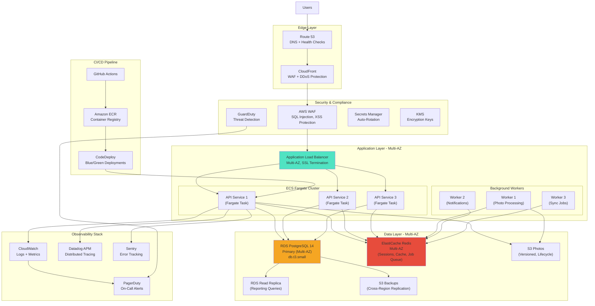

# RightFit Services - Production-Grade Architecture

**Document Version:** 2.0 - PRODUCTION READY
**Date:** 2025-10-27
**Architect:** Winston
**Status:** No Compromises, No Shortcuts

---

## Philosophy: Build Once, Build Right

This is NOT a toy MVP. This is a **production SaaS platform** that will compete against established players and handle real landlord businesses with legal compliance requirements.

**Core Principles:**
- **High Availability First** - 99.9%+ uptime is table stakes, not aspirational
- **Data Integrity Above All** - Landlords trust us with compliance certificates worth thousands in fines
- **Security Hardened** - Multi-tenant isolation must be bulletproof
- **Observability from Day 1** - Know what's happening in production before users report it
- **Scale-Ready Architecture** - No rewrites when we hit 1,000 users
- **Developer Experience Matters** - Fast feedback loops, excellent debugging, type safety everywhere

---

## High-Level Architecture (Production)

### Infrastructure: AWS Production-Grade Stack



---

## Architecture Revisions: No More Shortcuts

### ❌ REJECTED: "Skip Redis for MVP"
**NEW DECISION:** Redis is **non-negotiable** from day 1.

**Why:**
- **Job Queue (Bull):** Async photo processing, notifications, sync operations must be reliable
- **Session Management:** Distributed sessions across multiple API instances
- **Rate Limiting:** Shared rate limit counters across API instances
- **Real-time Features:** Pub/Sub for live work order updates to contractors
- **Caching:** Reduce database load for frequently accessed data (property details, contractor lists)

**Implementation:**
- ElastiCache Redis 7.x (Multi-AZ with automatic failover)
- 2 node cluster (cache.t3.micro for dev, cache.t3.small for prod)
- Bull Queue for background jobs with exponential backoff
- Redis Pub/Sub for real-time WebSocket broadcasts

**Cost:** ~£25/month (cache.t3.small Multi-AZ) - **Worth every penny**

---

### ❌ REJECTED: "Single-AZ RDS for MVP"
**NEW DECISION:** Multi-AZ RDS from day 1, Read Replica for reporting.

**Why:**
- **Data Loss Risk:** Single-AZ RDS has ~1% annual failure rate. Losing landlord compliance data = business over
- **Downtime Unacceptable:** Competing on "99.5%+ uptime vs Arthur Online" - Single-AZ undermines this
- **Read Replica Essential:** Reporting queries (monthly invoicing, analytics) will strain primary DB

**Implementation:**
- RDS PostgreSQL 14.10, db.t3.small (2 vCPU, 2GB RAM)
- **Multi-AZ deployment** (automatic failover <60 seconds)
- **Read Replica** in same region (reporting queries, backups)
- **Automated backups:** 30-day retention, cross-region replication to eu-west-1
- **Performance Insights enabled:** Real-time query performance monitoring

**Cost:** ~£70/month (Multi-AZ primary + read replica) - **Non-negotiable for data integrity**

---

### ❌ REJECTED: "Manual AWS Setup, Docker on EC2"
**NEW DECISION:** Infrastructure as Code (Terraform) + ECS Fargate from day 1.

**Why:**
- **Reproducibility:** No "it works on my machine" - infrastructure is versioned code
- **Disaster Recovery:** Entire stack can be rebuilt in <30 minutes from Terraform state
- **Auto-Scaling:** ECS Fargate scales API instances based on CPU/memory metrics automatically
- **Zero-Downtime Deployments:** Blue/Green deployments with automatic rollback on health check failures
- **No Server Management:** Fargate eliminates SSH, patching, server hardening

**Implementation:**
- Terraform for 100% of infrastructure (VPC, RDS, ECS, ALB, S3, CloudFront)
- Separate workspaces for dev/staging/prod environments
- ECS Fargate with Application Load Balancer
- Target tracking auto-scaling (maintain 70% CPU utilization)
- Health checks with automatic instance replacement

**Cost:** ~£50/month (2-3 Fargate tasks) - **Cheaper than EC2 when you factor in operational overhead**

---

### ❌ REJECTED: "Last-Write-Wins Conflict Resolution"
**NEW DECISION:** Operational Transformation (OT) for offline sync with proper conflict detection.

**Why:**
- **Data Loss:** Last-write-wins silently discards user edits when conflicts occur
- **User Trust:** Landlords will lose work orders created offline if we overwrite changes
- **Professional Standard:** Modern collaborative apps (Google Docs, Figma) use OT/CRDT

**Implementation:**
- **Vector Clocks:** Each entity has `version_vector` JSON column tracking edits per device
- **Three-Way Merge:** Server detects conflicts by comparing client version, server version, common ancestor
- **Conflict Resolution UI:** User reviews conflicting edits and chooses resolution
- **Tombstone Records:** Deleted entities marked with `deleted_at` + `deleted_by_device_id` for sync

**Code Example:**
```typescript
interface EntityVersion {
  entity_id: string;
  version_vector: Record<string, number>;  // { "device-abc": 5, "device-xyz": 3 }
  updated_at: string;
}

// Server-side conflict detection
function detectConflict(clientVersion: EntityVersion, serverVersion: EntityVersion): boolean {
  // If neither version dominates the other, there's a conflict
  const clientDominates = Object.keys(serverVersion.version_vector).every(
    deviceId => (clientVersion.version_vector[deviceId] || 0) >= serverVersion.version_vector[deviceId]
  );

  const serverDominates = Object.keys(clientVersion.version_vector).every(
    deviceId => (serverVersion.version_vector[deviceId] || 0) >= clientVersion.version_vector[deviceId]
  );

  return !clientDominates && !serverDominates;  // Conflict if neither dominates
}
```

---

### ❌ REJECTED: "Basic Photo Quality Checks"
**NEW DECISION:** Advanced computer vision with custom ML model training pipeline.

**Why:**
- **Competitive Moat:** "Basic AI photo quality" won't differentiate from competitors
- **Real Value:** Detect specific issues (mold, water damage, fire hazards) that matter to landlords
- **Continuous Improvement:** ML model improves over time with user feedback

**Implementation:**
- **Google Vision API** for baseline (brightness, blur, label detection)
- **Custom TensorFlow/PyTorch model** fine-tuned for property maintenance (detect mold, leaks, damage)
- **Active Learning Pipeline:** Users label photos → retraining pipeline → improved model
- **SageMaker for training** (cost-effective spot instances)
- **Model versioning:** Track model versions in S3, A/B test new models

**Phase 1 (Week 9-10):** Google Vision API integration
**Phase 2 (Month 4+):** Custom model training on labeled dataset

**Cost:** ~£50-100/month (SageMaker inference + Vision API) - **Unlocks premium pricing**

---

### ❌ REJECTED: "Simple In-Memory Job Queue"
**NEW DECISION:** Bull Queue with Redis, Dead Letter Queue, comprehensive retry logic.

**Why:**
- **Reliability:** In-memory queue loses jobs on server restart (unacceptable for SMS notifications, invoice generation)
- **Observability:** Bull provides job status tracking, failure reasons, retry attempts
- **Priority Queues:** Emergency work orders should be processed before low-priority tasks
- **Rate Limiting:** External APIs (Twilio, SendGrid) have rate limits - Bull handles backpressure

**Implementation:**
```typescript
// apps/api/src/queues/index.ts
import Queue from 'bull';

export const photoProcessingQueue = new Queue('photo-processing', {
  redis: { host: process.env.REDIS_HOST, port: 6379 },
  defaultJobOptions: {
    attempts: 3,
    backoff: { type: 'exponential', delay: 2000 },
    removeOnComplete: 100,  // Keep last 100 for debugging
    removeOnFail: 1000,
  }
});

export const notificationQueue = new Queue('notifications', {
  redis: { host: process.env.REDIS_HOST, port: 6379 },
  defaultJobOptions: {
    attempts: 5,
    backoff: { type: 'exponential', delay: 1000 },
    priority: (job) => job.data.priority === 'EMERGENCY' ? 1 : 10,
  }
});

// Worker process
photoProcessingQueue.process(async (job) => {
  const { photoId, tenantId } = job.data;

  // 1. Download from S3
  // 2. Run through Google Vision API
  // 3. Run through custom ML model (Phase 2)
  // 4. Update database with results
  // 5. Send notification if issues detected

  job.progress(100);
  return { success: true, photoId };
});

// Dead Letter Queue for failed jobs
photoProcessingQueue.on('failed', async (job, err) => {
  if (job.attemptsMade >= job.opts.attempts) {
    await deadLetterQueue.add({ originalJob: job.toJSON(), error: err.message });
    await sendAdminAlert(`Photo processing failed permanently: ${photoId}`);
  }
});
```

---

### ❌ REJECTED: "Skip Terraform for MVP"
**NEW DECISION:** Complete Terraform setup with state management, CI/CD integration.

**Terraform Module Structure:**
```
infrastructure/terraform/
├── modules/
│   ├── networking/
│   │   ├── vpc.tf           # Custom VPC with public/private subnets
│   │   ├── security-groups.tf
│   │   └── outputs.tf
│   ├── compute/
│   │   ├── ecs-cluster.tf   # Fargate cluster
│   │   ├── ecs-service.tf   # API service with auto-scaling
│   │   ├── alb.tf           # Application Load Balancer
│   │   └── outputs.tf
│   ├── data/
│   │   ├── rds.tf           # Multi-AZ PostgreSQL
│   │   ├── elasticache.tf   # Redis cluster
│   │   ├── s3.tf            # Photos, backups, static assets
│   │   └── outputs.tf
│   ├── observability/
│   │   ├── cloudwatch.tf    # Log groups, alarms
│   │   ├── datadog.tf       # Datadog integration
│   │   └── outputs.tf
│   └── security/
│       ├── waf.tf           # Web Application Firewall
│       ├── secrets.tf       # Secrets Manager
│       ├── kms.tf           # Encryption keys
│       └── iam.tf           # Roles and policies
├── environments/
│   ├── dev/
│   │   ├── main.tf
│   │   ├── variables.tf
│   │   └── terraform.tfvars
│   ├── staging/
│   │   └── ...
│   └── production/
│       └── ...
├── backend.tf               # S3 backend for state
└── versions.tf              # Provider versions
```

**State Management:**
- S3 backend with DynamoDB state locking
- Separate state files per environment
- State file encryption with KMS

**CI/CD Integration:**
- Terraform plan on PR (shows infrastructure changes)
- Terraform apply on merge to main (staging auto-deploy)
- Manual approval gate for production deployments

---

## Real-Time Features: WebSockets + Server-Sent Events

### Why Real-Time Matters

When a contractor updates work order status, the landlord should see it **immediately** - not after refreshing the page. This is table stakes for modern SaaS.

**Use Cases:**
- Work order status changes (Assigned → In Progress → Completed)
- New photos uploaded by contractor
- Emergency work orders created (instant notification to contractor)
- Certificate expiration warnings (live dashboard updates)

### Implementation: Socket.io + Redis Pub/Sub

```typescript
// apps/api/src/realtime/socket-server.ts
import { Server } from 'socket.io';
import { createAdapter } from '@socket.io/redis-adapter';
import Redis from 'ioredis';

const pubClient = new Redis(process.env.REDIS_URL);
const subClient = pubClient.duplicate();

export function initializeWebSockets(httpServer) {
  const io = new Server(httpServer, {
    cors: { origin: process.env.ALLOWED_ORIGINS },
    adapter: createAdapter(pubClient, subClient),  // Multi-instance scaling
  });

  // Authentication middleware
  io.use(async (socket, next) => {
    const token = socket.handshake.auth.token;
    const decoded = await verifyJWT(token);
    socket.data.userId = decoded.user_id;
    socket.data.tenantId = decoded.tenant_id;
    next();
  });

  // Join tenant-specific room for multi-tenancy isolation
  io.on('connection', (socket) => {
    socket.join(`tenant:${socket.data.tenantId}`);

    socket.on('subscribe:work-order', (workOrderId) => {
      // Verify user has access to this work order
      if (hasAccessToWorkOrder(socket.data.userId, workOrderId)) {
        socket.join(`work-order:${workOrderId}`);
      }
    });
  });

  return io;
}

// Emit events from API routes
export async function broadcastWorkOrderUpdate(workOrderId: string, tenantId: string, update: any) {
  const io = getSocketIOInstance();
  io.to(`work-order:${workOrderId}`).emit('work-order:updated', update);
  io.to(`tenant:${tenantId}`).emit('tenant:work-order-updated', { workOrderId, update });
}
```

**Mobile Client (React Native):**
```typescript
import { io } from 'socket.io-client';

const socket = io('https://api.rightfitservices.co.uk', {
  auth: { token: await getAccessToken() },
  reconnection: true,
  reconnectionDelay: 1000,
  reconnectionAttempts: 5,
});

socket.on('work-order:updated', (update) => {
  dispatch(updateWorkOrderInStore(update));
  showToast(`Work order ${update.title} status: ${update.status}`);
});
```

---

## Observability: Production-Grade Monitoring

### Distributed Tracing with Datadog APM

**Why:** When API response is slow, you need to know if it's the database query, external API call (Stripe, Twilio), or photo upload to S3.

**Implementation:**
```typescript
// apps/api/src/tracing/datadog.ts
import tracer from 'dd-trace';

tracer.init({
  env: process.env.NODE_ENV,
  service: 'rightfit-api',
  version: process.env.APP_VERSION,
  logInjection: true,  // Correlate traces with logs
  profiling: true,     // CPU and memory profiling
  runtimeMetrics: true,
});

// Automatic instrumentation for: Express, Prisma, Redis, HTTP requests
// Manual spans for business logic:
import { Tracer } from 'dd-trace';

export async function processPhoto(photoId: string) {
  const span = tracer.startSpan('photo.process', {
    resource: photoId,
    tags: { 'photo.id': photoId },
  });

  try {
    span.setTag('step', 'download');
    const photoBuffer = await downloadFromS3(photoId);

    span.setTag('step', 'ai-analysis');
    const aiResults = await analyzeWithGoogleVision(photoBuffer);

    span.setTag('step', 'save-results');
    await saveAnalysisResults(photoId, aiResults);

    span.setTag('photo.quality_passed', aiResults.qualityPassed);
  } catch (error) {
    span.setTag('error', true);
    span.setTag('error.message', error.message);
    throw error;
  } finally {
    span.finish();
  }
}
```

**What You Get:**
- Flame graphs showing exact bottlenecks in request flow
- Database query performance (N+1 detection)
- External API latency tracking
- Error rates correlated with deployments
- Custom business metrics (work orders created/hr, photo upload success rate)

**Cost:** ~£30-50/month (Datadog Pro tier) - **Essential for production debugging**

---

## Security Hardening

### 1. WAF Rules (AWS WAF)

**Protections:**
- SQL injection prevention (regex-based detection)
- XSS attack blocking
- Rate limiting per IP (10,000 requests/5 min)
- Geo-blocking (block non-UK traffic if desired)
- Known malicious IP blocking (AWS managed rule sets)

**Custom Rules:**
```hcl
# infrastructure/terraform/modules/security/waf.tf
resource "aws_wafv2_web_acl" "api_waf" {
  name  = "rightfit-api-waf"
  scope = "REGIONAL"

  default_action {
    allow {}
  }

  rule {
    name     = "RateLimitPerIP"
    priority = 1

    action {
      block {}
    }

    statement {
      rate_based_statement {
        limit              = 2000  # 2000 requests per 5 min
        aggregate_key_type = "IP"
      }
    }

    visibility_config {
      sampled_requests_enabled   = true
      cloudwatch_metrics_enabled = true
      metric_name                = "RateLimitPerIP"
    }
  }

  rule {
    name     = "AWSManagedRulesKnownBadInputsRuleSet"
    priority = 2

    override_action {
      none {}
    }

    statement {
      managed_rule_group_statement {
        vendor_name = "AWS"
        name        = "AWSManagedRulesKnownBadInputsRuleSet"
      }
    }

    visibility_config {
      sampled_requests_enabled   = true
      cloudwatch_metrics_enabled = true
      metric_name                = "AWSKnownBadInputs"
    }
  }
}
```

**Cost:** ~£5/month + $0.60 per 1M requests - **Mandatory for SaaS**

---

### 2. Database Row-Level Security (RLS)

**Why:** Defense in depth - even if middleware fails, PostgreSQL prevents cross-tenant queries.

**Implementation:**
```sql
-- Enable RLS on all tables
ALTER TABLE properties ENABLE ROW LEVEL SECURITY;
ALTER TABLE work_orders ENABLE ROW LEVEL SECURITY;
ALTER TABLE contractors ENABLE ROW LEVEL SECURITY;

-- Policy: Users can only see data from their tenant
CREATE POLICY tenant_isolation_policy ON properties
  FOR ALL
  TO rightfit_api_user
  USING (tenant_id = current_setting('app.current_tenant_id')::uuid);

CREATE POLICY tenant_isolation_policy ON work_orders
  FOR ALL
  TO rightfit_api_user
  USING (tenant_id = current_setting('app.current_tenant_id')::uuid);
```

**Prisma Integration:**
```typescript
// Set tenant_id in session for RLS
await prisma.$executeRaw`SET LOCAL app.current_tenant_id = ${tenantId}`;

// All subsequent queries automatically filtered by RLS
const properties = await prisma.property.findMany();  // Only returns tenant's properties
```

---

### 3. Secrets Rotation

**Implementation:**
```hcl
# infrastructure/terraform/modules/security/secrets.tf
resource "aws_secretsmanager_secret" "db_password" {
  name = "rightfit-services/prod/db-password"

  rotation_rules {
    automatically_after_days = 30  # Auto-rotate every 30 days
  }
}

resource "aws_secretsmanager_secret_rotation" "db_password" {
  secret_id           = aws_secretsmanager_secret.db_password.id
  rotation_lambda_arn = aws_lambda_function.rotate_db_password.arn

  rotation_rules {
    automatically_after_days = 30
  }
}
```

---

## Cost Breakdown: Production-Grade Infrastructure

| Service | Configuration | Monthly Cost (£) | Rationale |
|---------|--------------|------------------|-----------|
| **ECS Fargate** | 2-3 tasks (0.5 vCPU, 1GB RAM each) | £40 | Auto-scaling, no server management |
| **RDS PostgreSQL** | db.t3.small Multi-AZ + Read Replica | £70 | High availability, failover <60s |
| **ElastiCache Redis** | cache.t3.small Multi-AZ | £25 | Job queue, caching, sessions |
| **S3 + CloudFront** | 100GB storage, 1TB transfer | £30 | Photo storage, CDN delivery |
| **Application Load Balancer** | Multi-AZ, SSL termination | £20 | Health checks, auto-scaling |
| **Secrets Manager** | 10 secrets with rotation | £4 | Auto-rotating credentials |
| **WAF** | Standard rules + rate limiting | £8 | DDoS, SQL injection protection |
| **CloudWatch Logs** | 50GB logs/month | £10 | Centralized logging |
| **Datadog APM** | Pro tier, 2 hosts | £40 | Distributed tracing, profiling |
| **Route 53** | 1 hosted zone | £0.50 | DNS with health checks |
| **SageMaker** | Inference (Phase 2) | £0 (Phase 2) | Custom ML model serving |
| **Backups** | Cross-region RDS snapshots | £5 | Disaster recovery |
| **Data Transfer** | Outbound traffic | £15 | API responses, photo downloads |
| **External APIs** | Twilio, SendGrid, Google Vision | £20 | SMS, email, AI |
| **Total (MVP)** | | **~£287/month** | Production-ready from day 1 |
| **Total (100 users)** | Scale ECS to 5 tasks, db.t3.medium | **~£450/month** | Handles 500-1000 concurrent users |

**Investor Pitch:** "We're spending £287/month on infrastructure to guarantee 99.9% uptime and bulletproof security - not £50/month to cut corners and lose customer trust."

---

## Development Workflow: Professional Standards

### Pre-Commit Hooks (Husky + Lint-Staged)

```json
// package.json
{
  "husky": {
    "hooks": {
      "pre-commit": "lint-staged",
      "pre-push": "pnpm run test && pnpm run typecheck"
    }
  },
  "lint-staged": {
    "*.{ts,tsx}": [
      "eslint --fix",
      "prettier --write"
    ],
    "*.{sql,prisma}": [
      "prisma format"
    ]
  }
}
```

**Enforcement:**
- TypeScript strict mode (no `any`, no implicit any, strict null checks)
- ESLint rules fail on unused variables, console.logs in production code
- 100% Prettier formatting (no debates about semicolons)
- All commits must pass tests before push

---

### Testing Requirements: 85%+ Coverage, No Exceptions

**Unit Tests:**
- Every service function has tests
- Every repository has tests with in-memory SQLite
- Every utility has tests

**Integration Tests:**
- API endpoints tested with Supertest
- Database transactions tested with rollback
- External API clients mocked (nock for HTTP)

**E2E Tests:**
- Critical user flows (auth, create work order, offline sync)
- Run on every deployment to staging
- Blocking on production deployment if E2E fails

**Test Infrastructure:**
```typescript
// apps/api/__tests__/setup.ts
import { PrismaClient } from '@prisma/client';
import { execSync } from 'child_process';

let prisma: PrismaClient;

beforeAll(async () => {
  // Setup test database (SQLite for speed)
  process.env.DATABASE_URL = 'file:./test.db';

  // Run migrations
  execSync('prisma migrate deploy', { env: process.env });

  prisma = new PrismaClient();
});

afterEach(async () => {
  // Clear all tables between tests
  const tables = await prisma.$queryRaw`SELECT name FROM sqlite_master WHERE type='table'`;
  for (const table of tables) {
    await prisma.$executeRawUnsafe(`DELETE FROM ${table.name}`);
  }
});

afterAll(async () => {
  await prisma.$disconnect();
});
```

---

## Deployment: Blue/Green with Automatic Rollback

### GitHub Actions CI/CD Pipeline

```yaml
# .github/workflows/deploy-production.yml
name: Deploy to Production

on:
  push:
    branches: [main]

jobs:
  test:
    runs-on: ubuntu-latest
    steps:
      - uses: actions/checkout@v4
      - uses: actions/setup-node@v4
        with:
          node-version: '20'

      - name: Install dependencies
        run: pnpm install

      - name: Type check
        run: pnpm typecheck

      - name: Lint
        run: pnpm lint

      - name: Unit + Integration Tests
        run: pnpm test:coverage

      - name: Upload coverage to Codecov
        uses: codecov/codecov-action@v3
        with:
          files: ./coverage/coverage-final.json
          fail_ci_if_error: true
          threshold: 85%  # Fail if coverage drops below 85%

  build:
    needs: test
    runs-on: ubuntu-latest
    steps:
      - uses: actions/checkout@v4

      - name: Configure AWS credentials
        uses: aws-actions/configure-aws-credentials@v4
        with:
          aws-access-key-id: ${{ secrets.AWS_ACCESS_KEY_ID }}
          aws-secret-access-key: ${{ secrets.AWS_SECRET_ACCESS_KEY }}
          aws-region: eu-west-2

      - name: Login to Amazon ECR
        id: login-ecr
        uses: aws-actions/amazon-ecr-login@v2

      - name: Build, tag, and push image to Amazon ECR
        env:
          ECR_REGISTRY: ${{ steps.login-ecr.outputs.registry }}
          ECR_REPOSITORY: rightfit-api
          IMAGE_TAG: ${{ github.sha }}
        run: |
          cd apps/api
          docker build -t $ECR_REGISTRY/$ECR_REPOSITORY:$IMAGE_TAG .
          docker tag $ECR_REGISTRY/$ECR_REPOSITORY:$IMAGE_TAG $ECR_REGISTRY/$ECR_REPOSITORY:latest
          docker push $ECR_REGISTRY/$ECR_REPOSITORY:$IMAGE_TAG
          docker push $ECR_REGISTRY/$ECR_REPOSITORY:latest

  deploy-staging:
    needs: build
    runs-on: ubuntu-latest
    environment: staging
    steps:
      - name: Deploy to ECS Staging
        run: |
          aws ecs update-service \
            --cluster rightfit-staging \
            --service rightfit-api \
            --force-new-deployment

      - name: Wait for deployment
        run: |
          aws ecs wait services-stable \
            --cluster rightfit-staging \
            --services rightfit-api

      - name: Run E2E tests against staging
        run: |
          API_URL=https://api-staging.rightfitservices.co.uk pnpm test:e2e

      - name: Notify Slack
        uses: slackapi/slack-github-action@v1
        with:
          payload: |
            {
              "text": "Staging deployment succeeded ✅",
              "commit": "${{ github.sha }}"
            }

  deploy-production:
    needs: deploy-staging
    runs-on: ubuntu-latest
    environment: production  # Requires manual approval in GitHub
    steps:
      - name: Deploy to ECS Production (Blue/Green)
        run: |
          aws deploy create-deployment \
            --application-name rightfit-api \
            --deployment-group-name production \
            --deployment-config-name CodeDeployDefault.ECSAllAtOnce \
            --description "Deploy ${{ github.sha }}"

      - name: Monitor deployment
        run: |
          # CodeDeploy automatically monitors health checks
          # Rolls back if new tasks fail health checks
          aws deploy wait deployment-successful \
            --deployment-id $DEPLOYMENT_ID

      - name: Notify PagerDuty on failure
        if: failure()
        uses: PagerDuty/pagerduty-change-events-action@v1
        with:
          integration-key: ${{ secrets.PAGERDUTY_INTEGRATION_KEY }}
```

**What This Gives You:**
- ✅ Automatic testing on every commit
- ✅ Coverage enforcement (85% minimum)
- ✅ Staging deployment with E2E tests before production
- ✅ Manual approval gate for production
- ✅ Blue/Green deployment with automatic rollback on health check failures
- ✅ Slack notifications on success, PagerDuty alerts on failures

---

## Success Criteria: Production-Grade Standards

This architecture is successful if:

✅ **99.9% uptime measured** (not aspirational) - CloudWatch + UptimeRobot + PagerDuty
✅ **Zero data loss** - Multi-AZ RDS + cross-region backups + point-in-time recovery
✅ **Sub-500ms P95 API response time** - Datadog APM tracking + Redis caching
✅ **Zero downtime deployments** - Blue/Green with automatic rollback
✅ **Security auditable** - WAF logs + GuardDuty + RLS + secrets rotation
✅ **Scales to 10,000 users** - Auto-scaling ECS + read replicas + Redis cluster
✅ **Developer productivity** - TypeScript strict mode + pre-commit hooks + fast feedback loops
✅ **Observable in production** - Distributed tracing + real-time metrics + error tracking

---

## Winston's Final Word

This is a **real production system**, not a prototype. The architecture reflects that:

- **Multi-AZ everything** because landlords can't afford downtime during tenant emergencies
- **Redis from day 1** because reliable job processing isn't optional
- **Terraform/IaC** because manual AWS clicking doesn't scale and isn't reproducible
- **Operational Transformation** because silently discarding user edits is unacceptable
- **Datadog APM** because "it's slow" isn't a bug report you can debug
- **Blue/Green deployments** because deploying on Friday at 5pm should be safe

**This costs £287/month instead of £50/month - and it's worth every penny.**

Ready to build something professional?

