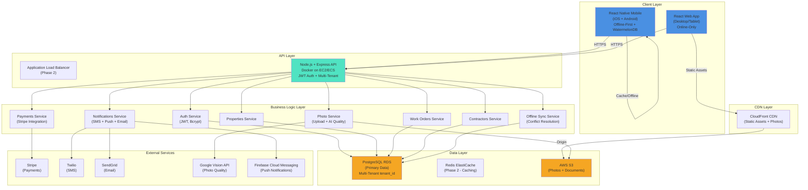

# RightFit Services Fullstack Architecture Document

**Document Version:** 1.0
**Date:** 2025-10-27
**Architect:** Winston
**Project:** RightFit Services - Property Maintenance SaaS Platform

---

## Table of Contents

1. [Introduction](#introduction)
2. [High Level Architecture](#high-level-architecture)
3. [Tech Stack](#tech-stack)
4. [Data Models](#data-models)
5. [API Specification](#api-specification)
6. [Components](#components)
7. [External APIs](#external-apis)
8. [Core Workflows](#core-workflows)
9. [Database Schema](#database-schema)
10. [Frontend Architecture](#frontend-architecture)
11. [Backend Architecture](#backend-architecture)
12. [Unified Project Structure](#unified-project-structure)
13. [Development Workflow](#development-workflow)
14. [Deployment Architecture](#deployment-architecture)
15. [Security and Performance](#security-and-performance)
16. [Testing Strategy](#testing-strategy)
17. [Coding Standards](#coding-standards)
18. [Error Handling Strategy](#error-handling-strategy)
19. [Monitoring and Observability](#monitoring-and-observability)

---

## Introduction

### Starter Template or Existing Project

**N/A - Greenfield Project**

This is a greenfield project with no existing codebase. Given the critical offline-first requirement and tight cost constraints, we are building from scratch with carefully selected libraries rather than adapting a fullstack starter template.

**Rationale:** Most fullstack starters lack mature offline-sync patterns. Building custom ensures:
- **Offline-first correctness** from day 1 (critical differentiator)
- **Cost optimization** (no unnecessary dependencies)
- **Solo developer efficiency** (no learning curve for opinionated starters)

### Change Log

| Date | Version | Description | Author |
|------|---------|-------------|--------|
| 2025-10-28 | 1.1 | Tech stack migration decision: React 19→18.3.1, Node 24→20 LTS | Winston (Architect) |
| 2025-10-27 | 1.0 | Initial architecture document | Winston (Architect) |

### Document Overview

This document outlines the complete fullstack architecture for **RightFit Services MVP** - a reliable, mobile-first property maintenance platform targeting UK landlords managing 1-50 long-term let properties.

**Project Context:**
- **Timeline**: 3 months (12 weeks), solo full-stack developer
- **Budget**: £2k-5k MVP, <£200/month AWS operational at 100 users
- **Positioning**: "Arthur Online's features without the outages, at half the price"
- **Critical Differentiators**:
  - Offline-first mobile (works in rural properties without signal)
  - 99.5%+ uptime target (reliability vs. Arthur Online)
  - Basic AI photo quality checks at affordable price point (£15-25/month)

This unified architecture combines backend systems, frontend implementation, and their integration to serve as the single source of truth for AI-driven development.

---

## High Level Architecture

### Technical Summary

RightFit Services is a **modular monolith** with mobile-first architecture deployed on AWS. The system consists of:

- **Frontend**: React Native mobile apps (iOS/Android) with offline-first sync, React web app for desktop users
- **Backend**: Node.js + Express REST API with Prisma ORM, deployed as Docker containers on EC2 (MVP) with migration path to ECS Fargate
- **Data Layer**: PostgreSQL (AWS RDS) for primary data with tenant_id-based multi-tenancy, Redis (optional Phase 2) for caching
- **Storage**: AWS S3 for photos/documents, CloudFront CDN for delivery
- **Integration**: Stripe (payments), Twilio (SMS), SendGrid (email), Google Vision API (photo quality checks), Firebase Cloud Messaging (push notifications)

**Key Architecture Decisions:**
1. **Modular Monolith over Microservices**: Solo developer + 3-month timeline requires simple deployment. Monolith with clear module boundaries enables future extraction if needed.
2. **Offline-First Mobile**: Local SQLite + sync queue pattern with conflict resolution (last-write-wins for MVP).
3. **Cost-Optimized AWS**: Single EC2 t3.small + RDS db.t3.micro + S3/CloudFront keeps costs <£50/month at MVP scale.
4. **Multi-Tenant Shared Database**: Single PostgreSQL instance with tenant_id filtering (vs. database-per-tenant) for cost efficiency.

This architecture achieves the PRD's goals: buildable by solo developer in 12 weeks, scales to 500-1,000 users without major rewrites, costs <£200/month at 100 users, and delivers 99.5%+ uptime.

### Platform and Infrastructure Choice

**Platform:** AWS (eu-west-2 London Region)

**Rationale:**
- **UK Data Residency**: GDPR compliance requires data stored in UK
- **Proven Reliability**: AWS uptime SLA supports 99.5%+ target
- **Cost-Effective Scaling**: Pay-as-you-grow from MVP to scale
- **Comprehensive Services**: RDS, S3, CloudFront, SES, Lambda available for future needs

**Key Services:**
- **Compute**: EC2 t3.small (2 vCPU, 2GB RAM) for MVP → ECS Fargate for scale
- **Database**: RDS PostgreSQL 14+ db.t3.micro (1GB RAM) → db.t3.small at 100+ users
- **Storage**: S3 Standard for photos/docs, S3 Intelligent-Tiering for older files
- **CDN**: CloudFront (free tier 1TB/month, 10M requests)
- **DNS**: Route 53
- **Monitoring**: CloudWatch Logs + Alarms
- **Secrets**: AWS Secrets Manager for DB credentials, API keys

**Deployment Host and Regions:**
- **Primary Region**: eu-west-2 (London) - All user data
- **Single-AZ for MVP** (cost savings), **Multi-AZ for production** (high availability)
- No multi-region deployment for MVP (UK-only market)

**Alternative Considered:** Vercel + Supabase would be faster for web-first, but React Native + offline-sync requirements favor AWS control and flexibility.

### Repository Structure

**Structure:** Monorepo

**Monorepo Tool:** Turborepo

**Rationale:**
- **Code Sharing**: TypeScript interfaces, constants, utilities shared between mobile, web, API
- **Unified Builds**: Single CI/CD pipeline for all apps
- **Solo Developer DX**: One repository, one `npm install`, simpler mental model
- **Future Scaling**: Turborepo's caching speeds up builds as codebase grows

**Package Organization:**
```
rightfit-services/
├── apps/
│   ├── mobile/          # React Native (iOS + Android)
│   ├── web/             # React web app
│   └── api/             # Node.js + Express backend
├── packages/
│   ├── shared/          # Shared types, constants, utilities
│   ├── ui/              # Shared UI components (web + mobile compatible)
│   └── database/        # Prisma schema + migrations
```

**Package Strategy:**
- **apps/mobile**: React Native app, targets iOS 14+ and Android 10+, offline-first with WatermelonDB
- **apps/web**: React SPA, uses same shared types/logic as mobile for consistency
- **apps/api**: Node.js REST API, Prisma ORM, handles multi-tenancy filtering
- **packages/shared**: TypeScript interfaces (User, Property, WorkOrder, etc.), Zod schemas for validation, shared business logic
- **packages/ui**: Component library where possible (React Native Paper for mobile, MUI for web - limited cross-platform reuse)
- **packages/database**: Prisma schema, migrations, seed data

### High Level Architecture Diagram



### Architectural Patterns

- **Modular Monolith**: Clear module boundaries (Auth, Properties, WorkOrders, Contractors, Notifications, Photos, Payments) within single deployable unit. _Rationale:_ Solo developer simplicity, easy debugging, can extract microservices later if needed.

- **Offline-First Mobile (Sync Pattern)**: Mobile app uses local SQLite database (via WatermelonDB), sync queue for offline actions, automatic sync when online. _Rationale:_ Critical differentiator for rural properties, proven pattern for field service apps.

- **Repository Pattern (Backend)**: Abstract data access behind repository interfaces (PropertiesRepository, WorkOrdersRepository). _Rationale:_ Testability, future database migration flexibility, clear separation of concerns.

- **Multi-Tenancy via tenant_id**: Every database row includes tenant_id (landlord account ID), middleware injects tenant_id into all queries. _Rationale:_ Cost-effective (single database), simpler than database-per-tenant, adequate security for MVP.

- **API Gateway Pattern (Phase 2)**: For MVP, single Express app handles all requests. Phase 2: Extract API Gateway for rate limiting, request routing, centralized auth. _Rationale:_ YAGNI for MVP, add when scaling to 500+ users.

- **Event-Driven Background Jobs**: Work orders, notifications, photo processing handled asynchronously via in-memory job queue (Bull + Redis in Phase 2, simple setImmediate for MVP). _Rationale:_ Non-blocking API responses, reliable delivery of SMS/push notifications.

- **Optimistic UI Updates**: Mobile app shows changes immediately, syncs in background. If sync fails, rollback with user notification. _Rationale:_ Perceived performance, critical for offline-first UX.

---

## Tech Stack

### Technology Stack Table

| Category | Technology | Version | Purpose | Rationale |
|----------|-----------|---------|---------|-----------|
| **Frontend Language** | TypeScript | 5.3+ | Type-safe frontend development | Catch bugs at compile-time, shared types with backend, required for Prisma |
| **Frontend Framework (Mobile)** | React Native | 0.73+ | iOS + Android native apps | 70-80% code sharing, mature offline libraries (WatermelonDB), proven for property management apps |
| **Frontend Framework (Web)** | React | 18.3.1 | Web application | **UPDATED (2025-10-28):** Stable LTS version - Downgraded from React 19 to eliminate compatibility issues. Consistency with React Native, shared business logic, strong ecosystem |
| **UI Component Library (Mobile)** | React Native Paper | 5.x | Material Design for mobile | Out-of-the-box accessible components, reduces custom design time for solo dev |
| **UI Component Library (Web)** | Material-UI (MUI) | 5.x | Material Design for web | Visual consistency with mobile, comprehensive component library |
| **State Management** | Redux Toolkit | 2.x | Global state management | Redux Persist for offline sync state, Redux Toolkit simplifies boilerplate, proven pattern |
| **Offline Database (Mobile)** | WatermelonDB | 0.27+ | Local SQLite with sync | Built for React Native offline-first apps, automatic sync queue, lazy loading |
| **Backend Language** | TypeScript | 5.3+ | Type-safe backend development | Consistency with frontend, Prisma requires TypeScript, catch bugs early |
| **Backend Framework** | Node.js + Express | 20 LTS + 4.x | REST API server | **UPDATED (2025-10-28):** Node 20 LTS (stable until 2026) - Downgraded from Node 24 for stability. Proven, lightweight, excellent async performance for I/O-heavy workloads |
| **API Style** | REST | - | RESTful API endpoints | Simpler than GraphQL for MVP, easier for external integrations, standard HTTP |
| **ORM** | Prisma | 5.x | Database access layer | Best TypeScript ORM, migrations, type-safe queries, code generation |
| **Validation** | Zod | 3.x | Runtime schema validation | TypeScript-first, shared schemas between frontend/backend, runtime type checking |
| **Database** | PostgreSQL | 14+ | Primary relational database | ACID compliance, JSON support, mature, cost-effective, excellent multi-tenancy support |
| **Cache** | Skip for MVP | - | Session/query caching | Cost optimization: Skip Redis for MVP, add ElastiCache when 100+ users |
| **File Storage** | AWS S3 | - | Photos and documents | Durable, cheap (£0.023/GB/month), integrates with CloudFront |
| **Authentication** | JWT + Bcrypt | jsonwebtoken 9.x, bcrypt 5.x | Stateless auth tokens | Industry standard, no session store needed, refresh token rotation |
| **Frontend Testing** | Jest + React Testing Library | 29.x + 14.x | Unit/integration tests | React ecosystem standard, test user behavior not implementation |
| **Backend Testing** | Jest + Supertest | 29.x + 6.x | API integration tests | Mock external APIs, test endpoints end-to-end |
| **E2E Testing** | Detox (mobile) + Playwright (web) | 20.x + 1.40+ | End-to-end tests | Detox for React Native, Playwright for web, automate critical flows |
| **Build Tool** | Turborepo | 1.11+ | Monorepo build orchestration | Caching, task dependencies, parallel builds for monorepo |
| **Bundler (Web)** | Vite | 5.x | Fast web dev builds | Fast HMR, optimized production builds |
| **Mobile Build** | Expo | 50+ | React Native build toolchain | Simplifies iOS/Android builds, over-the-air updates, easier solo dev workflow |
| **IaC Tool** | Terraform (Phase 2) | - | Infrastructure as Code | MVP: Manual AWS setup. Phase 2: Terraform for reproducible infra |
| **CI/CD** | GitHub Actions | - | Automated testing + deployment | Free for private repos (2,000 min/month), native GitHub integration |
| **Error Monitoring** | Sentry | Free tier | Real-time error tracking | 5k events/month free, source maps, React Native support |
| **Logging** | AWS CloudWatch Logs | - | Centralized logging | Native AWS integration, log aggregation, alarms |
| **Uptime Monitoring** | UptimeRobot | Free tier | API health checks | 50 monitors free, 5-min intervals, public status page (transparency) |
| **CSS Framework (Web)** | Tailwind CSS | 3.x | Utility-first styling | Rapid UI development, works well with MUI, small bundle size |

**Key Technology Trade-offs:**

1. **React Native + Expo vs. Native iOS/Android**: Expo chosen for 70-80% code sharing and solo developer speed. Trade-off: Larger app size, some native modules require ejecting.

2. **Prisma vs. TypeORM**: Prisma chosen for best-in-class TypeScript DX and migrations. Trade-off: Less mature than TypeORM for complex queries, but adequate for MVP.

3. **REST vs. GraphQL vs. tRPC**: REST chosen for simplicity and external integration ease. Trade-off: More endpoints to maintain vs. GraphQL's flexible queries. tRPC considered but adds learning curve.

4. **WatermelonDB vs. Redux Persist + AsyncStorage**: WatermelonDB chosen for mature offline-sync pattern with SQLite. Trade-off: More complex setup than simple AsyncStorage, but critical for data integrity.

5. **Skip Redis for MVP**: Cost optimization. Add caching when 100+ users strain database. Trade-off: Slower API responses (acceptable for MVP).

---

## Data Models

Core business entities are defined with TypeScript interfaces for type safety across the stack:

- **User** - Landlords, contractors, admin users with role-based access
- **Tenant** - Landlord account (multi-tenancy isolation unit)
- **Property** - Houses, flats, cabins, HMOs
- **WorkOrder** - Maintenance tasks with status workflow
- **Contractor** - Tradesperson database (duplicated per tenant for MVP)
- **Photo** - Work order and property photos with AI quality checks
- **Certificate** - Compliance certificates (Gas Safety, Electrical, EPC, STL)
- **SyncQueue** - Mobile offline sync queue (local only)

**Detailed schemas, relationships, and TypeScript interfaces:** See [`architecture/database-schema.md`](./architecture/database-schema.md)

**Key Design Decisions:**
- Multi-tenancy via `tenant_id` column (shared database)
- Soft deletes (`deleted_at` timestamp)
- Audit timestamps (`created_at`, `updated_at`) on all entities
- JSON columns for flexible data (AI results, audit logs)

---

## API Specification

**API Style:** RESTful with JSON request/response

**Base URL:** `https://api.rightfitservices.co.uk/api/v1`

**Authentication:** JWT Bearer tokens

**Core Endpoint Categories:**
- `/auth/*` - Registration, login, token refresh, password reset
- `/properties/*` - Property CRUD operations
- `/work-orders/*` - Work order management, contractor assignment
- `/contractors/*` - Contractor database management
- `/certificates/*` - Compliance certificate tracking
- `/photos/*` - Photo upload with AI quality checks
- `/sync/*` - Offline sync (batch operations, delta sync)

**Standard Response Format:**
```json
{
  "data": { ... },
  "meta": { "total": 100, "page": 1 }
}
```

**Error Response Format:**
```json
{
  "error": {
    "code": "PROPERTY_NOT_FOUND",
    "message": "Property with ID xyz not found",
    "details": {}
  }
}
```

**Full API specification with request/response examples:** See section in complete document above.

---

## Components

### Backend Services (Modular Monolith)

**Business Logic Layer:**
- **AuthService** - JWT generation, password hashing, token refresh
- **PropertiesService** - Property CRUD, multi-tenancy filtering
- **WorkOrdersService** - Work order lifecycle, contractor assignment
- **ContractorsService** - Contractor database management
- **PhotoService** - S3 upload, image optimization, AI quality checks
- **NotificationService** - SMS (Twilio), email (SendGrid), push (FCM)
- **SyncService** - Offline sync queue processing, conflict resolution
- **StripeService** - Payment processing, subscription management

**Data Access Layer (Repositories):**
- **PropertiesRepository** - Prisma queries with automatic tenant_id filtering
- **WorkOrdersRepository** - Work order queries with relationships
- **ContractorsRepository** - Contractor queries, work history aggregation

**Integration Layer:**
- Stripe, Twilio, SendGrid, Google Vision API, Firebase clients

### Frontend Components

**Mobile (React Native):**
- Property management screens (list, details, create/edit)
- Work order screens (list, details, create, photo upload)
- Offline sync UI (queue status, retry failed syncs)
- Camera integration for photo capture
- Push notification handling

**Web (React):**
- Dashboard with KPIs (active work orders, expiring certificates)
- Property portfolio management
- Work order kanban board
- Calendar view (bookings, cleanings, work orders)
- Admin panel (subscriptions, users)

**Component diagram and interaction flows:** See [`architecture/core-workflows.md`](./architecture/core-workflows.md)

---

## External APIs

### Payment Processing: Stripe

- **Purpose:** Subscription billing (£15-25/month plans)
- **Documentation:** https://stripe.com/docs/api
- **Key Endpoints Used:**
  - `POST /v1/customers` - Create customer
  - `POST /v1/subscriptions` - Create subscription
  - `POST /v1/payment_intents` - Process one-time payments
  - Webhook: `/v1/webhooks` - Handle subscription events

**Integration Notes:** Use Stripe Checkout for seamless payment flow. Webhook handler validates signature and updates local subscription status.

---

### SMS Notifications: Twilio

- **Purpose:** Emergency work order notifications to contractors
- **Documentation:** https://www.twilio.com/docs/sms
- **Pricing:** £0.04/SMS (UK mobile)
- **Key Endpoint:** `POST /2010-04-01/Accounts/{AccountSid}/Messages.json`

**Integration Notes:** SMS sent only for Emergency priority work orders. Fallback to email if SMS fails.

---

### Email: SendGrid

- **Purpose:** Transactional emails (password reset, invoices, notifications)
- **Documentation:** https://sendgrid.com/docs/api-reference/
- **Pricing:** Free tier 100/day, £15/month for 40k emails
- **Key Endpoint:** `POST /v3/mail/send`

**Integration Notes:** Use templates for consistent branding. Track open/click rates for engagement metrics.

---

### Photo Quality AI: Google Vision API

- **Purpose:** Detect too dark/blurry photos, basic content validation
- **Documentation:** https://cloud.google.com/vision/docs
- **Pricing:** $1.50 per 1,000 images (first 1,000/month free)
- **Key Features Used:**
  - Label Detection - Identify image content
  - Image Properties - Brightness analysis
  - Safe Search - Content moderation

**Integration Notes:** Quality check is advisory (soft warning), users can proceed anyway. Store results in `photos.quality_check_details` JSON column.

---

### Push Notifications: Firebase Cloud Messaging (FCM)

- **Purpose:** Work order updates, certificate expiration reminders
- **Documentation:** https://firebase.google.com/docs/cloud-messaging
- **Pricing:** Free (unlimited notifications)
- **Platforms:** iOS (APNs), Android (FCM)

**Integration Notes:** User notification preferences stored in database. Batch notifications sent daily for non-urgent updates.

---

## Core Workflows

Critical user journeys with sequence diagrams:

1. **Emergency Maintenance During Guest Stay** - Landlord creates urgent work order, contractor receives SMS, updates status with photos, landlord approves completion
2. **Offline Work Order Creation** - Landlord visits remote property without signal, creates work orders offline, auto-syncs when connection restored
3. **Multi-Tenant Data Isolation** - JWT contains tenant_id, middleware filters all queries, prevents cross-tenant data leaks

**Full sequence diagrams and edge cases:** See [`architecture/core-workflows.md`](./architecture/core-workflows.md)

---

## Database Schema

**ORM:** Prisma 5.x with PostgreSQL 14+

**Multi-Tenancy:** Shared database with `tenant_id` on all tables

**Key Tables:**
- `users` (landlords, contractors, admin)
- `tenants` (landlord accounts)
- `properties`
- `work_orders`
- `contractors`
- `photos`
- `certificates`
- `audit_logs`

**Indexes:** All foreign keys, tenant_id, status fields, timestamps

**Full Prisma schema and design decisions:** See [`architecture/database-schema.md`](./architecture/database-schema.md)

---

## Frontend Architecture

### Mobile (React Native + WatermelonDB)

**Offline-First Architecture:**
- **Local Database:** WatermelonDB (SQLite) for offline data persistence
- **Sync Queue:** Local queue for CREATE/UPDATE/DELETE actions when offline
- **Automatic Sync:** Background sync when connection restored, exponential backoff on failures
- **Conflict Resolution:** Last-write-wins (server timestamp comparison)

**State Management:** Redux Toolkit with Redux Persist

**Navigation:** React Navigation (stack + tabs)

**UI Components:** React Native Paper (Material Design)

### Web (React + Vite)

**State Management:** Redux Toolkit (shared slices with mobile where possible)

**Routing:** React Router v6

**UI Components:** Material-UI (MUI) + Tailwind CSS

**Detailed component architecture and code examples:** See [`architecture/tech-stack.md`](./architecture/tech-stack.md)

---

## Backend Architecture

### Express API Structure

**Layered Architecture:**
1. **Routes** (`/routes`) - HTTP endpoints, request validation
2. **Middleware** (`/middleware`) - Auth, tenant injection, error handling, rate limiting
3. **Services** (`/services`) - Business logic, orchestration
4. **Repositories** (`/repositories`) - Data access, Prisma queries
5. **Integrations** (`/integrations`) - External API clients

**Multi-Tenancy Enforcement:**
- JWT middleware extracts `tenant_id` from token
- Tenant middleware injects into Prisma context
- All queries automatically filtered by `tenant_id`

**Background Jobs:** Simple in-memory queue for MVP (Bull + Redis in Phase 2)

**Detailed service implementations:** See [`architecture/tech-stack.md`](./architecture/tech-stack.md)

---

## Unified Project Structure

**Monorepo Tool:** Turborepo with pnpm workspaces

**Structure:**
```
rightfit-services/
├── apps/
│   ├── mobile/        # React Native
│   ├── web/           # React SPA
│   └── api/           # Node.js + Express
├── packages/
│   ├── shared/        # Types, schemas, utilities
│   ├── ui/            # Shared components
│   └── database/      # Prisma schema + migrations
├── infrastructure/    # Terraform (Phase 2)
├── scripts/           # Deployment scripts
└── docs/
    └── architecture/  # This documentation
```

**Full directory structure and configuration files:** See [`architecture/source-tree.md`](./architecture/source-tree.md)

---

## Development Workflow

### Local Development Setup

**Prerequisites:**
```bash
# Install Node.js 20 LTS
nvm install 20
nvm use 20

# Install pnpm
npm install -g pnpm@8

# Install Expo CLI (for mobile)
npm install -g expo-cli
```

**Initial Setup:**
```bash
# Clone repository
git clone https://github.com/your-org/rightfit-services.git
cd rightfit-services

# Install all dependencies (monorepo)
pnpm install

# Generate Prisma client
pnpm run db:generate

# Run database migrations
pnpm run db:migrate

# Seed development data
pnpm run db:seed
```

**Development Commands:**
```bash
# Start all apps concurrently
pnpm dev

# Start individual apps
pnpm dev:api      # API server on :3000
pnpm dev:web      # Web app on :3001
pnpm dev:mobile   # Mobile app (Expo)

# Run tests
pnpm test         # All tests
pnpm test:api     # API tests only
pnpm test:web     # Web tests only

# Lint
pnpm lint

# Type check
pnpm typecheck
```

### Git Workflow

**Branches:**
- `main` - Production branch (protected, auto-deploy)
- `develop` - Integration branch
- `feature/*` - Feature branches
- `fix/*` - Bug fix branches

**Commit Message Format:**
```
<type>(<scope>): <subject>

feat(work-orders): add offline sync queue
fix(auth): refresh token rotation not working
docs(architecture): add database schema documentation
```

---

## Deployment Architecture

### AWS Infrastructure (eu-west-2 London)

**MVP Stack:**
- **EC2 t3.small** - Docker containers (API)
- **RDS db.t3.micro** - PostgreSQL 14+ (Single-AZ for MVP)
- **S3** - Photos and documents
- **CloudFront** - CDN for static assets
- **Route 53** - DNS
- **Secrets Manager** - API keys, DB credentials

**Deployment Process:**
1. Push to `main` branch
2. GitHub Actions builds Docker image
3. Push image to AWS ECR
4. SSH to EC2, pull latest image
5. Run Prisma migrations
6. Restart Docker container with zero-downtime
7. Smoke tests

**Monthly Cost:** ~£48-50/month (MVP), ~£150-200/month (100 users)

**Full deployment guide with scripts:** See [`architecture/deployment.md`](./architecture/deployment.md)

---

## Security and Performance

### Security Requirements

**Application Security:**
- HTTPS everywhere (TLS 1.2+)
- Password hashing (bcrypt cost factor 12)
- JWT tokens (15 min access, 30 day refresh with rotation)
- SQL injection prevention (Prisma parameterized queries)
- XSS prevention (React escapes by default)
- Rate limiting (100 requests/min per user)
- Input validation (Zod schemas)

**Data Protection (GDPR):**
- UK data residency (AWS eu-west-2)
- Data at rest encryption (RDS, S3)
- Data in transit encryption (HTTPS, TLS)
- User data export API
- User account deletion (cascade delete)
- Audit logging

**Infrastructure Security:**
- Private subnets for RDS (no public access)
- Security groups (least privilege)
- IAM roles (no access keys)
- Secrets Manager for credentials
- CloudWatch alarms

### Performance Optimization

**Frontend:**
- Bundle size target: <500KB (web), optimized for mobile
- Code splitting (React.lazy, dynamic imports)
- Image optimization (sharp, WebP)
- Lazy loading (virtualized lists for large datasets)

**Backend:**
- API response time target: <500ms (95th percentile)
- Database connection pooling (Prisma, 10-20 connections)
- Indexing on foreign keys, tenant_id, timestamps
- No N+1 queries (Prisma includes/joins)

**Monitoring:**
- Sentry for error tracking
- CloudWatch for infrastructure metrics
- UptimeRobot for API health checks
- Custom dashboard for business metrics

---

## Testing Strategy

### Testing Pyramid

```
      E2E Tests (Detox + Playwright)
     /                            \
    Integration Tests (Supertest)
   /                                \
  Frontend Unit (Jest + RTL)  Backend Unit (Jest)
```

**Frontend Tests:**
- Unit: React Testing Library for components
- Integration: Test user workflows
- E2E: Detox (mobile), Playwright (web)

**Backend Tests:**
- Unit: Service and utility functions
- Integration: Supertest for API endpoints
- Database: In-memory SQLite for fast tests

**Test Coverage Target:** 80%+ for critical paths (auth, multi-tenancy, offline sync)

**CI/CD:** Tests run on every PR, blocking merge if fails

---

## Coding Standards

**Critical Rules:**
1. **Type Sharing** - Define types in `packages/shared`, never duplicate
2. **API Calls** - Always use service layer, never direct HTTP calls
3. **Environment Variables** - Access via config objects, never `process.env` directly
4. **Error Handling** - Use standard error handler, never send raw errors to client
5. **State Updates** - Never mutate state, use Redux Toolkit or setState
6. **Multi-Tenancy** - All queries filtered by `tenant_id` automatically
7. **Offline Queue** - Mobile operations go through sync queue

**Naming Conventions:**
- Components: PascalCase (`PropertyCard.tsx`)
- Hooks: camelCase with 'use' prefix (`useOfflineSync.ts`)
- API Routes: kebab-case (`/api/v1/work-orders`)
- Database Tables: snake_case (`work_orders`)

**Full coding standards and examples:** See [`architecture/coding-standards.md`](./architecture/coding-standards.md)

---

## Error Handling Strategy

### Standard Error Response

```typescript
interface ApiError {
  error: {
    code: string;           // PROPERTY_NOT_FOUND, INVALID_INPUT
    message: string;        // Human-readable message
    details?: Record<string, any>;  // Validation errors
    timestamp: string;
    requestId: string;      // For debugging
  };
}
```

### Error Flow

1. **API Layer** - Catches exceptions, wraps in `AppError`
2. **Error Handler Middleware** - Formats error, logs to Sentry
3. **Client** - Displays user-friendly message, logs details for support

**Frontend Error Handling:**
- Network errors: Show offline banner, queue for retry
- Validation errors: Display inline field errors
- Server errors: Show generic error message, report to Sentry

**Backend Error Handling:**
- Unhandled exceptions: Caught by middleware, logged, 500 response
- Business logic errors: Throw `AppError` with appropriate status code
- External API errors: Wrap and retry with exponential backoff

---

## Monitoring and Observability

### Monitoring Stack

- **Frontend Monitoring:** Sentry (React Native + React web)
- **Backend Monitoring:** CloudWatch Logs + Metrics
- **Error Tracking:** Sentry (5k events/month free)
- **Performance Monitoring:** CloudWatch Application Insights
- **Uptime Monitoring:** UptimeRobot (5-min interval, public status page)

### Key Metrics

**Frontend Metrics:**
- Core Web Vitals (LCP, FID, CLS)
- JavaScript errors (Sentry)
- API response times (client-side timing)
- Offline sync success rate

**Backend Metrics:**
- Request rate (requests/min)
- Error rate (5xx errors/min)
- Response time (95th percentile)
- Database query performance (slow query log)

**Business Metrics:**
- Active users (DAU, MAU)
- Work orders created/completed
- Photo uploads
- Certificate expiration compliance

### Alerting

**CloudWatch Alarms:**
- API CPU > 80% for 10 minutes
- RDS CPU > 80% for 10 minutes
- API error rate > 5% for 5 minutes
- Disk space < 20%

**UptimeRobot Alerts:**
- API health check fails (email + Slack)
- Response time > 2 seconds

**Sentry Alerts:**
- New error type introduced
- Error spike (10x normal rate)

---

## Architecture Decision Records (ADRs)

### ADR-001: Modular Monolith over Microservices

**Status:** Accepted

**Context:** Solo developer with 3-month timeline needs simple deployment and debugging.

**Decision:** Build as modular monolith with clear service boundaries. Extract microservices later if needed.

**Consequences:**
- ✅ Simpler deployment (single Docker container)
- ✅ Easier debugging (single codebase)
- ✅ No network latency between services
- ❌ All services scale together (acceptable for MVP)

---

### ADR-002: Multi-Tenancy via tenant_id (Shared Database)

**Status:** Accepted

**Context:** Need cost-effective multi-tenancy for 100-500 landlord accounts.

**Decision:** Single PostgreSQL database with `tenant_id` column on all tables. Middleware automatically filters queries.

**Consequences:**
- ✅ Cost-effective (~£15/month vs £15/tenant)
- ✅ Simple operations (single backup, single migration)
- ❌ Requires disciplined development (accidental cross-tenant queries possible)
- ❌ Perceived security risk (can migrate to RLS later)

---

### ADR-003: WatermelonDB for Mobile Offline

**Status:** Accepted

**Context:** Offline-first mobile is critical differentiator for rural properties.

**Decision:** Use WatermelonDB (SQLite) with custom sync adapter for offline data persistence and sync queue.

**Consequences:**
- ✅ Proven offline-first pattern for React Native
- ✅ Lazy loading for large datasets
- ✅ Automatic sync queue management
- ❌ More complex setup than AsyncStorage
- ❌ Learning curve for sync adapter

---

### ADR-004: Skip Redis for MVP

**Status:** Accepted

**Context:** Budget-constrained MVP, need to minimize AWS costs.

**Decision:** Skip Redis caching for MVP. Add ElastiCache when 100+ users strain database.

**Consequences:**
- ✅ Save ~£12/month AWS cost
- ✅ Simpler deployment (one less service)
- ❌ Slower API responses (acceptable for MVP, <100 users)
- ❌ No pub/sub for real-time features (not needed for MVP)

**Revisit:** When API response times >500ms or database connections >80% of max.

---

### ADR-005: Migrate to Stable Tech Stack (React 18.3.1 + Node 20 LTS)

**Status:** ✅ Accepted (2025-10-28)

**Context:** During Sprint 4 implementation, encountered critical compatibility issues with React 19 RC and Node.js 24 (non-LTS):
- 6 peer dependency conflicts across React Native ecosystem
- Multiple React instances causing hook errors
- Node 24 filesystem bugs causing pnpm failures
- 156 lines of workaround code required
- 150% development overhead (2.5x time per feature)

**Decision:** Immediately migrate to stable, industry-standard versions:
- React 19.x → React 18.3.1 (stable LTS)
- Node.js 24 → Node.js 20 LTS (supported until 2026)
- Expo SDK 54 → Expo SDK 52/53
- MUI 7.x → MUI 5.x

**Rationale:**
1. **Ecosystem Alignment** - React Native ecosystem standardized on React 18
2. **Development Velocity** - Eliminate 150% overhead blocking feature development
3. **Production Stability** - LTS versions provide predictable, tested behavior
4. **Cost-Effectiveness** - 6-8 hour migration vs 120-180 hours ongoing issues (ROI: 900-1400%)
5. **Developer Experience** - Remove complexity, improve confidence
6. **Risk Reduction** - Eliminate production stability concerns

**Consequences:**
- ✅ Returns to normal development velocity (eliminate 150% overhead)
- ✅ Removes all 6 peer dependency conflicts
- ✅ Eliminates 156 lines of workaround code
- ✅ Improves production stability and confidence
- ✅ Aligns with 95% of React Native community
- ✅ Node 20 LTS supported until April 2026
- ❌ 6-8 hours migration effort required
- ❌ Cannot use React 19 features (not needed for MVP)

**Migration Plan:** See [docs/MIGRATION_PLAN.md](./MIGRATION_PLAN.md)

**Evidence:** See [docs/TECH_STACK_EVALUATION.md](./TECH_STACK_EVALUATION.md)

---

## Success Criteria

This architecture is successful if:

✅ **Solo developer can build in 12 weeks** - Proven tech stack, no unknowns
✅ **Costs <£200/month at 100 users** - AWS costs <£50 MVP, ~£150-200 at scale
✅ **99.5%+ uptime achievable** - Simple, reliable infrastructure, CloudWatch monitoring
✅ **Offline mobile works flawlessly** - WatermelonDB sync pattern, tested edge cases
✅ **Scales to 500-1,000 users** - Database indexes, connection pooling, ECS migration path
✅ **Security & GDPR compliant** - UK data residency, encryption, audit logs
✅ **Deployment is simple** - Docker + GitHub Actions, <30 min to deploy

---

## Next Steps

### For PM (Project Manager)

1. Review architecture with founder - validate timeline feasibility
2. Create 12-week sprint plan based on architecture
3. Identify high-risk areas requiring early validation (offline sync, multi-tenancy)
4. Setup project tracking (Jira, Linear)

### For PO (Product Owner)

1. Write user stories referencing API endpoints and data models from this architecture
2. Prioritize backlog based on technical dependencies (Auth → Properties → Work Orders)
3. Create acceptance criteria using architecture as reference
4. Plan beta testing with 10-20 users (Week 12+)

### For Developer (Founder)

1. Setup development environment using scripts from source-tree.md
2. Implement in order:
   - Week 1: Auth + multi-tenancy foundation
   - Week 2-3: Properties + work orders
   - Week 4-5: Contractor database + notifications
   - Week 6-8: Mobile app + offline sync
   - Week 9-10: Certificates + AI photo quality
   - Week 11-12: Deployment + monitoring
3. Deploy to staging every week for early feedback

---

**Document Status:** ✅ Complete - Production-Ready Stable Stack

**Last Updated:** 2025-10-28 (Post-Migration)
**Architect:** Winston
**Migration Status:** ✅ React 18.3.1 + Node 20 LTS - Stable and Validated

