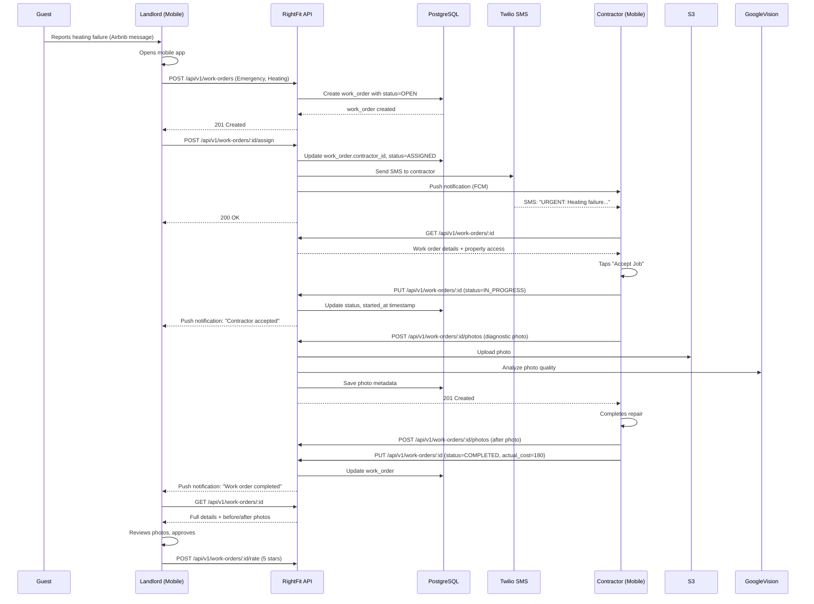
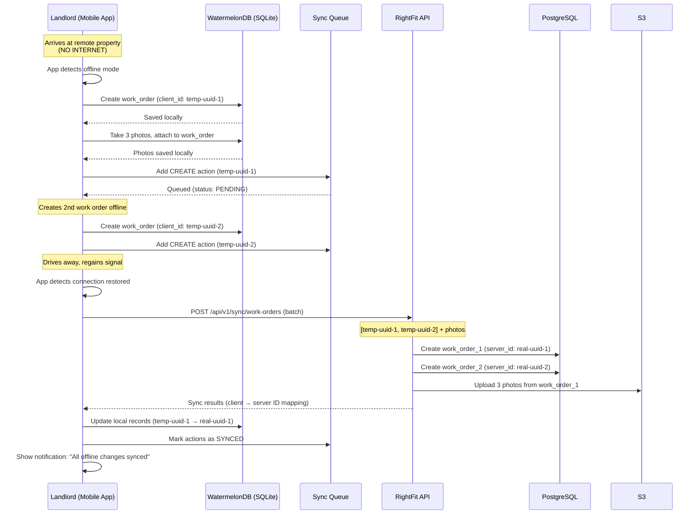
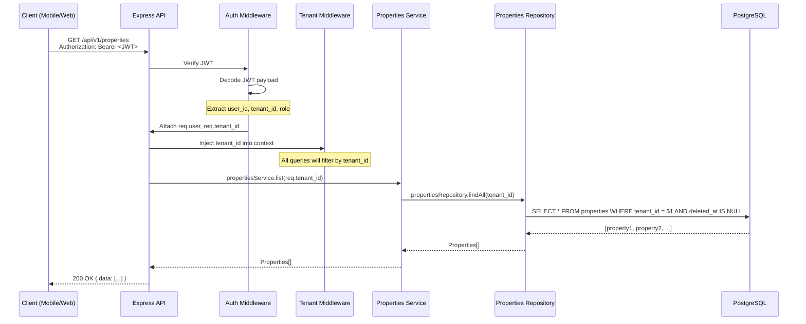

# Core Workflows

## Emergency Maintenance During Guest Stay

**Critical Requirements:**
- Work order creation must complete in <60 seconds on 4G
- SMS notification sent within 30 seconds of assignment
- Contractor receives push notification immediately if app installed
- Photo upload with AI quality check <10 seconds on 4G
- Complete audit trail: timestamps, photos, location data, resolution

---

## Offline Work Order Creation (Rural Property Visit)

**Critical Requirements:**
- App fully functional offline (create work orders, take photos, add notes)
- No data loss if app crashes during offline session (persistent local storage)
- Automatic sync when connection restored (no manual "sync now" button)
- Sync conflict resolution (last-write-wins acceptable for MVP)
- Photo upload optimization (compress before upload on slow connections)

---

## Multi-Tenant Data Isolation Flow

**Security Enforcement:**
1. **JWT contains tenant_id**: Immutable, cryptographically signed
2. **Middleware injects tenant_id**: Every request automatically filtered
3. **Repository layer enforces**: No raw SQL without tenant_id filter
4. **Database row-level constraints**: Foreign keys enforce referential integrity per tenant

**Failure Modes:**
- **Invalid JWT**: 401 Unauthorized (before tenant_id extraction)
- **Missing tenant_id**: 403 Forbidden (user not associated with tenant)
- **Cross-tenant access attempt**: Returns empty result set (tenant_id filter prevents leaks)

---

