```mermaid
graph TD
    A[🔴 Push Notification:<br/>Emergency Work Order] --> B[Contractor taps notification]
    B --> C[Work Order Details screen opens<br/>Auto-scrolled to Accept button]

    C --> D{Contractor reviews}
    D --> E[Property: Highland Cabin #2<br/>Issue: Heating Failure<br/>Priority: EMERGENCY]
    E --> F[Large Accept Job button<br/>Primary blue, full width]

    F --> G[Tap Accept Job]
    G --> H[Optimistic UI:<br/>Button changes to Accepted ✓]
    H --> I[Status updates to Assigned]
    I --> J[Sync to backend]
    J --> K[Landlord receives<br/>acceptance notification]

    K --> L[Screen shows action buttons:<br/>Get Directions, Start Work, Contact]
    L --> M{Contractor action}

    M -->|Get Directions| N[Open Maps app with address]
    M -->|Start Work| O[Status → In Progress<br/>Timestamp recorded]
    M -->|Contact Landlord| P[Show phone/message options]
    M -->|Add Photo| Q[Camera flow]

    style A fill:#ffebee
    style F fill:#2196f3,color:#fff
    style H fill:#c8e6c9
    style K fill:#c8e6c9
```

```mermaid
graph TD
    A[User working offline] --> B[Multiple actions:<br/>3 work orders created<br/>5 photos captured<br/>2 status updates]

    B --> C[Persistent offline banner shown:<br/>📡 Offline Mode<br/>Changes will sync when reconnected]

    C --> D[All changes stored locally<br/>Added to sync queue]
    D --> E[User can view sync queue:<br/>Tap banner or Settings]

    E --> F[Sync Queue Screen shows:<br/>✓ 3 work orders created<br/>✓ 5 photos captured<br/>✓ 2 status updates<br/>⏳ Waiting to sync...]

    F --> G{Internet reconnects}
    G -->|Yes| H[Banner changes:<br/>📡 Syncing...<br/>Progress indicator]

    H --> I[Items sync one by one]
    I --> J{Sync successful?}

    J -->|Yes - All items| K[Banner changes:<br/>✅ All changes synced<br/>Green background]
    K --> L[Banner auto-dismisses after 3s]

    J -->|Partial - Some failed| M[Banner shows:<br/>⚠️ 2 items synced, 1 failed<br/>Tap to view details]
    M --> N[User taps to view]
    N --> O[Sync Queue shows:<br/>✅ Work order ABC - Synced<br/>✅ Photo 1 - Synced<br/>❌ Photo 2 - Failed<br/>Retry button prominent]

    O --> P{User retries?}
    P -->|Yes| H
    P -->|No| Q[Items remain in queue<br/>Auto-retry in background]

    style C fill:#fff9c4
    style K fill:#c8e6c9
    style M fill:#ffe0b2
```

# RightFit Services UI/UX Specification

**Version:** 1.0
**Last Updated:** 2025-10-27
**Author:** Sally (UX Expert)
**Status:** Draft for Review

---

## Change Log

| Date | Version | Description | Author |
|------|---------|-------------|--------|
| 2025-10-27 | 1.0 | Initial UI/UX specification created from architect handover | Sally (UX Expert) |

---

## Introduction

This document defines the user experience goals, information architecture, user flows, and visual design specifications for **RightFit Services**' user interface. It serves as the foundation for visual design and frontend development, ensuring a cohesive and user-centered experience.

**Project Context:**
- **Platform:** Mobile-first (React Native) + Web dashboard (React)
- **Target Market:** UK landlords managing 1-50 long-term rental properties
- **Core Differentiator:** Offline-first functionality for rural property visits
- **Value Proposition:** "Arthur Online's reliability without the outages, at half the price"
- **Tech Stack:** React Native with React Native Paper (mobile), React with Material-UI (web)

---

## Overall UX Goals & Principles

### Target User Personas

**Primary Persona: Jamie - Remote Landlord**
- **Age:** 35-45
- **Tech Comfort:** Medium (uses Airbnb, online banking, WhatsApp)
- **Context:** Visits properties monthly, often in rural areas with poor signal
- **Pain Point:** Needs to document maintenance issues while on-site, even without internet
- **Jobs to be Done:**
  - Create work orders while on-site at properties (often offline)
  - Track maintenance status across multiple properties
  - Contact contractors quickly when issues arise
  - Ensure compliance certificates stay current

**Secondary Persona: Contractor (John)**
- **Age:** 30-55
- **Tech Comfort:** Low-Medium (uses WhatsApp, basic apps)
- **Context:** Receives work orders, updates status, uploads "before/after" photos
- **Pain Point:** Needs simple, fast app - can't have complicated workflows
- **Jobs to be Done:**
  - Accept emergency work orders quickly
  - Navigate to property locations
  - Update work status and add photos
  - Complete jobs with minimal app interaction

### Usability Goals

1. **Offline Reliability:** Users must feel confident the app works without internet, not broken
   - Success metric: >90% of users understand when they're offline and data will sync

2. **Speed of Core Actions:** Every action must have immediate feedback
   - Button tap → visual feedback: <100ms
   - Screen transition: <300ms
   - Work order creation: <2 seconds (even offline)

3. **Simplicity for Low-Tech Users:** Max 3 taps to complete any core action
   - Contractors can accept job, update status, and complete without confusion
   - No hidden menus or gestures (won't be discovered)

4. **Photo Quality Assurance:** AI-powered quality checks help users capture useful evidence
   - Photo retake rate: <20% (helpful, not annoying)

5. **Rural Context Optimization:** High contrast for outdoor visibility, large tap targets for gloved hands
   - Minimum tap target: 44x44pt (iOS) / 48x48dp (Android)
   - Contrast ratio: 4.5:1 minimum (WCAG AA)

### Design Principles

1. **Offline-First is Our Moat**
   - Make offline mode feel reliable and trustworthy, never broken
   - Show clear sync status without being alarming
   - Use optimistic UI - show changes immediately, sync in background

2. **Clarity Over Cleverness**
   - Prioritize clear communication over aesthetic innovation
   - No hidden gestures or discovery-based interactions
   - Contractors have thick fingers - big buttons, high contrast

3. **Fast Feedback on Every Action**
   - Instant visual feedback on taps (haptic on iOS, ripple on Android)
   - Use skeleton screens while loading, not spinners
   - Show progress for long operations

4. **Progressive Disclosure**
   - Show only what's needed, when it's needed
   - Keep forms short (mobile context, often outdoors)
   - Priority information first, details on demand

5. **Visual Hierarchy Through Color**
   - Status colors convey priority at a glance (red=emergency, orange=high, yellow=medium, green=low)
   - Color is not the only indicator (use icons + text for accessibility)

---

## Information Architecture (IA)

### Site Map / Screen Inventory

### Navigation Structure

**Primary Navigation (Mobile):**

**Landlord View:**
- **Bottom Tab Bar** (persistent across all screens)
  - Properties (home icon) - Default view
  - Work Orders (build icon) - All work orders across properties
  - Notifications (bell icon with badge)
  - Settings (settings icon)

**Contractor View:**
- **Bottom Tab Bar** (persistent across all screens)
  - My Jobs (build icon) - Default view
  - Completed (check_circle icon) - Job history
  - Notifications (bell icon with badge)
  - Settings (settings icon)

**Secondary Navigation:**
- **Stack Navigation** within each tab (standard back button in header)
- **Floating Action Button (FAB)** on key screens (e.g., "New Work Order" on Property Details)
- **Contextual Actions** via three-dot menu (⋮) in headers

**Breadcrumb Strategy:**
- **Mobile:** Header shows current screen title with back button (standard mobile pattern)
- **Web:** Traditional breadcrumbs in top bar (e.g., "Dashboard > Properties > Highland Cabin #2 > Work Order #123")

---

## User Flows

### Flow 1: Create Work Order (Offline)

**User Goal:** Landlord visits property without internet and needs to document a maintenance issue immediately

**Entry Points:**
- Property Details screen → "New Work Order" FAB
- Properties List → Quick action on property card

**Success Criteria:**
- Work order created and visible in list with "pending sync" indicator
- User feels confident data is saved and will sync when connection returns

#### Flow Diagram

#### Edge Cases & Error Handling

- **Photo storage fills up:** Show warning at 90% capacity, block camera at 95%, suggest deleting old synced photos
- **Sync fails after multiple retries:** Show "Sync Failed" notification with Retry and View Details buttons
- **Conflicting edits (rare):** If work order modified on web while offline edit pending, show conflict resolution screen
- **Form validation:** Check required fields before allowing save; show inline errors
- **Camera permission denied:** Show friendly modal explaining why camera access is needed, with link to settings
- **Low battery during photo capture:** Show warning if <10% battery, suggest charging before capturing multiple photos

**Notes:** Offline capability is the #1 differentiator - this flow must feel bulletproof and reliable, not like a broken online app.

---

### Flow 2: Contractor Accepts Emergency Job

**User Goal:** Contractor receives emergency work order notification and needs to accept quickly

**Entry Points:**
- Push notification → Direct to work order details
- My Jobs list → Emergency section at top

**Success Criteria:**
- Contractor accepts job in <10 seconds
- Landlord receives confirmation immediately
- Contractor has all info needed to start (address, access instructions)

#### Flow Diagram

#### Edge Cases & Error Handling

- **Offline when accepting:** Queue acceptance, show "Will send when online" message, allow contractor to continue
- **Job already accepted by another contractor:** Show "This job was just accepted by someone else" with list of other available jobs
- **Invalid address for directions:** Show manual address text with copy button if Maps can't parse
- **Contractor declines job:** Show Decline button (secondary, less prominent) → Optional reason → Notify landlord → Return to jobs list

**Notes:** Emergency jobs need fastest possible acceptance flow - minimize cognitive load and taps.

---

### Flow 3: Photo Capture with AI Quality Check

**User Goal:** User needs to capture clear, useful photo evidence of maintenance issue or completion

**Entry Points:**
- Create Work Order form → Camera button
- Work Order Details → Add Photo button
- Update Status → Add Photo option

**Success Criteria:**
- Photo is clear, well-lit, and focused
- AI provides helpful feedback without blocking workflow
- Photo labeled appropriately (Before/During/After)

#### Flow Diagram

#### Edge Cases & Error Handling

- **AI quality check fails/times out:** Show generic "Photo captured" message, allow user to proceed
- **Storage space low:** Show warning before opening camera if <100MB available
- **Photo too large:** Auto-compress to max 2MB while preserving quality
- **Camera crash/error:** Show friendly error message, offer Gallery option as backup
- **Outdoor glare:** AI detects overexposure → Suggest finding shade or changing angle
- **Multiple photos needed:** After labeling, offer "Take Another Photo" quick action

**Notes:** AI feedback should be educational and positive, not blocking or judgmental. User can always proceed with any photo.

---

### Flow 4: Sync Queue Visibility (Offline → Online Transition)

**User Goal:** User working offline wants confidence that changes are saved and will sync

**Entry Points:**
- Automatic when network status changes
- User can view sync status from Settings

**Success Criteria:**
- User understands what's in sync queue
- Clear feedback when items sync successfully
- Transparent error handling if sync fails

#### Flow Diagram

#### Edge Cases & Error Handling

- **Sync conflict:** Backend data changed while offline - show conflict resolution UI with "Keep Mine" / "Use Server Version" / "View Diff"
- **Photo upload fails repeatedly:** Suggest checking connection quality, offer option to skip photo and sync other data
- **Partial sync state:** Some items synced, others pending - clearly differentiate in UI
- **Background sync while using app:** Show unobtrusive progress in notification drawer, don't interrupt user
- **Sync queue grows large (>50 items):** Show item count in banner, prioritize by type (emergency work orders first)

**Notes:** Sync status visibility is critical for building user trust in offline mode. Over-communicate rather than under-communicate.

---

## Wireframes & Mockups

### Primary Design Files

**Design Tool:** Figma
**Project Link:** [To be created - recommend Figma for collaboration with developers]

**Naming Convention for Files:**
- `rightfit-mobile-landlord-v1.fig` - Landlord mobile flows
- `rightfit-mobile-contractor-v1.fig` - Contractor mobile flows
- `rightfit-web-dashboard-v1.fig` - Web dashboard
- `rightfit-components-library.fig` - Component library and design system

**Export Guidelines:**
- Export assets at 1x, 2x, 3x for mobile (iOS and Android)
- Provide design tokens (colors, spacing, typography) as JSON for developers
- Annotate interactions (swipe, long-press, animations) in Figma prototypes

---

### Key Screen Layouts

#### 1. Login / Register

**Purpose:** Secure, trustworthy entry point for both landlords and contractors

**Key Elements:**
- Clean, minimalist design (establishing trust for business data)
- Email + password fields (16pt font size to avoid mobile zoom)
- "Forgot password" link below password field
- Primary "Login" button (full width, blue)
- Secondary "Create Account" link below
- Option for biometric login (after first successful login)

**Interaction Notes:**
- Validation on blur, not on every keystroke (less aggressive)
- Clear error states with red border + helpful message below field
- Auto-focus on email field when screen loads
- Return key on keyboard moves to next field, then submits

**Accessibility:**
- Password field has show/hide toggle
- All form fields have labels above (not placeholder-only)
- Error messages announced to screen readers

**Design File Reference:** `rightfit-mobile-landlord-v1.fig` → Frame: "01-Login"

---

#### 2. Properties List (Landlord)

**Purpose:** Quick overview of all properties with status at a glance

**Key Elements:**
- Header: "My Properties" with "+" icon in top-right for adding new property
- Property cards (vertical scroll):
  - Property photo as background with gradient overlay
  - Property name and address
  - Active work order count (prominent, red if >3)
  - Next important action (e.g., "Gas cert expires in 45 days")
- Pull-to-refresh gesture to sync latest data
- Empty state if no properties: "Add your first property" with illustration
- Offline banner at top (if applicable)

**Interaction Notes:**
- Tap card → Navigate to Property Details
- Long-press card → Show quick actions (Edit, Delete, View on Map)
- Swipe down → Pull-to-refresh (show spinner in header)

**Visual Hierarchy:**
- Property photo draws eye first
- Active work order count is largest text (bold, colored by urgency)
- Certificate expiry is secondary info (smaller, gray text unless expiring soon)

**Design File Reference:** `rightfit-mobile-landlord-v1.fig` → Frame: "02-Properties-List"

---

#### 3. Property Details

**Purpose:** Central hub for all information about a specific property

**Key Elements:**
- Header with back button and three-dot menu (Edit Property, Delete Property)
- Property photo (larger, hero image)
- Address with map pin icon (tappable → opens Maps)
- **Work Orders section** (most prominent):
  - "Work Orders (3 active)" header
  - List of work order cards (same design as main work order list)
  - Status colors on left border (red/orange/yellow/green)
- **Certificates section** (below work orders):
  - "Certificates" header
  - List: Gas Safety, Electrical, EPC, etc.
  - Status icons: ✅ Valid (green), ⚠️ Expiring (orange + days remaining), ❌ Expired (red)
- Floating Action Button (FAB): "New Work Order" (blue circle with + icon)

**Interaction Notes:**
- Tap work order card → Navigate to Work Order Details
- Tap certificate → Show certificate details (upload date, expiry, document link)
- FAB tap → Navigate to Create Work Order (property pre-selected)

**States:**
- Empty state for work orders: "No active work orders" with checkmark icon
- Loading state: Skeleton screens for work orders and certificates

**Design File Reference:** `rightfit-mobile-landlord-v1.fig` → Frame: "03-Property-Details"

---

#### 4. Create Work Order

**Purpose:** Fast, mobile-friendly form to document maintenance issues (often used on-site)

**Key Elements:**
- Header: "New Work Order" with "Save" button (enabled only when valid)
- Form fields (vertical layout):
  1. **Property dropdown** (pre-selected if coming from Property Details)
  2. **Title text input** (required, placeholder: "e.g., Broken window")
  3. **Priority picker** (large color buttons in horizontal row):
     - 🔴 Emergency
     - 🟠 High
     - 🟡 Medium
     - 🟢 Low
  4. **Category dropdown** (Plumbing, Electrical, Heating, General, etc.)
  5. **Description textarea** (optional, 3 lines, placeholder: "Additional details...")
  6. **Photos section** (optional):
     - "Take Photo" button with camera icon
     - Thumbnail gallery of added photos
  7. **Assign Contractor dropdown** (optional, "None" by default)

**Interaction Notes:**
- Priority buttons are large (60x60pt) for easy tapping outdoors
- Selected priority button has filled background, others outlined
- Camera button opens full camera interface
- Photos show as thumbnails below camera button (tap to view full size)
- Form auto-saves draft to local storage every 5 seconds (can resume if interrupted)

**Validation:**
- Title and Priority are required (show inline error if user taps Save without them)
- Other fields optional to minimize friction

**Offline Behavior:**
- Contractor dropdown shows "Will assign when online" if no cached contractor list
- Save button always enabled - stores locally and queues for sync

**Design File Reference:** `rightfit-mobile-landlord-v1.fig` → Frame: "04-Create-Work-Order"

---

#### 5. Work Order Details

**Purpose:** Complete information about a work order with status tracking and communication

**Key Elements:**
- Header: Work order title with back button and three-dot menu (Edit, Delete)
- **Status Progress Bar:**
  - Visual stepper: Open → Assigned → In Progress → Completed
  - Current status highlighted with blue dot
- **Priority and Category badges** (colored pills)
- **Metadata:**
  - Created: [timestamp]
  - Due: [timestamp with countdown if urgent]
- **Property Info:**
  - Property name (tappable → navigate to Property Details)
  - Address
- **Assigned Contractor Section:**
  - Contractor name and company
  - Large action buttons: [📞 Call] [💬 Message]
  - Status badge showing contractor's last update
- **Photos Section:**
  - "Before" photos (grid)
  - "During" photos (grid)
  - "After" photos (grid with empty state if none yet)
  - "+ Add Photo" button
- **Activity Timeline:**
  - Chronological list of updates
  - "Jamie created this work order" - 2:34pm
  - "John accepted job" - 2:45pm
  - "John started work" - 3:10pm
  - "John added photo" - 3:25pm

**Interaction Notes:**
- Tap photo thumbnail → View fullscreen with swipe gallery
- Call/Message buttons use native phone/SMS apps
- Long-press on timeline item → Copy text

**States:**
- Unassigned state: Show "Assign Contractor" button instead of contact buttons
- Completed state: Show green success banner, mark all sections read-only except photos

**Design File Reference:** `rightfit-mobile-landlord-v1.fig` → Frame: "05-Work-Order-Details"

---

#### 6. Camera / Photo Capture

**Purpose:** Capture high-quality photos with helpful guidance

**Key Elements:**

**Camera Viewfinder (Fullscreen):**
- Camera preview fills entire screen
- Top bar (semi-transparent overlay):
  - Back button (X icon) on left
  - Flash toggle on right (auto/on/off)
  - Flip camera button (front/back)
- Optional: Grid overlay (rule of thirds, can be toggled in settings)
- Bottom bar:
  - Gallery button (left) - access recent photos
  - Large circular capture button (center) - 80pt diameter
  - Cancel button (right) - return without capturing

**Photo Preview (After Capture):**
- Full-screen photo preview
- Top: "Photo Preview" title with back arrow
- Center: Photo (pinch to zoom)
- **AI Quality Check Section** (overlay card at bottom):
  - ✅ "Photo Quality: Good" (green) OR
  - ⚠️ "Photo Quality: Could be better" (orange) OR
  - ❌ "Photo Quality: Poor" (red)
  - Specific feedback bullets:
    - Brightness: ✓ Good / ⚠️ Too dark - try flash
    - Focus: ✓ Sharp / ❌ Blurry - hold steady
    - Content: ✓ Heating unit detected / ? Content unclear
- **Label Picker:**
  - "Label this photo:" header
  - Three large buttons: [Before] [During] [After]
- Bottom action bar:
  - [Retake] button (secondary, left)
  - [Use Photo] button (primary, right)

**Interaction Notes:**
- Tap capture → Immediate preview (no delay)
- AI quality check runs in background, shows results within 500ms
- User can tap "Use Photo" immediately without waiting for AI
- Pinch to zoom on preview
- Selected label highlights in blue

**Accessibility:**
- High contrast controls for outdoor use
- Haptic feedback on capture (iOS)
- VoiceOver describes camera state and photo quality

**Design File Reference:** `rightfit-mobile-landlord-v1.fig` → Frame: "06-Camera-Capture" and "06b-Photo-Preview"

---

#### 7. Contractor - My Jobs List

**Purpose:** Simple, scannable list of assigned work orders grouped by urgency

**Key Elements:**
- Header: "My Jobs" with notification bell icon (badge if unread)
- **Emergency Section** (if any):
  - "Emergency (1)" header in red
  - Work order cards with:
    - 🔴 EMERGENCY badge
    - Work order title
    - Property name
    - "Assigned 10 min ago" timestamp
    - Large **[Accept Job]** button (primary action)
- **In Progress Section:**
  - "In Progress (2)" header
  - Work order cards (same design, no Accept button):
    - Priority color badge
    - Work order title
    - Property name
    - "Started 1h ago" timestamp
- **Completed Section** (collapsed by default):
  - "Completed (5)" header with chevron
  - Tap to expand → Show completed work order cards

**Interaction Notes:**
- Tap card → Navigate to Work Order Details
- Tap "Accept Job" → Optimistic UI update, stay on list (snackbar confirms)
- Pull-to-refresh to check for new jobs
- Swipe on in-progress card → Quick actions (Add Photo, Mark Complete)

**Empty States:**
- No emergency jobs: Don't show section at all
- No in-progress jobs: Show "No active jobs" with clipboard icon
- No completed jobs: "No completed jobs yet"

**Design File Reference:** `rightfit-mobile-contractor-v1.fig` → Frame: "07-Contractor-Jobs-List"

---

#### 8. Contractor - Work Order Details

**Purpose:** All info needed to complete job with minimal complexity

**Key Elements:**
- Header: Work order title with back button
- **Property Information (Top Priority):**
  - Property name and full address
  - Large **[📍 Get Directions]** button (opens Maps app)
- **Access Instructions Card** (if provided by landlord):
  - "Access Instructions" header
  - Instructions text (e.g., "Key under mat, lockbox code 1234")
  - Copy button to copy code
- **Work Order Details:**
  - Priority badge and category
  - Description text
  - Due date/time
- **Status Section:**
  - Current status badge
  - **Action Buttons** (stacked vertically, large tap targets):
    - [Start Work] (if not started)
    - [Add Photo]
    - [Add Note]
    - [Mark Complete]
- **Photos Section:**
  - Thumbnail grid of photos contractor has uploaded
  - Shows labels (Before/During/After)
- **Contact Landlord:**
  - Landlord name
  - [📞 Call] [💬 Message] buttons

**Interaction Notes:**
- "Get Directions" opens Maps with property address
- "Start Work" updates status to In Progress, records timestamp
- "Add Photo" opens camera
- "Add Note" opens text input modal (e.g., "Need to order parts, returning tomorrow")
- "Mark Complete" shows confirmation modal → Update status → Show success message

**States:**
- If job not accepted yet: Show "Accept Job" button first
- If job completed: All buttons disabled except "View Photos"

**Design File Reference:** `rightfit-mobile-contractor-v1.fig` → Frame: "08-Contractor-Work-Order-Details"

---

#### 9. Web Dashboard (Desktop)

**Purpose:** Overview of all properties, work orders, and certificates at a glance (desk work, reporting)

**Key Elements:**
- **Left Sidebar Navigation** (persistent, 240px wide):
  - Logo at top
  - Menu items:
    - Dashboard (selected by default)
    - Properties
    - Work Orders
    - Contractors
    - Calendar
    - Settings
  - User profile card at bottom with dropdown menu
- **Top Bar:**
  - Breadcrumbs (e.g., "Dashboard")
  - Search bar (center)
  - Notifications icon with badge
  - User avatar with dropdown
- **Main Content Area:**
  - **Key Metrics Cards** (3-column grid):
    - Total Properties (count + icon)
    - Active Work Orders (count + icon, red if >10)
    - Expiring Certificates (count + icon, orange if any)
  - **Recent Work Orders Table:**
    - Columns: Status (color dot), Title, Property, Contractor, Priority, Due Date, Actions
    - Sortable columns
    - Row hover shows quick actions (View, Edit, Delete)
  - **Upcoming Certificate Renewals:**
    - List of certificates expiring in next 60 days
    - Property name, certificate type, expiry date, days remaining

**Interaction Notes:**
- Sidebar collapses on tablet (hamburger menu)
- Click metric card → Navigate to filtered view (e.g., all active work orders)
- Click table row → Open Work Order Details in side drawer (drawer overlays content on right)
- Search bar supports global search across properties, work orders, contractors

**Responsive Behavior:**
- Desktop (>1024px): Full sidebar always visible
- Tablet (641-1024px): Sidebar collapsible
- Mobile (<640px): Redirect to mobile app or show simplified mobile web view

**Design File Reference:** `rightfit-web-dashboard-v1.fig` → Frame: "09-Web-Dashboard"

---

## Component Library / Design System

### Design System Approach

**Strategy:** Create a lightweight, custom design system based on Material Design 3 principles, leveraging React Native Paper (mobile) and Material-UI (web) as foundation.

**Rationale:**
- Material Design provides familiar patterns for both iOS and Android users
- React Native Paper and Material-UI offer consistent cross-platform components
- Custom theming allows brand differentiation while maintaining usability
- Accessibility built-in by default with Material components

**Component Documentation:**
- All components documented in Figma with variants, states, and usage guidelines
- Storybook for web components (interactive documentation)
- React Native component showcase app for testing on devices

---

### Core Components

#### Component: Button

**Purpose:** Primary interactive element for actions

**Variants:**
- **Primary:** Filled button (blue background, white text) - Main CTAs like "Save", "Create"
- **Secondary:** Outlined button (blue border, blue text) - Secondary actions like "Cancel", "View Details"
- **Destructive:** Filled button (red background, white text) - Destructive actions like "Delete", "Reject"
- **Text:** Text-only button (blue text, no border) - Tertiary actions like "Learn More"

**States:**
- Default
- Hover (web only - darker shade)
- Active/Pressed (ripple effect on Android, subtle scale on iOS)
- Focused (blue outline for keyboard navigation)
- Disabled (gray background, low opacity text, no pointer)
- Loading (spinner replaces text, button disabled)

**Usage Guidelines:**
- Minimum size: 44x44pt (iOS) / 48x48dp (Android) for touch targets
- Use Primary for single main action per screen
- Use Secondary for alternate actions (e.g., Cancel alongside Save)
- Destructive actions should always require confirmation modal
- Button text should be action-oriented verbs (Create, Save, Delete) not generic (OK, Yes)

**Code Reference:** React Native Paper `<Button>`, Material-UI `<Button>`

---

#### Component: Work Order Card

**Purpose:** Display work order summary in lists with priority at a glance

**Variants:**
- **List View:** Compact card for mobile lists (120pt height)
- **Grid View:** Square card for web dashboard grid (200x200px)

**States:**
- Default
- Hover (web only - subtle shadow increase)
- Selected (blue left border)
- Offline Pending (gray dot badge, "Pending sync" label)
- Synced (brief green checkmark animation)

**Anatomy:**
- **Left Border:** 4pt colored bar indicating priority (red/orange/yellow/green)
- **Header:** Priority badge (pill shape) + Work order title (bold, 16pt)
- **Metadata Row 1:** Property name (gray text, 14pt)
- **Metadata Row 2:** Status badge + Contractor name (or "Not assigned")
- **Footer:** Due date with icon (urgent dates in red)

**Usage Guidelines:**
- Always show priority color on left border for quick scanning
- Truncate title to 2 lines maximum (ellipsis)
- Show "Overdue" badge in red if past due date
- Tap anywhere on card to open details (entire card is tappable)

---

#### Component: Status Badge

**Purpose:** Display work order status clearly

**Variants:**
- Open (gray background, gray text)
- Assigned (blue background, blue text)
- In Progress (orange background, orange text)
- Completed (green background, green text)
- Cancelled (red background, red text)

**States:**
- Default
- With icon (optional checkmark, clock, etc.)

**Anatomy:**
- Pill shape (fully rounded ends)
- Padding: 4pt vertical, 8pt horizontal
- Background: Status color at 10% opacity
- Text: Status color at 100% opacity, bold, 12pt

**Usage Guidelines:**
- Use consistent color mapping across entire app
- Include icon only when it adds clarity (e.g., checkmark for Completed)
- Don't use status badges as interactive elements (they're informational only)

---

#### Component: Photo Gallery

**Purpose:** Display and manage work order photos organized by label

**Variants:**
- **Thumbnail Grid:** 3-column grid on mobile, 4-column on web
- **Labeled Sections:** Grouped by Before/During/After with headers

**States:**
- Loading (skeleton placeholders)
- Empty (dashed border, "+ Add Photo" text)
- Uploading (progress spinner overlay)
- Failed (red "!" icon overlay, retry option)

**Anatomy:**
- **Section Headers:** "Before Photos (2)", "During Photos (1)", "After Photos (0)"
- **Thumbnails:** Square (100x100pt on mobile, 120x120px on web)
- **Thumbnail Overlay:** Label badge (top-left), delete button (top-right, on hover/long-press)
- **Add Photo Button:** Dashed border, camera icon, "Add Photo" text

**Interaction:**
- Tap thumbnail → Open fullscreen viewer with swipe gallery
- Long-press thumbnail (mobile) or hover (web) → Show delete button
- Drag and drop to reorder (web only)
- Pinch to zoom in fullscreen viewer

**Usage Guidelines:**
- Always group photos by label (Before/During/After)
- Show empty state for missing photo types (e.g., "No 'After' photos yet")
- Allow uploading multiple photos at once

---

#### Component: Offline Banner

**Purpose:** Clearly communicate offline status without alarming user

**Variants:**
- **Offline Mode:** Yellow/amber background
- **Syncing:** Blue background with progress indicator
- **Sync Complete:** Green background (auto-dismisses after 3s)
- **Sync Failed:** Orange background with action buttons

**States:**
- Persistent (stays until dismissed or status changes)
- Dismissible (X button on right)
- Expandable (tap to show sync queue details)

**Anatomy:**
- **Icon:** 📡 or cloud icon (left side)
- **Title:** "Offline Mode" / "Syncing..." / "All changes synced"
- **Description:** Contextual message (e.g., "Changes will sync when reconnected")
- **Action Buttons:** Optional (e.g., "Retry Now", "View Details")

**Usage Guidelines:**
- Position at top of screen, below header (persistent across navigation)
- Use warm, reassuring language (not error language)
- Don't block content - push content down rather than overlay
- Show sync queue count if >3 items (e.g., "3 items waiting to sync")

---

#### Component: Form Input

**Purpose:** Text entry for forms

**Variants:**
- **Text Input:** Single-line text
- **Text Area:** Multi-line text (auto-expanding or fixed height)
- **Dropdown/Select:** Predefined options
- **Date Picker:** Date selection
- **File Upload:** Photo/document upload

**States:**
- Default
- Focused (blue border, label moves up)
- Filled (label stays up)
- Error (red border, error message below)
- Disabled (gray background, no interaction)

**Anatomy:**
- **Label:** Above input (not placeholder-only), 14pt gray text
- **Input Field:** 16pt text (avoids zoom on mobile), 48pt height minimum
- **Helper Text:** Below input, 12pt gray text (optional)
- **Error Message:** Below input, 12pt red text (shown on validation error)
- **Required Indicator:** Red asterisk (*) next to label

**Usage Guidelines:**
- Always use 16pt+ font size on mobile to prevent auto-zoom
- Label should describe what to enter (not instructions)
- Validate on blur (when user leaves field), not on every keystroke
- Show error state only after user has interacted with field
- Use input type="email" / "tel" / "number" for appropriate mobile keyboards

---

## Branding & Style Guide

### Visual Identity

**Brand Guidelines:** RightFit Services Brand Guidelines v1.0 (to be created)

**Brand Personality:**
- **Reliable:** Like a trustworthy contractor you've worked with for years
- **Straightforward:** No-nonsense, clear communication
- **Professional:** We handle your business data with care
- **Accessible:** Designed for real people, not just tech enthusiasts

**Tone of Voice:**
- Friendly but professional
- Clear over clever
- Helpful, not patronizing
- Honest about limitations (e.g., "You're offline, but we've got your back")

---

### Color Palette

| Color Type | Hex Code | Usage |
|------------|----------|-------|
| **Primary** | #2563EB | Primary actions, buttons, links, selected states |
| **Primary Dark** | #1E40AF | Navigation headers, hover states |
| **Secondary** | #10B981 | Success states, completed work orders |
| **Accent** | #F59E0B | Warnings, expiring certificates, attention items |
| **Emergency** | #DC2626 | Emergency priority work orders, critical alerts |
| **High Priority** | #F97316 | High priority work orders |
| **Medium Priority** | #FBBF24 | Medium priority work orders |
| **Low Priority** | #10B981 | Low priority work orders (reuses success color) |
| **Success** | #22C55E | Positive feedback, confirmations, sync complete |
| **Warning** | #F59E0B | Cautions, important notices, certificates expiring soon |
| **Error** | #EF4444 | Errors, destructive actions, sync failed |
| **Text Primary** | #111827 | Headings, important text, body copy |
| **Text Secondary** | #6B7280 | Labels, metadata, timestamps |
| **Background** | #F9FAFB | App background (light gray) |
| **Surface** | #FFFFFF | Cards, modals, form backgrounds |
| **Border** | #E5E7EB | Dividers, card borders, input borders |

**Accessibility Notes:**
- All color combinations meet WCAG AA contrast ratio (4.5:1 minimum)
- Priority colors also differentiated by icons and text (not color-only)
- Colorblind-friendly palette (tested with simulators)

---

### Typography

#### Font Families

- **Primary:** Roboto (Material Design default, excellent readability)
- **Secondary:** System Font Stack (fallback for performance)
- **Monospace:** Roboto Mono (for codes, access instructions)

**Rationale:** Roboto is the default for Material Design, loads quickly, and works well on all screen sizes. Using system fonts reduces bundle size for users on limited data plans.

#### Type Scale

| Element | Size | Weight | Line Height |
|---------|------|--------|-------------|
| **H1** | 24pt / 32px | Bold (700) | 32pt / 40px |
| **H2** | 20pt / 24px | Bold (700) | 28pt / 32px |
| **H3** | 18pt / 20px | Medium (500) | 24pt / 28px |
| **Body** | 16pt / 16px | Regular (400) | 24pt / 24px |
| **Body Small** | 14pt / 14px | Regular (400) | 20pt / 20px |
| **Caption** | 12pt / 12px | Regular (400) | 16pt / 16px |
| **Button** | 16pt / 16px | Medium (500) | 24pt / 24px |

**Mobile-Specific Notes:**
- Minimum 16pt for form inputs (prevents iOS auto-zoom)
- Minimum 14pt for all body text (outdoor readability)
- Line height 1.5x font size for body text (readability)

**Accessibility:**
- Text scales with system font size settings (Dynamic Type on iOS, Font Scale on Android)
- Tested at 200% zoom - layout doesn't break

---

### Iconography

**Icon Library:** Material Icons (https://fonts.google.com/icons)

**Rationale:** Material Icons are included with React Native Paper and Material-UI, reducing bundle size. Comprehensive set covers all needs. Familiar to users across platforms.

**Icon Sizes:**
- **Small:** 16pt (inline with text, e.g., calendar icon next to date)
- **Medium:** 24pt (list items, buttons, navigation)
- **Large:** 48pt (empty states, feature illustrations)

**Commonly Used Icons:**
- `home` - Properties
- `build` - Work Orders
- `person` - Contractors
- `camera_alt` - Photos
- `event` - Calendar, Due Dates
- `settings` - Settings
- `add_circle` - Create New
- `cloud_off` - Offline
- `sync` - Syncing
- `check_circle` - Completed, Success
- `warning` - Alerts, Expiring
- `error` - Errors
- `notifications` - Notifications Bell
- `location_on` - Address, Directions

**Usage Guidelines:**
- Use outlined style for unselected states, filled for selected
- Always pair with text label (don't rely on icon-only buttons except for universally understood icons like X, +, -)
- Icon color should match text color for consistency
- Provide alt text / content description for screen readers

---

### Spacing & Layout

**Grid System:**
- **Mobile:** Single column, full-width cards with 16pt horizontal padding
- **Web:** 12-column grid with 24px gutters, max-width 1400px

**Spacing Scale (8pt Base Grid):**
- **4pt (Tiny):** Between related items (e.g., icon and label in button)
- **8pt (Small):** Between form fields, list items
- **16pt (Medium):** Between sections, card padding
- **24pt (Large):** Between major components, page margins
- **32pt (XLarge):** Top/bottom screen padding, section separators

**Rationale:** 8pt grid system ensures consistent spacing and makes math easy for developers. All dimensions are multiples of 8.

**Layout Principles:**
- **Mobile:** Vertical scrolling primary, avoid horizontal scrolling
- **Content Hierarchy:** Most important content at top (work orders before certificates)
- **Thumb Zone:** Primary actions in bottom 1/3 of screen (FABs, submit buttons)
- **Safe Areas:** Respect iOS notch and Android gesture areas

---

## Accessibility Requirements

### Compliance Target

**Standard:** WCAG 2.1 Level AA

**Rationale:** Level AA is industry standard for commercial applications. Achievable without major design compromises. Covers most common disabilities (visual, motor, hearing, cognitive).

**Testing Strategy:**
- Automated testing with axe-core (CI/CD pipeline)
- Manual testing with screen readers (VoiceOver on iOS, TalkBack on Android)
- Keyboard navigation testing (web)
- Color contrast analysis with tools like Contrast Checker
- User testing with accessibility consultants

---

### Key Requirements

**Visual:**

**Color Contrast Ratios:**
- Normal text (16pt+): 4.5:1 minimum
- Large text (18pt+ or 14pt+ bold): 3:1 minimum
- UI components and graphics: 3:1 minimum
- Priority: All text on colored backgrounds meets these ratios

**Focus Indicators:**
- All interactive elements have visible focus state (2pt blue outline)
- Focus order follows logical reading order (top to bottom, left to right)
- Skip-to-content link available on web
- Focus never trapped (users can escape modals with keyboard)

**Text Sizing:**
- Supports Dynamic Type (iOS) and Font Scale (Android) up to 200%
- Layout doesn't break at larger text sizes (tested)
- Minimum touch target size: 44x44pt regardless of text size

---

**Interaction:**

**Keyboard Navigation:**
- All functionality available via keyboard (no mouse-only interactions)
- Tab order is logical and predictable
- Enter/Space activates buttons and links
- Escape closes modals and dialogs
- Arrow keys navigate within lists and dropdowns

**Screen Reader Support:**
- All images have alternative text (alt attributes)
- Form inputs have associated labels (not placeholder-only)
- Error messages announced when validation fails
- Status updates announced (e.g., "Work order created successfully")
- ARIA labels for icon-only buttons
- ARIA live regions for dynamic content (offline banner, sync status)

**Touch Targets:**
- Minimum size: 44x44pt (iOS) / 48x48dp (Android)
- Adequate spacing between tap targets (8pt minimum)
- No overlapping touch areas
- Large buttons for primary actions (full-width on mobile)

---

**Content:**

**Alternative Text:**
- All work order photos have alt text (auto-generated from AI content detection, editable by user)
- Decorative images marked as decorative (aria-hidden="true")
- Icons paired with text labels (not icon-only buttons except universally understood)

**Heading Structure:**
- Proper heading hierarchy (H1 → H2 → H3, no skipping levels)
- One H1 per screen (screen title)
- Headings describe content that follows

**Form Labels:**
- All form inputs have visible labels above (not placeholder-only)
- Labels use `<label for="input-id">` (web) or proper associations (mobile)
- Required fields indicated with asterisk (*) and "required" in label for screen readers
- Error messages clearly associated with inputs (aria-describedby)
- Group related inputs (e.g., address fields) with fieldset/legend

---

### Testing Strategy

**Automated Testing:**
- axe-core accessibility engine in CI/CD (catches ~30% of issues)
- Lighthouse accessibility audit (Chrome DevTools)
- Color contrast analysis on all color combinations

**Manual Testing:**
- Weekly VoiceOver (iOS) and TalkBack (Android) testing on dev builds
- Keyboard-only navigation testing on web (no mouse)
- Dynamic Type testing at 200% scale
- User flow testing with accessibility team

**User Testing:**
- Quarterly user testing sessions with users who have disabilities
- Partner with accessibility consulting firm for annual audit
- Bug bounty program includes accessibility issues

**Remediation Process:**
- Critical issues (blockers) fixed before release
- High-priority issues fixed within 1 sprint
- Medium/low-priority issues triaged and scheduled

---

## Responsiveness Strategy

### Breakpoints

| Breakpoint | Min Width | Max Width | Target Devices |
|------------|-----------|-----------|----------------|
| **Mobile** | 0px | 640px | iPhone SE, iPhone 14, Android phones |
| **Tablet** | 641px | 1024px | iPad, Android tablets, small laptops |
| **Desktop** | 1025px | 1440px | Desktop monitors, larger laptops |
| **Wide** | 1441px | - | Ultra-wide monitors, 4K displays |

**Rationale:**
- Mobile-first approach (design for smallest screen, enhance for larger)
- Breakpoints align with common device sizes
- 640px covers most phones in portrait, 1024px covers most tablets

---

### Adaptation Patterns

**Layout Changes:**

**Mobile (0-640px):**
- Single column layout
- Full-width cards and components
- Bottom tab navigation
- Vertical scrolling primary
- No sidebars

**Tablet (641-1024px):**
- Two-column layout where appropriate (e.g., property list + details side-by-side)
- Sidebar collapsible (hamburger menu)
- More comfortable spacing (24pt instead of 16pt)
- Grid views for cards (2 columns)

**Desktop (1025px+):**
- Multi-column layouts (sidebar + main content + optional right panel)
- Persistent sidebar navigation
- Hover states active
- Keyboard shortcuts available
- Larger typography and spacing
- Grid views for cards (3-4 columns)

---

**Navigation Changes:**

**Mobile:**
- Bottom tab bar (persistent, 4-5 items max)
- Stack navigation within tabs (back button in header)
- Hamburger menu for secondary navigation

**Tablet:**
- Side drawer navigation (swipe from left edge or tap hamburger)
- Bottom tabs retained for familiarity

**Desktop:**
- Persistent left sidebar (240px wide)
- Top navigation bar with breadcrumbs
- No bottom tabs (desktop users expect top/side navigation)

---

**Content Priority:**

**Mobile:**
- Show only essential information (progressive disclosure)
- Hide secondary metadata by default (expandable sections)
- Prioritize primary actions (large CTAs)
- One primary action per screen

**Tablet:**
- Show more metadata (more space available)
- Side-by-side views (list + detail)
- Multiple primary actions visible

**Desktop:**
- Show full information (no truncation)
- Data tables with all columns
- Multi-action toolbars
- Contextual menus on right-click

---

**Interaction Changes:**

**Mobile:**
- Touch-optimized (44x44pt minimum tap targets)
- Swipe gestures for common actions (swipe to delete, pull to refresh)
- Long-press for contextual menus
- Bottom sheets for modal content (easier to reach with thumb)

**Tablet:**
- Hybrid touch + keyboard/mouse support
- Hover states shown (if pointing device detected)
- Larger touch targets (48x48pt)

**Desktop:**
- Keyboard shortcuts (Cmd/Ctrl + K for search, etc.)
- Hover states for all interactive elements
- Right-click context menus
- Drag and drop where appropriate
- Smaller, precise click targets acceptable (mouse precision)

---

## Animation & Micro-interactions

### Motion Principles

**Purpose of Animation:**
- **Provide Feedback:** Confirm user actions (button press, item added)
- **Guide Attention:** Draw eye to important changes (new notification, sync complete)
- **Clarify Hierarchy:** Show spatial relationships (modal slides up from bottom, drawer slides from side)
- **Add Delight:** Make experience feel polished (subtle spring animation on FAB)

**Motion Philosophy:**
- **Subtle over flashy:** Don't distract from task
- **Fast over slow:** Animations should feel instant (<300ms)
- **Purposeful over decorative:** Every animation serves UX function
- **Respectful of preferences:** Honor system "reduce motion" setting (iOS, Android, web)

**Performance Constraints:**
- Keep frame rate at 60fps (16.67ms per frame)
- Avoid animating expensive properties (use transform and opacity, not width/height)
- No heavy animations (target: older Android phones with slower GPUs)
- Disable animations on low-end devices (automatic fallback)

---

### Key Animations

- **Button Press:** Ripple effect (Android), subtle scale 0.95 (iOS) - Duration: 150ms, Easing: ease-out

- **Screen Transition:** Slide from right (push), slide to right (pop) - Duration: 300ms, Easing: ease-in-out

- **Modal Appearance:** Slide up from bottom (mobile), fade + scale up (web) - Duration: 250ms, Easing: ease-out

- **Card Entry:** Fade in + slide up stagger (50ms delay per card) - Duration: 300ms, Easing: ease-out

- **FAB Tap:** Scale to 1.1 then back to 1.0, rotate 45° (if morphs to X) - Duration: 200ms, Easing: spring

- **Toggle Switch:** Thumb slides + background color transition - Duration: 200ms, Easing: ease-in-out

- **Status Badge Change:** Cross-fade old/new text + background color transition - Duration: 300ms, Easing: ease-in-out

- **Offline Banner Appearance:** Slide down from top with bounce - Duration: 400ms, Easing: spring

- **Sync Complete Checkmark:** Scale from 0 to 1.2 to 1.0 (bounce) - Duration: 500ms, Easing: spring

- **Photo Upload Progress:** Circular progress indicator (indeterminate for <2s, determinate for >2s) - Duration: continuous, Easing: linear

- **Loading Skeleton:** Shimmer effect left to right - Duration: 1500ms loop, Easing: linear

- **Swipe to Delete:** Card slides left revealing red delete background - Duration: 200ms, Easing: ease-out

- **Pull to Refresh:** Spinner rotation + arrow down → up flip - Duration: continuous, Easing: ease-in-out

**Accessibility Consideration:**
- All animations respect `prefers-reduced-motion` system setting
- When reduced motion enabled: Replace animations with instant transitions or simple fades
- Never use only animation to convey information (always pair with text/icon change)

---

## Performance Considerations

### Performance Goals

**Target Metrics:**
- **Page Load:** First Contentful Paint <1.5s on 3G connection
- **Interaction Response:** <100ms from tap to visual feedback (button press, card tap)
- **Screen Transition:** <300ms from tap to new screen rendered
- **Photo Capture → Preview:** <500ms from capture button tap to preview display
- **Animation Frame Rate:** 60fps minimum (no jank during scrolling or transitions)
- **App Launch:** <2s cold start on mid-range devices (e.g., iPhone 11, Samsung Galaxy A52)

**Bundle Size:**
- **iOS:** <50MB app bundle (App Store limit before warning)
- **Android:** <40MB APK base (Play Store recommendations)
- **Web:** <500KB initial JavaScript bundle (gzipped)

**Data Usage:**
- **Photo uploads:** Max 2MB per photo (compress with quality 85%)
- **Sync operations:** Batch API calls to minimize network requests
- **Offline storage:** <100MB SQLite database (warn user at 80MB)

---

### Design Strategies

**Skeleton Screens Over Spinners:**
- Show content layout immediately with loading placeholders
- Gives perception of faster load (user sees structure)
- Reduce anxiety ("something is happening")
- Replace with real content as it loads (progressive rendering)

**Lazy Loading Images:**
- Photos load only when scrolling into view (IntersectionObserver)
- Show low-quality image placeholder (LQIP) while loading full resolution
- Blur-up effect (blur placeholder → sharp image)

**Optimistic UI:**
- Show UI updates immediately (before server confirms)
- Roll back if server returns error
- Examples: Create work order → Show in list immediately with "pending" indicator

**Progressive Enhancement:**
- Core functionality works on slow connections
- Enhanced features (AI photo quality check) load asynchronously
- Graceful degradation if enhancement fails

**Image Optimization:**
- Compress photos to 2MB max before upload
- Use WebP format where supported (30% smaller than JPEG)
- Generate multiple sizes for responsive images (thumbnail, medium, full)

**Code Splitting (Web):**
- Lazy load routes (don't load Contractor screens if user is Landlord)
- Lazy load heavy components (camera, map) until needed
- Prefetch likely next routes on hover/idle

**Caching Strategy:**
- Cache API responses in memory (Redux)
- Cache assets (images, icons) in device storage
- Stale-while-revalidate: Show cached data, fetch fresh in background

**Bundle Size Optimization:**
- Use system fonts (avoid custom font downloads)
- Tree-shake unused Material icons
- Code split by route
- Compress assets (Gzip for web, ProGuard for Android)

**Offline-First Architecture:**
- SQLite for local data storage
- Service Workers for offline web app
- Background sync queue for pending operations
- Reduces dependency on network for perceived performance

---

## Next Steps

### Immediate Actions

1. **Review and Validate Specification**
   - Schedule review with Winston (System Architect) and product team
   - Validate user personas and flows with stakeholders
   - Confirm offline UX patterns meet business requirements

2. **Create High-Fidelity Designs**
   - Set up Figma workspace with RightFit Services project
   - Create component library in Figma (buttons, cards, forms, etc.)
   - Design all Phase 1 mobile screens (8 screens: landlord + contractor)
   - Design Phase 2 web dashboard (4 screens)
   - Create interactive prototypes for user flows

3. **Design System Documentation**
   - Export design tokens as JSON (colors, spacing, typography)
   - Document component usage guidelines
   - Create Storybook for web components (developer reference)
   - Create React Native component showcase app

4. **User Testing**
   - Create clickable prototype for user testing
   - Recruit test users matching personas (Jamie, John)
   - Run usability tests on core flows (create work order offline, contractor accept job)
   - Iterate designs based on feedback

5. **Handoff to Development**
   - Prepare design files for developer handoff (annotate interactions, export assets at 1x/2x/3x)
   - Schedule kick-off meeting with frontend development team
   - Provide design tokens and component specifications
   - Establish design QA process for implementation

6. **Accessibility Audit**
   - Run automated accessibility checks on designs (Figma plugins)
   - Document ARIA requirements for components
   - Create accessibility testing checklist for QA team

---

### Design Handoff Checklist

- [ ] All user flows documented (create work order, contractor workflow, photo capture, sync flow)
- [ ] Component inventory complete (buttons, cards, badges, forms, galleries, etc.)
- [ ] Accessibility requirements defined (WCAG 2.1 AA, screen reader support, keyboard navigation)
- [ ] Responsive strategy clear (mobile-first, breakpoints, adaptation patterns)
- [ ] Brand guidelines incorporated (color palette, typography, iconography, spacing)
- [ ] Performance goals established (load times, interaction response, animation fps)
- [ ] High-fidelity designs created in Figma (all Phase 1 screens)
- [ ] Interactive prototypes created for key user flows
- [ ] Design tokens exported (JSON for colors, spacing, typography)
- [ ] Assets exported at multiple resolutions (1x, 2x, 3x for mobile)
- [ ] Component usage guidelines documented
- [ ] Handoff meeting scheduled with development team

---

## Appendix

### Reference Documents

- **Architect Handover:** `docs/handover-ui-ux.md` - Winston's comprehensive technical and design brief
- **Product Requirements:** `docs/prd/` - Detailed product requirements (if available)
- **User Research:** (To be created) - User interviews, personas, journey maps
- **Competitive Analysis:** (To be created) - UX analysis of Arthur Online, Landlord Studio, etc.

### Design Tools

- **Figma:** Primary design and prototyping tool
- **Figma Plugins:**
  - Stark (accessibility checking)
  - Content Reel (realistic content generation)
  - Unsplash (property photos for mockups)
  - Iconify (Material Icons integration)
- **Storybook:** Web component documentation
- **React Native Showcase:** Mobile component testing app

### Collaboration

**Slack Channels:**
- #rightfit-design - Design discussions and reviews
- #rightfit-dev - Developer collaboration
- #rightfit-general - General project updates

**Weekly Meetings:**
- Design Review (Tuesdays 2pm) - Review in-progress designs with team
- Dev Handoff (Thursdays 10am) - Sync with frontend team on implementation

**Questions?**
- Slack: @sally-ux-expert (UX questions)
- Slack: @winston-architect (Technical feasibility)
- Email: design@rightfit.internal

---

**End of UI/UX Specification v1.0**

*This document is a living specification and will be updated as designs evolve and user feedback is incorporated.*
