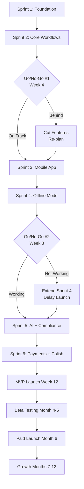

# RightFit Services - 12-Month Project Roadmap

**Document Version:** 1.0
**Date:** 2025-10-27
**Project Manager:** John (PM Agent)
**Project:** RightFit Services - Property Maintenance SaaS MVP

---

## Executive Summary

This roadmap outlines the 12-month plan to launch RightFit Services, from MVP development (Months 1-3) through paid launch (Month 6) to product-market fit (Month 12). The plan accounts for a solo part-time developer (20-30 hrs/week), minimal budget (£2k-5k), and aggressive but achievable milestones.

**Key Milestones:**
- **Month 3:** MVP launched to 20+ beta users
- **Month 6:** 50-100 paying customers, £750-2k MRR
- **Month 12:** 200-500 customers, £4k-12.5k MRR, product-market fit

---

## Phase 1: MVP Development (Months 1-3)

### Timeline: Week 1 - Week 12 (84 days)

```
Month 1              Month 2              Month 3
Week 1-4             Week 5-8             Week 9-12
│                    │                    │
├─ Sprint 1          ├─ Sprint 3          ├─ Sprint 5
│  Foundation        │  Mobile App        │  AI + Compliance
│  Auth + Props      │  Foundation        │
│                    │                    │
├─ Sprint 2          ├─ Sprint 4          ├─ Sprint 6
│  Core Workflows    │  Offline Mode      │  Payments + Polish
│  Work Orders       │  (CRITICAL)        │  Launch! 🚀
│                    │                    │
└─ Go/No-Go #1       └─ Go/No-Go #2       └─ MVP LAUNCH
   Week 4               Week 8               Week 12
```

### Month 1: Foundation & Core Features

**Sprint 1 (Week 1-2): Foundation**
- User authentication & JWT tokens
- Property management (CRUD)
- AWS infrastructure setup (EC2, RDS, S3)
- Turborepo monorepo setup

**Sprint 2 (Week 3-4): Core Workflows**
- Work order management (CRUD)
- Contractor database (CRUD)
- Twilio SMS integration
- Photo upload to S3

**Week 4 Milestone:** ✅ Go/No-Go Decision Point #1
- **Question:** Are we on track for 12-week MVP?
- **Criteria:** Foundation + core workflows complete, <1 week behind schedule
- **If NO:** Cut 1-2 features immediately (e.g., delay UK compliance to Phase 2)

---

### Month 2: Mobile App & Offline Mode

**Sprint 3 (Week 5-6): Mobile App Foundation**
- React Native + Expo setup
- Navigation (tab + stack navigation)
- Authentication screens (login/signup)
- Properties list and work orders list (mobile)
- Create work order + camera photo upload

**Sprint 4 (Week 7-8): Offline Mode (CRITICAL)**
- WatermelonDB setup + local schema
- Offline data persistence (properties, work orders)
- Sync queue (queue offline actions)
- Auto-sync when connection restored
- Conflict resolution (last-write-wins for MVP)

**Week 8 Milestone:** 🚨 Go/No-Go Decision Point #2
- **Question:** Is offline mode working reliably?
- **Criteria:** Can create work orders offline, sync automatically, no data loss
- **If NO:** Extend Sprint 4 by 1 week, delay Sprint 5 (non-negotiable feature)

---

### Month 3: Final Features & Launch

**Sprint 5 (Week 9-10): AI + UK Compliance**
- Google Vision API integration (photo quality analysis)
- Photo quality check UI (warn if too dark/blurry)
- Certificate upload (Gas Safety, Electrical, EPC)
- Certificate expiration tracking
- Push notifications (Firebase Cloud Messaging)
- Background job for certificate reminders

**Sprint 6 (Week 11-12): Payments + Polish + Launch**
- Stripe integration (subscription checkout)
- Pricing page (£15-25/month plans)
- Free 30-day trial (no credit card required)
- Bug fixes from internal testing
- CI/CD pipeline (GitHub Actions)
- Error monitoring (Sentry)
- Uptime monitoring (UptimeRobot + status page)
- App Store + Google Play submission

**Week 12 Milestone:** 🚀 MVP LAUNCH
- **Target:** 10-20 beta users onboarded
- **Success Criteria:** 99%+ uptime Week 1, no critical bugs, >10 active users

---

## Phase 2: Beta Testing & Iteration (Months 4-5)

### Month 4: Beta Testing

```
Week 13-14: Recruit & Onboard Beta Users
├─ Post in UK landlord Facebook groups
├─ Local property investor meetups (Birmingham area)
├─ Reddit (r/UKLandlords)
├─ Email friends/family who are landlords
└─ Goal: 20-30 beta signups → 15-20 active users

Week 15-16: Bug Fixes & UX Improvements
├─ Fix critical bugs from beta feedback
├─ Small UX improvements (confusing flows)
├─ Performance optimizations
└─ Weekly check-ins with beta users (WhatsApp group)
```

**Month 4 Milestone:**
- ✅ 20+ beta users actively using app weekly
- ✅ <5 critical bugs remaining
- ✅ Uptime >99%
- ✅ Positive feedback ("easier than Arthur Online", "love mobile app")

---

### Month 5: Iteration & Prepare for Launch

```
Week 17-18: Polish & Nice-to-Haves
├─ Add features cut from MVP (if time allows)
├─ Refine onboarding flow (first-time user experience)
├─ Create help documentation (FAQ, video tutorials)
└─ Improve web app dashboard (basic analytics)

Week 19-20: Launch Preparation
├─ Finalize pricing (validate £15-25/month with beta users)
├─ Marketing website (landing page, features, pricing)
├─ App Store + Google Play listing optimization
├─ Prepare launch communications (email beta users, social posts)
└─ Load testing (simulate 100 concurrent users)
```

**Month 5 Milestone:**
- ✅ App Store and Google Play approved (live in stores)
- ✅ Marketing website live (app.rightfitservices.co.uk)
- ✅ 30+ beta users, ready to convert to paid
- ✅ Launch plan finalized

---

## Phase 3: Paid Launch & Growth (Months 6-12)

### Month 6: Paid Launch

```
Week 21: Launch Event
├─ Email beta users (convert free → paid, offer discount)
├─ Post in UK landlord groups (Facebook, Reddit)
├─ Local PR (Birmingham Post, property investor newsletters)
└─ Announce on LinkedIn, Twitter

Week 22-24: Early Adopter Support
├─ Personal onboarding for paying customers
├─ Daily monitoring (Sentry, UptimeRobot)
├─ Fix bugs rapidly (<24 hour response time)
└─ Collect testimonials from happy customers
```

**Month 6 Milestone:**
- ✅ 50-100 paying customers
- ✅ £750-2,000 MRR
- ✅ >80% retention (customers stay after Month 1)
- ✅ First testimonials collected

---

### Months 7-9: Growth Phase 1

**Marketing Strategy:**
- **Word-of-mouth:** Incentivize referrals (1 month free for referrer)
- **Content marketing:** Blog posts on UK landlord compliance, maintenance tips
- **Community engagement:** Active in landlord Facebook groups, answer questions
- **Partnerships:** Partner with local contractors (they recommend RightFit to landlords)

**Product Focus:**
- Fix bugs and UX issues reported by paying customers
- Monitor retention (identify churn reasons, address top 3)
- Add small improvements (top-voted feature requests)

**Month 9 Milestone:**
- ✅ 100-200 paying customers
- ✅ £1,500-4,000 MRR
- ✅ >85% retention
- ✅ NPS score >20

---

### Months 10-12: Growth Phase 2 & Phase 2 Features

**Phase 2 Features (Based on User Feedback):**
- **Most Requested:** Tenant portal (if users ask for it)
- **STR Expansion:** Cleaning coordination (if STR landlords join)
- **Advanced Reporting:** Export work orders to CSV, basic analytics
- **Contractor Ratings:** Rate contractors after job completion

**Marketing Expansion:**
- Partnership with landlord associations (NRLA, RLA)
- Paid ads (Google Ads, Facebook Ads - small budget £200-500/month)
- Webinars for landlords ("How to manage maintenance efficiently")

**Month 12 Milestone:**
- ✅ 200-500 paying customers
- ✅ £4,000-12,500 MRR (£48k-150k ARR)
- ✅ >85% retention
- ✅ NPS >30
- ✅ Positive cash flow (MRR > AWS costs + operating expenses)
- ✅ **Product-Market Fit Achieved**

---

## Roadmap Gantt Chart

```
Month  │ 1      │ 2      │ 3      │ 4      │ 5      │ 6      │ 7      │ 8      │ 9      │ 10     │ 11     │ 12     │
───────┼────────┼────────┼────────┼────────┼────────┼────────┼────────┼────────┼────────┼────────┼────────┼────────┤
Sprint │ 1   2  │ 3   4  │ 5   6  │        │        │        │        │        │        │        │        │        │
───────┼────────┼────────┼────────┼────────┼────────┼────────┼────────┼────────┼────────┼────────┼────────┼────────┤
Dev    │ ██████ │ ██████ │ ██████ │ ▓▓▓▓▓▓ │ ▓▓▓▓▓▓ │        │        │        │        │        │        │        │
       │ Sprint │ Sprint │ Sprint │  Beta  │ Polish │        │        │        │        │        │        │        │
       │  1-2   │  3-4   │  5-6   │  Test  │ Launch │        │        │        │        │        │        │        │
───────┼────────┼────────┼────────┼────────┼────────┼────────┼────────┼────────┼────────┼────────┼────────┼────────┤
Beta   │        │        │        │ ██████ │ ██████ │        │        │        │        │        │        │        │
       │        │        │        │ Recruit│ Iterate│        │        │        │        │        │        │        │
───────┼────────┼────────┼────────┼────────┼────────┼────────┼────────┼────────┼────────┼────────┼────────┼────────┤
Launch │        │        │        │        │        │ ██████ │        │        │        │        │        │        │
       │        │        │        │        │        │  Paid  │        │        │        │        │        │        │
       │        │        │        │        │        │ Launch │        │        │        │        │        │        │
───────┼────────┼────────┼────────┼────────┼────────┼────────┼────────┼────────┼────────┼────────┼────────┼────────┤
Growth │        │        │        │        │        │        │ ██████ │ ██████ │ ██████ │ ██████ │ ██████ │ ██████ │
       │        │        │        │        │        │        │ Growth │ Growth │ Growth │ Phase2 │ Phase2 │ Phase2 │
       │        │        │        │        │        │        │ Phase1 │ Phase1 │ Phase1 │Features│Features│Features│
───────┼────────┼────────┼────────┼────────┼────────┼────────┼────────┼────────┼────────┼────────┼────────┼────────┤
Users  │   0    │   0    │  10-20 │  20-30 │  30+   │ 50-100 │100-150 │150-200 │200-300 │300-350 │350-450 │450-500 │
───────┼────────┼────────┼────────┼────────┼────────┼────────┼────────┼────────┼────────┼────────┼────────┼────────┤
MRR    │   £0   │   £0   │   £0   │   £0   │   £0   │£750-2k │£1.5-3k │£2-4k   │£3-6k   │£4-7k   │£6-9k   │£8-12.5k│
───────┼────────┼────────┼────────┼────────┼────────┼────────┼────────┼────────┼────────┼────────┼────────┼────────┤

Legend:
██████ = Active development/work
▓▓▓▓▓▓ = Testing/iteration phase
```

---

## Critical Path Dependencies



**Critical Path Notes:**
- **Sprint 4 (Offline Mode)** is the highest-risk item - everything depends on this working
- **Go/No-Go decisions at Week 4 and Week 8** are mandatory - cannot skip
- **App Store approval** can add 1-2 weeks - submit early (Week 10-11)
- **Beta user recruitment** must start Week 10 (parallel with Sprint 5-6)

---

## Budget Allocation (12 Months)

| Category | Month 1-3 (MVP) | Month 4-6 (Beta+Launch) | Month 7-12 (Growth) | Total |
|----------|-----------------|-------------------------|---------------------|-------|
| **AWS (EC2, RDS, S3)** | £145 | £290 | £580 | £1,015 |
| **Twilio SMS** | £90 | £150 | £300 | £540 |
| **Domain + SSL** | £10 | £0 | £0 | £10 |
| **App Store Fees** | £0 | £99 | £0 | £99 |
| **Marketing** | £0 | £200 | £600 | £800 |
| **Contingency (10%)** | £25 | £75 | £150 | £250 |
| **TOTAL** | **£270** | **£814** | **£1,630** | **£2,714** |

**Revenue Projections:**
- Month 6: £750-2,000 MRR (break even on operating costs)
- Month 12: £4,000-12,500 MRR (£48k-150k ARR, profitable)

---

## Risk Mitigation Timeline

| Risk | When to Monitor | Action Required | Owner |
|------|----------------|-----------------|-------|
| **Solo Dev Burnout** | Weekly (check hours) | If >35 hrs/week for 2+ weeks, cut scope | PM |
| **Offline Mode Fails** | Week 7-8 (Sprint 4) | If not working by Week 8, extend sprint or pivot | PM + Dev |
| **AWS Cost Overrun** | Weekly (billing alerts) | If >£150/month, optimize immediately | PM |
| **Scope Creep** | Every sprint planning | Reject features not in MVP scope doc | PM |
| **App Store Rejection** | Week 10-11 (submission) | Submit early, 1-week buffer for resubmission | Dev |
| **Low Beta Adoption** | Week 10-12 (recruitment) | Over-recruit (30+ signups for 15-20 active) | PM |

---

## Success Metrics Dashboard

Track weekly:

| Metric | Month 3 Target | Month 6 Target | Month 12 Target | Status |
|--------|---------------|----------------|-----------------|--------|
| **Beta Users** | 20+ | 30+ (convert to paid) | - | TBD |
| **Paying Customers** | 0 | 50-100 | 200-500 | TBD |
| **MRR** | £0 | £750-2,000 | £4,000-12,500 | TBD |
| **Retention (Monthly)** | - | >80% | >85% | TBD |
| **Uptime** | >99% | >99.5% | >99.5% | TBD |
| **NPS** | - | >20 | >30 | TBD |
| **Critical Bugs Open** | <5 | <3 | <2 | TBD |
| **AWS Cost/Month** | <£150 | <£200 | <£300 | TBD |

---

## Next Steps

1. **Week 1 Kickoff:** Review roadmap with developer, get buy-in
2. **Setup Tools:** GitHub Projects, Trello/Notion, WhatsApp communication
3. **Create Sprint 1 Plan:** Break down Week 1-2 tasks into daily work items
4. **Start Sprint 1:** Developer begins coding Monday Week 1
5. **Weekly Check-ins:** Every Friday, PM reviews progress and updates roadmap

---

**Last Updated:** 2025-10-27
**Next Review:** 2025-11-03 (after Sprint 1)
**Document Owner:** John (PM)
